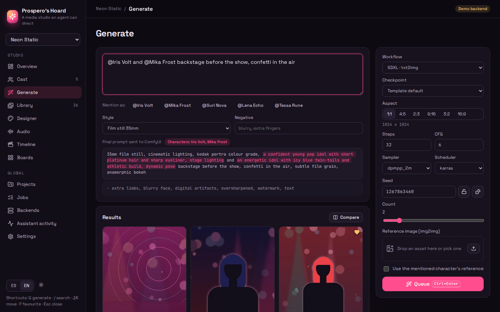
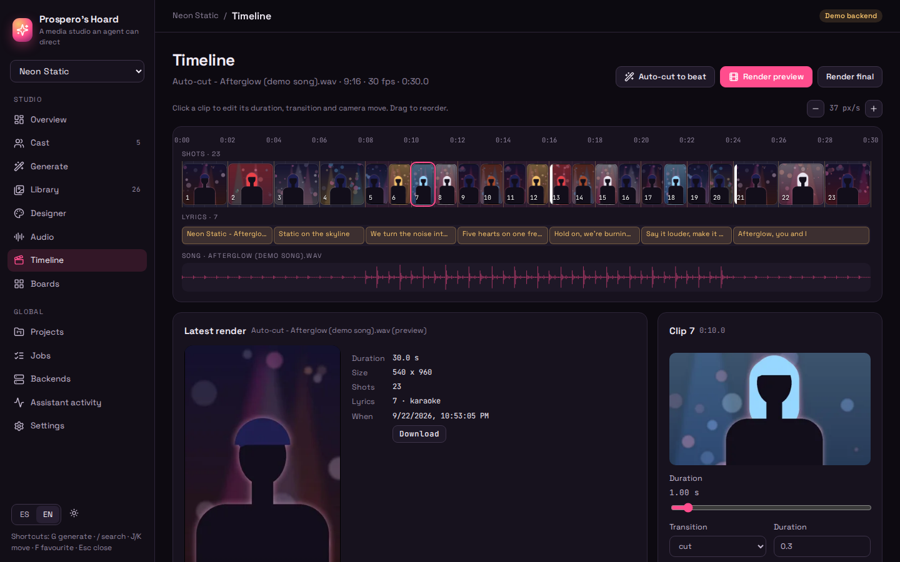
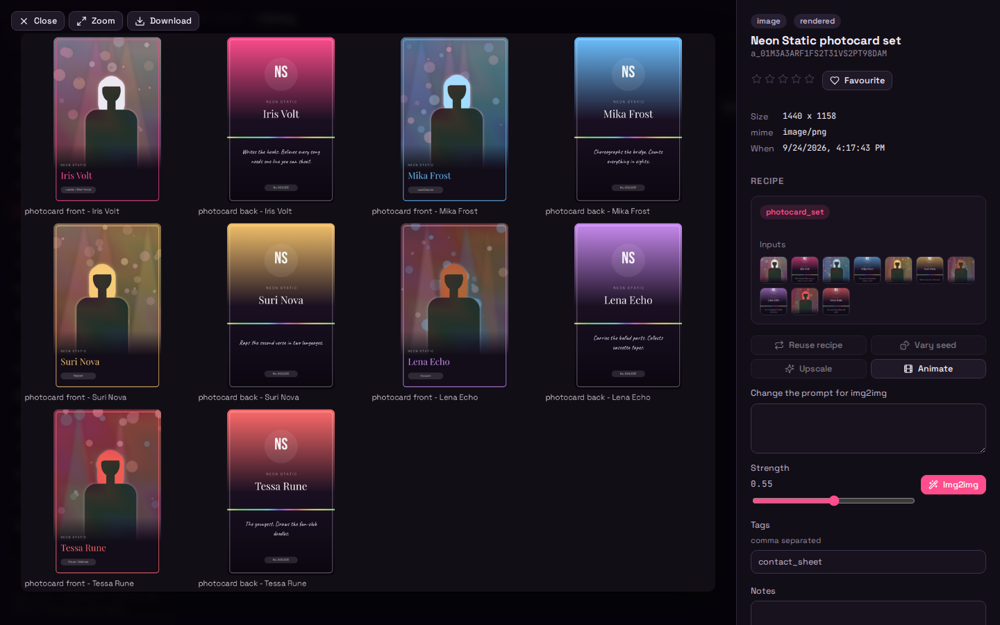
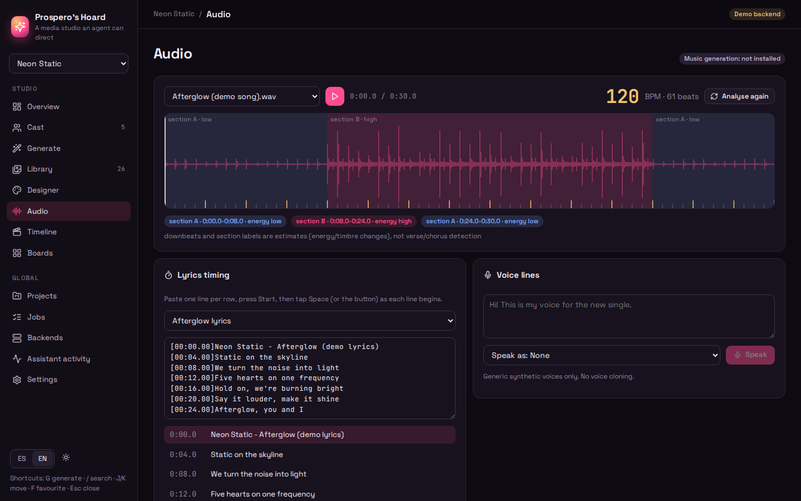
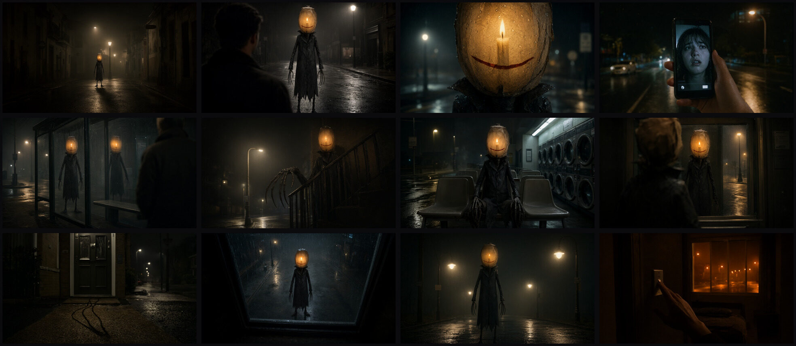
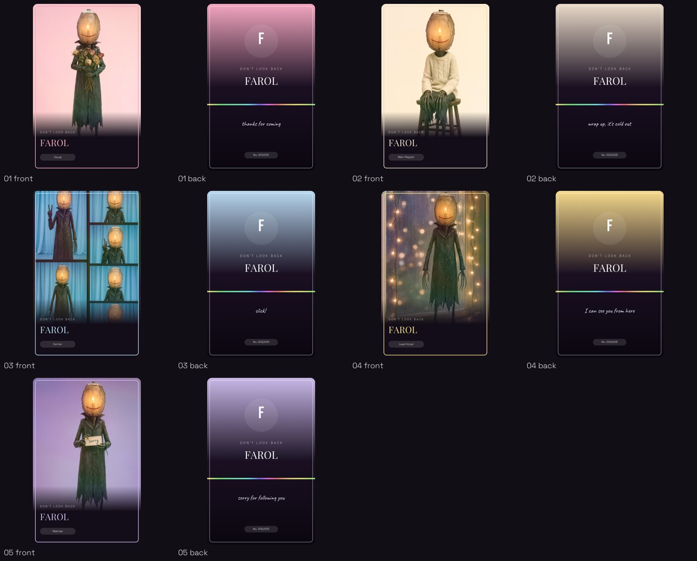
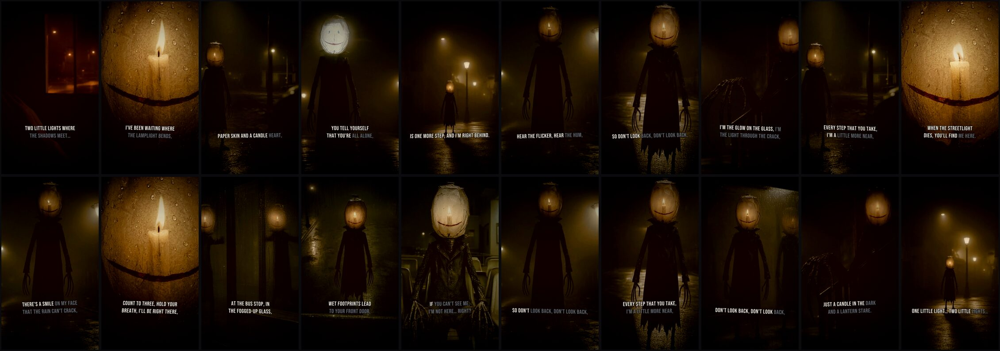
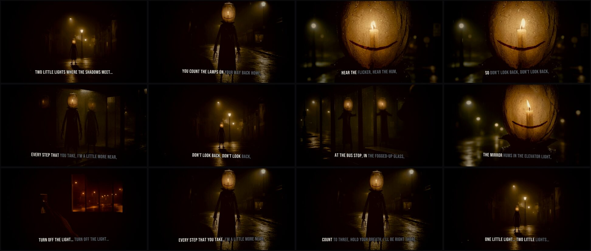
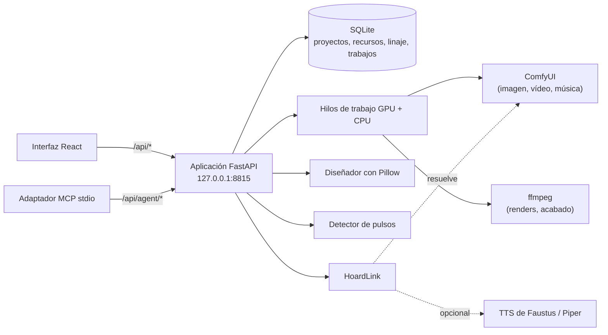

# Prospero's Hoard
### Estamos hechos de la misma materia que los sueños: ¿puede un agente dirigir una producción entera?
**Un estudio multimedia local que maneja tu ComfyUI, ffmpeg y una voz sintética local para crear personajes coherentes, photocards, portadas y videoclips montados al ritmo, a mano o por completo desde MCP, y que recuerda exactamente cómo se hizo cada recurso.**

[English](README.md) · [Inicio rápido](#inicio-rápido) · [Producción real de ejemplo](#la-ejecución-real) · [Conectar con Faustus](#conectarlo-a-faustus) · [Referencia MCP](docs/MCP.md) · [Estudio de voz](docs/VOICE.md) · [Portfolio](https://luissalet.github.io/Portfolio/#projects)


*Aplicación real, datos de demostración sintéticos. Todas las imágenes salen del backend de demostración incluido, un sustituto procedural de ComfyUI que dibuja escenas de relleno rotuladas; con tu ComfyUI conectado, las mismas pantallas muestran resultados reales de los modelos.*

## Por qué

Un modelo de lenguaje al que se le pide ayuda con una pequeña producción
musical (un grupo inventado, sus photocards, una portada, un vídeo para el
single) solo puede describir lo que haría. No puede ejecutar un grafo de
nodos, no puede mantener la cara de un personaje en cuarenta imágenes, no
encuentra el pulso de una canción y nadie sabrá después qué semilla y qué
checkpoint hicieron esa tarjeta. Hacerlo a mano obliga a saltar entre un
editor de nodos, un editor de imagen, una herramienta de audio y un editor
de vídeo que no comparten memoria.

Prospero convierte cada paso en una operación tipada, encolable y con su
receta guardada: los personajes se mencionan como `@Nombre` y su
descripción se inserta cada vez, cada recurso conserva los parámetros
exactos que lo produjeron (y se puede repetir byte a byte en el mismo
backend), las canciones se analizan para sacar tempo y secciones, y un
montaje se corta al ritmo y se renderiza con ffmpeg. El modelo local dirige;
el estudio hace el trabajo y responde con identificadores e imágenes.


*Aplicación real, datos de demostración sintéticos: el montaje automático de la canción de 30 s (120 BPM, suave-fuerte-suave), dos pulsos por plano en la parte fuerte, cuatro en las suaves, y la vista previa que renderizó con ffmpeg.*

## Casos de uso

- **Un músico independiente con un single terminado** importa la canción,
  deja que el detector de pulsos encuentre el tempo y las secciones,
  sincroniza la letra y obtiene una portada, una tarjeta de letra y un vídeo
  9:16 cortado al ritmo, sin abrir un editor de nodos ni uno de vídeo.
- **Una guionista o diseñadora de juegos con un reparto original** da a
  cada personaje un prompt de aspecto y una referencia canónica y pide
  «@Iris y @Mika entre bastidores»: vuelven las mismas caras en decenas de
  imágenes (`consistent=true`) y cada tarjeta dice qué semilla y qué
  checkpoint la hicieron.
- **Un modelo local en Faustus** al que se le pide «haz un teaser del
  single» llama a `studio_generate_image`, `studio_timeline` y
  `studio_render`, recibe identificadores cortos, solo mira una imagen cuando
  la pide y cada llamada que hace queda en **Actividad del asistente**.
- **Quien ya usa ComfyUI con sus propios flujos** importa la exportación en
  formato de interfaz, la ve convertida, comprobada contra la lista de nodos
  en vivo y con sus parámetros con nombre, y a partir de ahí genera con ella
  desde el estudio o desde un agente, con linaje.

## Qué hay implementado

| Área | Disponible ahora | Límite |
| --- | --- | --- |
| Proyectos y reparto | Proyectos, personajes (prompt de aspecto, negativo, paleta, referencia canónica, voz), grupos ordenados, menciones `@Nombre` que reconocen nombres de varias palabras y avisan de los desconocidos, 6 estilos predefinidos | Un único usuario local; los nombres no se pueden repetir en un proyecto (son la mención) |
| Generación (ComfyUI) | Qwen-Image 2.1 (int8) txt2img y edición multi-referencia (1 a 10 referencias, hasta 2K nativo), SDXL txt2img, img2img, inpaint y ampliación en dos pasadas («hires fix»), SD 1.5 txt2img, SVD imagen a vídeo, FLUX.1 schnell txt2img, FLUX.1 Kontext (edición guiada por referencia), Wan 2.2 TI2V imagen a vídeo, todo como plantillas en formato API, cada una con sus propios valores de sampler y tamaño; motor de imagen `auto \| qwen21 \| flux \| sdxl` por proyecto y por llamada («auto» usa Qwen-Image 2.1 si está instalado, si no Flux, si no SDXL, e indica siempre cuál usó); el prompt entero se comprueba contra `/object_info` antes de encolarlo (nodos, cada archivo de modelo, samplers, opciones, rangos), un archivo de modelo que falta se reporta como «descárgalo», nunca como un fallo, con las opciones instaladas en el error; importador de flujos en formato de interfaz **o** API cuyo conversor coincide entrada a entrada con la exportación del propio frontend de ComfyUI 0.37 en las plantillas oficiales (subgrafos y widgets promovidos, combos dinámicos, sockets autogrow, `PrimitiveNode`/`Reroute`, bypass/mute), con mapa de parámetros editable y una copia de la lista de nodos para cuando ComfyUI está apagado; `consistent=true` mantiene el diseño exacto de un `@Personaje` vía una plantilla de edición (Qwen-Image 2.1 o Kontext, según el motor) y su referencia canónica, recortada a una pose de la hoja de referencia | Prospero no aloja ningún modelo; Kontext admite una sola referencia (Qwen-Image 2.1 hasta 10), Wan solo imagen a vídeo |
| Uso compartido de la GPU | VRAM estimada por familia de flujo (editable), comparada con la tarjeta en la que corre de verdad ComfyUI (su propio `system_stats`, donde los modelos que tiene en caché cuentan como libres; nvidia-smi si no responde); si falta memoria, el trabajo espera en `waiting_gpu` con el motivo, reintentando cada 15 s hasta 30 min; se puede cancelar en cualquier momento; un grupo de render (`render_pool` en `backend.json`, un ComfyUI por GPU) reparte los trabajos en cola entre todas las tarjetas a la vez | Nunca se descarga nada salvo que pulses «Liberar memoria de ComfyUI» |
| Linaje | Cada recurso generado guarda plantilla, hash de la plantilla, checkpoint, todos los parámetros y la semilla, entradas y tiempos; «Repetir receta» reproduce una imagen byte a byte en el mismo backend (probado), «Variar semilla» la repite con semillas nuevas | La reproducción solo está garantizada con el mismo backend, modelos y versión de ComfyUI |
| Diseño | Renderizador con Pillow, sin navegador: photocard anverso y reverso, portada de álbum (4 composiciones), cartel teaser, tarjeta de letra, contraportada con lista de canciones, miniatura, con una variante «night» de terror/thriller para portada, cartel, tarjeta de letra y contraportada; degradados, lámina holográfica, modos de fusión, viñeta, espaciado de letras, sombras, texto que se encoge para caber y columnas para la lista de canciones; sets de photocards de un grupo entero o de un solista en varios looks, con hoja de contactos; modo imprenta con 3 mm de sangrado a 300 ppp; 6 familias tipográficas incluidas | La capa QR dibuja un recuadro de relleno (no hay librería de QR fijada) |
| Audio | Importación (mp3, wav, flac, ogg, m4a), forma de onda, detector de pulsos propio (flujo espectral equilibrado por bandas, preferencia de tempo y programación dinámica) probado a menos de 1 BPM y 50 ms con metrónomos y patrones de bombo y caja de 90 a 140 BPM, estimación de tiempos fuertes y secciones, letras LRC con herramienta para sincronizarlas pulsando una tecla y una primera sincronización automática a partir de las etiquetas `[Section]` de la letra y los compases | La sincronización automática es una estimación por estructura, no alineación con la voz; las secciones se llaman «section A/B» con energía baja/media/alta, no estrofa/estribillo; las canciones muy rápidas (170 BPM) se detectan a la mitad |
| Voces | Piper TTS con seis voces seleccionadas en español e inglés que se descargan la primera vez que se usan; TTS de Faustus mediante Hoard Link con Piper como respaldo; voz y velocidad por personaje | Voces sintéticas genéricas para la narración de personajes; la clonación se hace en el estudio de voz de abajo |
| Estudio de voz | Un registro de motores TTS/STT conectables (Piper más motores de clonación locales opcionales - Coqui XTTS-v2, F5-TTS, Kokoro, Chatterbox - y un flujo de trabajo de TTS por ComfyUI opcional; faster-whisper y opcionalmente openai-whisper para voz a texto), instalados solo cuando se piden, nunca en silencio; una biblioteca de voces a partir de una muestra subida (normalización de volumen, recorte de silencios, un control de calidad de SNR/recorte, una transcripción de referencia automática, preajustes con nombre); transcripción y dictado de clips cortos con marcas de tiempo por palabra y exportación a SRT/VTT/TXT; narración de audiolibros a partir de texto o un archivo `.txt`/`.md`/`.epub` como trabajo en segundo plano reanudable (archivos por capítulo, MP3 o M4B con marcadores de capítulo, un SRT/LRC alineado); doblaje de vídeo (extraer el audio, transcribir con marcas de tiempo, traducir segmento a segmento con el modelo local y un glosario, resintetizar con la voz elegida, ajustar el ritmo al original, volver a montarlo) guardando los archivos de cada etapa para poder corregir y rehacer un solo segmento sin repetir el resto | Los motores de clonación hay que instalarlos (un `pip install` documentado, a veces con GPU); el doblaje necesita un modelo local detrás de Hoard Link para traducir y falla con un mensaje claro si no lo hay; usa solo una voz que tengas derecho a reproducir |
| Generación de música | `studio_compose` (etiquetas, letra, bpm, tonalidad, idioma) vía ACE-Step 1.5 en ComfyUI (`ComfyMusic`, se activa solo al instalar el checkpoint) o una API HTTP mínima documentada para otro servidor local; las canciones compuestas guardan linaje y se analizan automáticamente | Necesita el checkpoint de ACE-Step en ComfyUI (el single del ejemplo se compuso con ACE-Step 1.5 turbo); las canciones importadas funcionan del todo igualmente |
| Vídeo | Montaje automático al ritmo (densidad según la energía - según las marcas de estrofa/estribillo de la letra cuando las hay - destellos al inicio de cada frase musical, plano nuevo en cada sección y, si se pide, en cada verso cantado, guiones por sección en orden de historia, sin repetir plano seguido, cubre la canción entera) en un montaje editable; renderizador ffmpeg con movimientos Ken Burns, transiciones de corte, fundido, fundido a negro y destello que mantienen los cortes en el pulso, subtítulos de la letra incrustados con karaoke opcional y la canción mezclada; vista previa a 540p o final a 1080p; los clips de SVD/Wan se convierten a mp4; acabado opcional (gradación de color, grano, viñeta, barras de cine, destellos glitch en los tiempos fuertes, estilo de letra en mayúsculas condensadas para terror) | El Ken Burns es un rango de zoom más una dirección de desplazamiento, no rectángulos libres de inicio y fin; las gradaciones de color son aproximaciones con `eq`/`colorbalance`/`curves`, no una LUT 3D |
| Producciones y recetas | Un videoclip entero como un solo trabajo reanudable y con puntos de control (protagonista y su hoja de referencia, canción, fotogramas, sincronización de la letra, clips de Wan, photocards, arte del single, el montaje y sus renders, un `REPORT.md`) que encola sus fotogramas y clips como trabajos normales, así que un pool de render los reparte entre todas las tarjetas; «cambiar planos» (otra variante, clip sí o no, otro prompt u otra semilla) rehace solo lo que depende de ellos. Una producción terminada - hecha en la app o con el script de producción - se convierte en una **receta** con el protagonista abstraído en un hueco de reparto `{lead}`; «Recrea esto con…» la ejecuta con otro personaje del estudio o con una descripción nueva, reutilizando la canción y los fotogramas y clips en los que no sale el protagonista | El script de producción no guarda el ritmo del montaje (pulsos por plano), así que una receta exportada de una ejecución del script usa los valores por defecto; los prompts que describen objetos del protagonista anterior se señalan, no se reescriben |
| Animático | Antes de los clips caros (cada clip de Wan de 5 s tardó unos 9,5 min en la ejecución real), la producción corta sus fotogramas justo donde cortará el montaje final - el mismo montaje automático sobre la misma toma de la canción, las mismas marcas de letra y sección y las mismas opciones - con un movimiento Ken Burns y un fundido por plano, subtítulos y acabado, renderizado a 720p en cada formato previsto, más un `plan.json` (cada corte, el tiempo en pantalla y el fotograma de cada plano, qué planos serán clips de Wan, los minutos de GPU estimados); la producción se detiene en `awaiting_review` hasta **Continuar** (o sigue sola con `animatic_autocontinue`), y **Cambiar planos** cambia fotogramas, activa o quita clips o reescribe un plano antes | El animático funde todos los cortes (el final conserva sus destellos y glitches); los minutos de GPU son estimaciones con los tiempos de la ejecución real (configurables) |
| Director de calidad | Una revisión de las salidas de una producción, por etapa o de todas, durante la producción tras cada etapa (`settings.qa.enabled`) o cuando se pida: fotogramas planos o con ruido, bandas negras o rojas en un borde (la franja de ffmpeg 8), saltos de exposición dentro de un clip, movimiento donde se pidió quietud (o un clip congelado), una cabeza de photocard que toca el borde superior, cobertura de la letra de un LRC alineado, duraciones frente a lo previsto; con un modelo de visión detrás de Hoard Link cada salida recibe además una nota de 0 a 10 contra la biblia, el prompt del plano y la referencia, con una línea de motivo. Los fotogramas, clips y photocards que fallan se regeneran con otra semilla y un arreglo concreto (ruido -> denoise 1, salto de exposición -> otro sampler, caminar -> el negativo de quietud, cabeza cortada -> aire arriba), hasta un límite de reintentos, y cada reintento queda en el historial y en REPORT.md | Las comprobaciones son heurísticas con umbrales editables, no un crítico entrenado; sin modelo de visión solo corren las comprobaciones sin modelo (nunca bloquea); una producción hecha con el script se revisa en solo lectura |
| Control por agentes | 43 herramientas MCP equivalentes a `/api/agent/*` (34 de producción más 9 del estudio de voz), resultados compactos con identificadores, imágenes solo cuando se piden explícitamente (`include_image=true`), errores con código y siguiente paso, y un registro auditable «Lo que hizo el asistente» | Los trabajos se consultan (`studio_job`/`voice_job` puede esperar en el servidor); no hay eventos push |
| Interfaz | Estudio en React: Resumen, Reparto, Generar, Biblioteca con visor, Diseño, Audio, Montaje, Tableros, Producciones (con Recetas), Voz, Trabajos, Backends, Actividad del asistente y Ajustes; tema oscuro y claro, español e inglés, atajos de teclado | El montaje se edita por planos (duración, transición, cámara, orden, sustitución), no fotograma a fotograma |


*Aplicación real, datos de demostración sintéticos: el set de photocards de los cinco miembros inventados, abierto en el visor con su receta y sus entradas.*

## Modelos

| Familia | Checkpoint / archivos | VRAM (aprox.) | Mejor para |
| --- | --- | --- | --- |
| Qwen-Image 2.1 (int8) | `qwen_image_2.1_int8_convrot.safetensors` (difusión), `qwen3vl_8b_int8_convrot.safetensors` (encoder de texto), `qwen_image_2.1_vae_bf16.safetensors` (VAE) | ~7,3 GB + 9,4 GB cargados uno tras otro; pico ~10-12 GB a 1 MP, más a 2K nativo | Mejor fidelidad al prompt, tipografía dentro de la imagen, identidad multi-referencia (1-10 imágenes) |
| FLUX.1 schnell | `flux1-schnell-fp8.safetensors` | ~13 GB | Bocetos más rápidos (4 pasos) |
| FLUX.1 Kontext dev | `flux1-dev-kontext_fp8_scaled.safetensors` + CLIP/VAE | ~13 GB | Edición con una sola referencia |
| SDXL / SD 1.5 | `sd_xl_base_1.0.safetensors` / `v1-5-pruned-emaonly-fp16.safetensors` | ~7 GB / ~3,5 GB | Alternativa siempre disponible, boceto con poca VRAM |
| SVD | `svd_xt.safetensors` | ~10 GB | Imagen a vídeo corto |
| Wan 2.2 TI2V (5B) | `wan2.2_ti2v_5B_fp16.safetensors` + VAE | ~12 GB | Imagen a vídeo, 1280x704 nativo |
| ACE-Step 1.5 | `ace_step_1.5_turbo_aio.safetensors` | ~8 GB | Composición de canciones con voz |

El parámetro `engine` de `studio_generate_image` (y el ajuste `image_engine`
de cada proyecto) elige entre las familias de imagen: `auto` (por defecto)
usa Qwen-Image 2.1 si sus clases de nodo y sus archivos de modelo están
instalados, si no Flux schnell, si no SDXL - el resultado siempre dice cuál
usó realmente. Un `template` explícito siempre gana a `engine` cuando se
dan los dos. Cómo el conversor pasa la exportación en formato de interfaz
de cada plantilla al formato API de arriba, y cómo se reporta un archivo de
modelo que falta: [docs/ARCHITECTURE.md](docs/ARCHITECTURE.md).

## Inicio rápido

```
git clone https://github.com/Luissalet/ProsperosHoard.git
cd ProsperosHoard
```

Hace falta Python 3.11 o posterior (se recomienda 3.13), Node.js 22 para la
interfaz y ffmpeg en el PATH (si no, se usa el binario incluido en
`imageio-ffmpeg`). ComfyUI es opcional: `--demo` lo ejecuta todo contra un
sustituto procedural.

### Windows

Haz doble clic en **`Iniciar Prospero's Hoard.cmd`** (o ejecuta
`scripts\start.ps1`). La primera vez crea `.venv` con Python 3.13, instala
`requirements-lock.txt`, compila la interfaz con npm y abre
http://127.0.0.1:8815; las siguientes veces solo reinstala si cambió el
archivo de bloqueo. **`Detener Prospero's Hoard.cmd`** la para (solo después
de comprobar que el puerto es de verdad de Prospero).

Pasos manuales:

```powershell
C:\Python313\python.exe -m venv .venv
.venv\Scripts\python.exe -m pip install -r requirements-lock.txt
cd frontend; npm ci; npm run build; cd ..
.venv\Scripts\python.exe -m prosperos_hoard            # datos reales en .\data
.venv\Scripts\python.exe -m prosperos_hoard --demo     # datos de demostración en .\data-demo
```

### Linux / macOS

```bash
python3 -m venv .venv
.venv/bin/python -m pip install -r requirements-lock.txt
(cd frontend && npm ci && npm run build)
.venv/bin/python -m prosperos_hoard --demo --no-browser
```

La primera ejecución con `--demo` prepara sus datos (alrededor de un minuto
con dos CPU) antes de que el servidor responda. Después abre
<http://127.0.0.1:8815> (`curl http://127.0.0.1:8815/api/health` responde
`"service": "prosperos-hoard"`).

Opciones: `--port`, `--data-dir` (o `PROSPERO_DATA_DIR`), `--demo` y
`--no-browser`. `--demo` arranca el backend procedural de demostración y
crea un grupo original de cinco miembros con retratos, fotos en el
escenario, una portada, un set de photocards, una canción sintética de 30 s
con la letra sincronizada y un montaje automático, y renderiza su vista
previa. Para usar tu ComfyUI, déjalo en 127.0.0.1:8188 (Hoard Link lo
encuentra) o pon su URL en Ajustes. Si la GPU la comparte un modelo de
lenguaje, los renders van mucho más lentos; `PROSPERO_COMFY_TIMEOUT_S` sube
cuánto puede tardar un trabajo (por defecto: vídeo 1 h, audio 30 min, imagen 20 min).


*Aplicación real, datos de demostración sintéticos: la canción sintética analizada con el detector de pulsos integrado, con la estimación de secciones y la letra LRC sincronizada.*

## Conectarlo a Faustus

Prospero's Hoard es un plugin de [Faustus](https://github.com/Luissalet/Faustus),
el espacio de trabajo de IA local, y se declara con
[`faustus-plugin.json`](faustus-plugin.json). Arráncala y, en Faustus, abre **Connectors -> Nearby apps -> Add**:
Faustus la encuentra en el puerto 8815, lee el manifiesto y lanza el
adaptador MCP (`prosperos_hoard/mcp_server.py`, stdio). El backend de
modelos es compartido: el estudio pregunta a Hoard Link qué ComfyUI y qué
TTS están ya en marcha en vez de cargar nada propio.

### Herramientas MCP

| Herramienta | Qué hace | Solo lectura |
| --- | --- | --- |
| `studio_status` | Backends, checkpoints, VRAM libre, cola | sí |
| `studio_projects` / `studio_create_project` | Listar o crear producciones | sí / no |
| `studio_cast` | Listar, crear y editar personajes y grupos | no (listar sí lo es) |
| `studio_generate_image` | Encolar txt2img/edición con @menciones, estilos y motor de imagen | no |
| `studio_edit_image` | img2img, inpaint, ampliar, repetir receta, variar semilla | no |
| `studio_animate` | Imagen a vídeo corto (SVD) | no |
| `studio_compose` | Componer una canción con voz (ACE-Step) | no |
| `studio_voice` | Frase hablada con la voz de un personaje | no |
| `studio_import` | Importar un archivo local de una carpeta permitida | no |
| `studio_analyze_audio` / `studio_time_lyrics` | Tempo, pulsos y secciones / sincronizar la letra con las secciones de la canción (LRC) | sí / no |
| `studio_design` / `studio_photocard_set` | Renderizar un diseño / un set de photocards | no |
| `studio_timeline` / `studio_render` | Montaje automático, lectura y edición / renderizado | no |
| `studio_jobs` / `studio_job` / `studio_cancel_job` / `studio_retry_job` | Cola, un trabajo (con espera), cancelar, reintentar uno fallido | sí / sí / no / no |
| `studio_assets` / `studio_show` / `studio_lineage` | Buscar recursos, verlos y su receta | sí |
| `studio_asset_update` / `studio_board` / `studio_project_update` | Puntuar, etiquetar y marcar favoritos / tableros de ambiente y guiones gráficos / ajustes y portada del proyecto | no |
| `studio_productions` / `studio_production` | Listar producciones / etapas, renders y siguiente paso de una producción | sí |
| `studio_production_create` / `studio_production_continue` / `studio_production_shots` | Lanzar una producción entera desde una especificación / reanudarla o aprobarla / cambiar planos antes del render | no |
| `studio_recipe_export` / `studio_recipes_list` / `studio_recipe_get` | Convertir una producción terminada en receta con un hueco `{lead}` / listar recetas / leer una | no / sí / sí |
| `studio_recipe_run` | «Recrea esto con X»: una producción nueva a partir de una receta con otro protagonista | no |
| `studio_animatic` | Los fotogramas cortados como el final, a 720p, con plan y estimación de GPU, antes de renderizar ningún clip | no |
| `studio_qa_run` / `studio_qa_report` | Revisión de calidad de una producción (revisar, o revisar y regenerar lo que falla) / su última hoja de resultados y reintentos | no / sí |
| `voice_engines` / `voice_create` / `voice_list` | Estado de los motores y cómo instalarlos / clonar una voz a partir de una muestra / listar voces guardadas | sí / no / sí |
| `voice_speak` / `voice_transcribe` | Sintetizar una frase / transcribir audio con marcas de tiempo | no / sí |
| `voice_audiobook` / `voice_dub` | Narrar un texto por capítulos / doblar un vídeo a otro idioma | no |
| `voice_resynthesize_segment` / `voice_job` | Corregir y rehacer un segmento de doblaje / consultar un trabajo del estudio de voz | no / sí |

También funciona con cualquier cliente MCP por stdio:

```json
{"mcpServers": {"prosperos-hoard": {
  "command": "C:/.../Prospero's Hoard/.venv/Scripts/python.exe",
  "args": ["C:/.../Prospero's Hoard/prosperos_hoard/mcp_server.py"],
  "env": {"PROSPERO_URL": "http://127.0.0.1:8815"}}}}
```

Argumentos, formato de las respuestas y límites de cada herramienta:
[docs/MCP.md](docs/MCP.md). La receta completa que sigue el agente:
[skills/idol-production/SKILL.md](skills/idol-production/SKILL.md).

## Modelos compartidos (HoardLink)

Prospero no aloja ningún modelo. Pide a [HoardLink](https://github.com/Luissalet/HoardLink)
(incluido en [`prosperos_hoard/hoard_link/`](prosperos_hoard/hoard_link),
copia byte a byte de HoardLink 0.1.1) el backend de `image`/`video`
(ComfyUI) y de `tts` (el TTS de Faustus, con Piper como alternativa local),
el mismo resolutor que usan todos los plugins de Faustus. El orden de
resolución, en una línea: un ajuste explícito en Ajustes, en
`data/backend.json` o en una variable de entorno `HOARD_*`; después el
registro de una instancia de Faustus en marcha; después un servidor que ya
escuche en loopback (ComfyUI en el 8188). La música sale de ACE-Step a
través del mismo ComfyUI o de un pequeño servidor HTTP documentado al que
apuntes con `HOARD_MUSIC_URL`. La pantalla **Backends** y `studio_status`
dicen siempre qué se ha encontrado y por qué; nada se carga ni se descarga
a tus espaldas.

## Ejemplo de producción

[`scripts/productions/no_mires_atras.py`](scripts/productions/no_mires_atras.py)
produce un sencillo de FAROL, «NO MIRES ATRÁS» en español o, con `--lang en`,
«DON'T LOOK BACK» en inglés (una criatura nocturna
original: cabeza de farolillo de papel, siempre quieta, siempre un poco más
cerca), de principio a fin **solo a través del adaptador MCP**: lanza
`mcp_server.py` por stdio, el mismo camino que usa Faustus, y falla si algún
resultado trae una imagen que no pidió. Nueve pasos: el proyecto (con un
motor `--engine auto|qwen21|flux`, guardado como su valor por defecto); una
hoja de referencia recortada a su vista frontal como referencia canónica de
FAROL; la canción con ACE-Step; doce fotogramas (una plantilla de edición
con esa referencia cuando FAROL sale en plano, un txt2img nuevo con la
misma estética nocturna cuando no - Qwen-Image 2.1 si está instalado, si no
Flux); clips de Wan a partir de los mejores fotogramas; un set de
photocards de solista en cinco looks idol con su hoja de contactos; la
portada, contraportada, cartel teaser y tarjeta de letra en variante
«night»; la letra sincronizada con los compases; montajes 9:16 y 16:9 que
siguen un guion por sección y cambian de plano en cada verso cantado, con
gradación sodium-night, grano, viñeta y destello + glitch de separación de color en los
tiempos fuertes del estribillo, y subtítulos karaoke de terror; y un
`REPORT.md` con cada id de recurso, los tiempos y qué revisar. Guarda cada
fotograma, clip, tarjeta y render según termina, así que una ejecución
interrumpida sigue donde se quedó; `--only <paso>` repite un paso.

En Windows, con la aplicación en marcha y ComfyUI arrancado en una tarjeta
de 16 GB:

```powershell
# el backend de demostración (sin GPU), unos minutos
.venv\Scripts\python.exe scripts\productions\no_mires_atras.py --backend fake --quality draft
# la producción real contra la aplicación y ComfyUI en marcha
.venv\Scripts\python.exe scripts\productions\no_mires_atras.py --backend real --quality final
# fijar el motor de imagen en vez de dejar que «auto» use Qwen-Image 2.1 primero
.venv\Scripts\python.exe scripts\productions\no_mires_atras.py --backend real --quality final --engine flux
# la versión inglesa sobre una ejecución terminada: mismas imágenes, canción cantada, un clip por plano
.venv\Scripts\python.exe scripts\productions\no_mires_atras.py --backend real --quality final --lang en --reuse-from data\productions\no_mires_atras --motion full --song-takes 4
# tras resincronizar la letra de oído en Audio > Sincronizar letra y exportar el LRC
.venv\Scripts\python.exe scripts\productions\no_mires_atras.py --backend real --quality final --only timeline --lrc-path C:\Users\<tu-usuario>\Music\no_mires_atras.lrc
```

### En la app: producciones y recetas

La misma cadena se ejecuta también dentro de la app como una **producción**
(`studio_production_create`, o la pantalla **Producciones**): un solo
trabajo orquestador que encola la hoja de referencia, la canción, cada
fotograma y cada clip como trabajos normales (un pool de render los hace a
la vez), guarda cada elemento en `data/productions/<slug>/state.json` y
escribe un `REPORT.md`. Tras los fotogramas y la canción hace un
**animático** (los fotogramas cortados igual que el final, a 720p, con un
`plan.json` y los minutos de GPU que costarán los clips) y espera a que lo
revises antes de renderizar un solo clip. Se reanuda donde se quedó tras un fallo, una
cancelación o un reinicio; `studio_production_shots` cambia un fotograma por
otra variante, activa o quita un clip o reescribe un plano, y solo se rehace
lo que depende de él.

Una producción terminada - también una hecha con el script de arriba - se
convierte en una **receta**: `studio_recipe_export(production, name)` escribe
`data/recipes/<name>.json` con cada etapa, prompt, semilla, plantilla y
ajuste, y el protagonista abstraído en un hueco de reparto `{lead}`
(`{lead}`, `{lead.look}`, `{lead.negative}`, `{lead.palette[0]}`…), además de
avisos para los prompts de plano que aún describen objetos del protagonista
anterior. `studio_recipe_run(recipe, cast={"lead": <id de personaje o {name,
look}>})` («recrea esto con X», o **Recrea esto con…** en la pantalla
Producciones) lanza una producción nueva con el hueco relleno: un personaje
existente conserva su referencia canónica, uno nuevo recibe antes una hoja de
referencia, y se reutilizan la canción (salvo que su letra nombre al
protagonista anterior) y los fotogramas y clips de los planos en los que no
sale (`options.reuse: ["song", "frames", "clips"]`).

### La ejecución real

El mismo script se ejecutó contra un ComfyUI 0.37 real en tarjetas de 16 GB,
en dos versiones que comparten todas las imágenes y clips. **DON'T LOOK
BACK** (`--lang en --motion full`) es un himno de terror cantado en inglés y
contado por la criatura, con un clip para cada plano, renderizado en un grupo
de tres servidores ComfyUI, uno por tarjeta. **NO MIRES ATRÁS** es la primera
toma, un rap de terror en español montado con siete clips en una sola
tarjeta. Qwen-Image 2.1 hizo la hoja de referencia, los fotogramas y las
photocards; Wan 2.2 TI2V 5B, los clips, y ACE-Step 1.5, las canciones. La
referencia canónica, la mejor variante de cada plano y la toma de la canción
se eligieron a ojo y a oído. La letra se alineó con la voz con faster-whisper
(fuera de Prospero) y se importó como LRC con marcas de sección. Todo lo de
abajo sale tal cual de la aplicación, solo reducido de tamaño para esta
página: no hay retoques. Los prompts, semillas, ajustes, tiempos y los nueve
problemas que encontró la ejecución (todos corregidos) están en el
[ejemplo completo](docs/examples/no-mires-atras.es.md).


<p>

</p>









En tarjetas de 16 GB: 48 fotogramas en 57 min, los primeros siete clips de
5 s en unos 70 min en una tarjeta y otros once en unos 40 min en tres, cuatro
tomas de canción en 2 min y los dos montajes (vista previa y final a 1080p)
en unos 7 min.

## Arquitectura

FastAPI y SQLite (WAL, una conexión por hilo) con un hilo de trabajo para la
GPU, otro para la CPU y un orquestador (producciones enteras) sobre una tabla
de trabajos persistente; la lógica vive en módulos sin dependencias web
(`engine`, `comfy_driver`, `design`, `audio`, `timeline`, `video`, `voices`,
`productions`, `recipes`); Hoard Link va incluido para resolver
los backends; el adaptador MCP es un script stdio aparte que solo habla HTTP
con la aplicación.



Detalles, modelo de datos y decisiones:
[docs/ARCHITECTURE.md](docs/ARCHITECTURE.md). Todos los endpoints:
[docs/API.md](docs/API.md).

## Privacidad y seguridad

Todo en local: la aplicación escucha en 127.0.0.1, no envía telemetría y
solo sale a internet cuando pides una voz de Piper que aún no está
descargada (del repositorio rhasspy/piper-voices en Hugging Face). Se
rechazan las peticiones con una cabecera `Host` ajena (DNS rebinding) y las
escrituras que llegan desde otras webs (comprobación de `Origin` y
`Sec-Fetch-Site`). Los agentes solo pueden importar archivos de tu carpeta
personal, de `data/inbox` y de las carpetas que añadas en Ajustes, y solo si
el contenido coincide con su tipo; los archivos se sirven siempre por id,
nunca por una ruta que mande el cliente. Cada llamada que hace un asistente
se guarda en la tabla de auditoría `agent_calls` y se ve en **Actividad del
asistente** (herramienta, resumen de argumentos, duración y resultado). La
demostración usa únicamente personas inventadas. La clonación de voz se
ejecuta por completo en motores locales que instalas explícitamente (nada
se descarga en silencio); una voz clonada solo se crea a partir de una
muestra que tú proporcionas, y usar la voz de otra persona sin su
consentimiento es responsabilidad tuya, no de la herramienta. Los datos se
quedan en `data/` (o en tu `--data-dir`); el token de Faustus se guarda en
`data/backend.json` y la API nunca lo devuelve.

## Desarrollo

```powershell
.venv\Scripts\python.exe -m pytest -q
cd frontend; npm ci; npm run build
```

En Linux/macOS, lo mismo con `.venv/bin/python`. **Pasan 296 pruebas**
en unos dos minutos en una máquina Linux compartida de 2 CPU, sin red, sin GPU
y sin descargar modelos (el backend de demostración sustituye a ComfyUI, y la
suite propia del estudio de voz añade motores TTS/STT falsos más pruebas
reales opcionales contra Piper y faster-whisper cuando están instalados).
Cubren el registro de motores de voz (estado e instrucciones de instalación
sin importar nunca una dependencia pesada), el procesado de muestras y el
control de calidad de la biblioteca de voces, los flujos de audiolibro y
doblaje de principio a fin (incluidas las matemáticas de ajuste de ritmo, la
traducción con glosario a través de un modelo local falso y la
resíntesis de un solo segmento), la superficie HTTP `/api/voice/*` y las 9
herramientas MCP de voz manejadas por el protocolo MCP real; y el
protocolo MCP de principio a fin (el adaptador lanzado por stdio contra la
aplicación en marcha: palabras clave y anotaciones de cada herramienta,
generación con imagen, linaje, diseño, errores legibles y el mensaje de
aplicación apagada); el conversor de flujos de formato de interfaz a API
contra siete plantillas oficiales de ComfyUI (ComfyUI 0.37, incluidas las
dos de Qwen-Image 2.1, sus subgrafos de widgets promovidos, combos
dinámicos y sockets autogrow), comparado entrada a entrada con lo que
exporta el frontend real (subgrafos y widgets promovidos, combos
dinámicos, entradas autogrow, bypass/mute, `PrimitiveNode`/`Reroute`) y la
importación de exportaciones de interfaz por la API con y sin ComfyUI; las
seis plantillas convertidas así (Flux schnell, edición Kontext, Wan 2.2
TI2V, canción ACE-Step, Qwen-Image 2.1 txt2img y edición) pasando la
validación del servidor con sus propios valores - incluido que un archivo
de modelo ausente de `/object_info` se reporta como «descárgalo», nunca
como un fallo - y generando contra el `/object_info` real del backend
falso; el motor de imagen `auto|qwen21|flux|sdxl` (detección de modelo
instalado, valor por defecto por proyecto, anulación por llamada, reserva
elegante) y la edición multi-referencia de Qwen-Image 2.1 (1-10 imágenes,
los nodos de referencia extra conectados o retirados según haga falta); la
sincronización de letras por secciones, los guiones por sección y el corte
por verso; un render largo con transiciones que debe conservar su
duración; el enrutado de consistencia de
personaje y su error `consistent_needs_reference`; los grafos de filtro del
acabado (gradación de color, grano, viñeta, barras, glitch) probados por
comparación exacta más un renderizado real con ffmpeg; la reproducción byte
a byte con «repetir receta»; casos límite de las @menciones; la validación
de checkpoints, samplers y nodos que faltan; importaciones hostiles de
flujos; rutas con `..`, enlaces
simbólicos, archivos renombrados y carpetas permitidas al importar; rutas
maliciosas contra la SPA y los recursos; la protección contra ataques desde
el navegador; la recuperación de trabajos tras un reinicio, la espera de
VRAM y la cancelación; el detector de pulsos con metrónomos, patrones de
batería y la canción de demostración; las invariantes del montaje
automático; el escapado ASS de letras hostiles; renders reales con ffmpeg
en una carpeta llamada como la instalación de Windows (apóstrofo, espacios y
tildes); hashes de referencia del diseño, sangrado y ajuste de texto; el uso
del almacén desde varios hilos y la comprobación del manifiesto de Faustus.

`npm run build` en `frontend/` termina sin errores de TypeScript. La
[CI](.github/workflows/ci.yml) ejecuta las pruebas en Ubuntu y Windows con
Python 3.11, 3.12 y 3.13 y compila la interfaz con Node.js 22.

## Hoja de ruta y límites conocidos

- Las comprobaciones del director de calidad son heurísticas (umbrales en
  `settings.qa.thresholds`); sus notas contra la biblia, el prompt y la
  referencia necesitan un modelo de visión detrás de Hoard Link, y elegir la
  toma final a oído sigue siendo cosa tuya.
- Una receta abstrae el nombre, el aspecto, el negativo, la paleta y la bio
  del protagonista; los prompts de plano que describen objetos del
  protagonista anterior («la cabeza de farol») salen como avisos para que los
  reescribas, no se reescriben solos.
- `consistent=true` mantiene el diseño de un personaje a partir de su
  referencia canónica; Kontext admite una sola referencia (Qwen-Image 2.1
  hasta 10) y Wan solo hace imagen a vídeo.
- La sincronización automática de la letra es una estimación a partir de la
  estructura de la canción, no una alineación con la voz; para el montaje
  final, resincronízala de oído en **Audio > Sincronizar letra** o importa un
  LRC alineado fuera (el ejemplo usó faster-whisper).
- Las secciones se llaman «section A/B» con un nivel de energía, no
  estrofa/estribillo; las canciones muy rápidas (unos 170 BPM) se detectan a
  la mitad.
- Los trabajos se consultan (`studio_job` puede esperar en el servidor); no
  hay eventos push.
- El montaje se edita por planos, el Ken Burns es un rango de zoom más una
  dirección de desplazamiento y las gradaciones de color son aproximaciones
  con filtros, no LUT 3D.
- La capa QR del diseñador dibuja un recuadro de relleno.

## Licencia

MIT - ver [LICENSE](LICENSE). Las tipografías incluidas conservan sus
licencias: SIL Open Font License (`prosperos_hoard/fonts/*/OFL.txt`), salvo
Special Elite (Apache License 2.0, `prosperos_hoard/fonts/SpecialElite/LICENSE.txt`).
