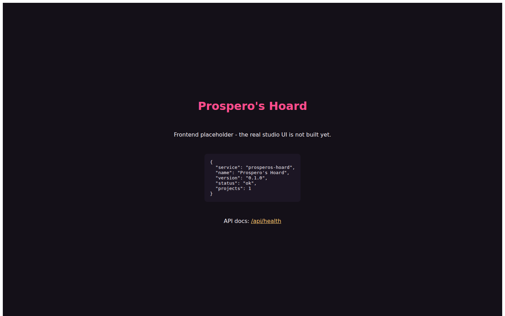
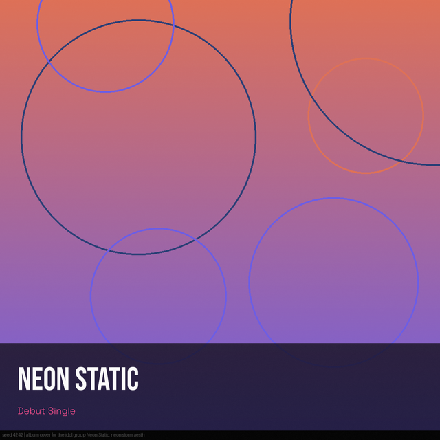
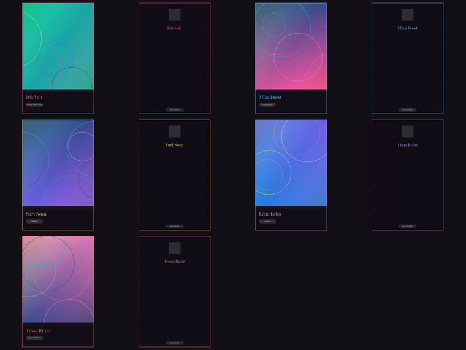

# Prospero's Hoard
### Un solo estudio, cada paso recordado - ¿podría un agente dirigir toda una producción?
**Un estudio de medios local que dirige ComfyUI, ffmpeg y TTS para construir personajes consistentes, photocards, portadas de álbum y videos musicales cortados al ritmo - a mano o enteramente por MCP.**

[English](README.md) · [Ejecutar en local](#ejecutar-en-local-en-windows) · [Conectar una IA](docs/MCP.md) · [Portfolio](https://luissalet.github.io/Portfolio/#projects)


*Aplicación real, datos de demo, backend de generación falso (la interfaz completa del estudio no se construye en esta entrega - ver "Límites" más abajo). El panel es JSON real de una instancia en ejecución con un proyecto de demo ya generado.*


*Salida real de `studio_design` (plantilla `album_cover`, variante `bottom_band`) - la pequeña leyenda grabada en la imagen indica la seed y el prompt, viene del backend de demo/pruebas, no de un generador real.*


*Salida de `studio_photocard_set`: un frente y un reverso con número de serie por cada miembro, cada uno con su propio color de acento.*

## Por qué

Hacer una producción al estilo fan-made (photocards de un grupo idol,
portada de álbum, voces de personaje, un video musical cortado a una
canción) hoy implica alternar entre un editor de nodos, un editor de
imagen, una DAW y un editor de video a mano, y ninguno recuerda cómo se
hizo cada recurso: recrear un personaje consistente significa volver a
adivinar el prompt y la seed cada vez. Un modelo de lenguaje al que se le
pide ayuda solo puede describir lo que haría; no puede ejecutar ComfyUI de
verdad, cortar un video al ritmo, ni decir la receta exacta que produjo
una imagen. Prospero convierte cada paso en una operación única, tipada y
encolable con su linaje registrado, para que un agente (o una persona)
pueda dirigir toda la producción y reproducir cualquier recurso con
exactitud.

## Qué está implementado

| Área | Disponible ahora | Límite |
| --- | --- | --- |
| Modelo de datos | Proyectos, recursos con linaje completo (receta -> reproducible), personajes/@menciones, grupos, 6 estilos predefinidos, tableros, líneas de tiempo, cola de trabajos persistente (SQLite, sobrevive un reinicio) | Sin multiusuario/autenticación - un solo usuario local, por diseño |
| Generación con ComfyUI | Plantillas txt2img/img2img/inpaint/hires/SD1.5/imagen-a-video, validación previa contra `/object_info`, estimación de VRAM + espera (nunca descarga modelos), importación de workflows personalizados en formato API con mapeo de parámetros autodetectado | Un workflow en formato UI se rechaza con un mensaje claro, no se convierte automáticamente |
| Backend de demo | Un ComfyUI falso procedimental (renders deterministas con Pillow) para que todo el pipeline funcione y se pueda probar sin GPU | Obviamente no es una generación real - cada render lleva la seed/prompt como marca de agua |
| Motor de diseño | 7 plantillas (photocard frente/reverso, portada de álbum en 3 variantes, póster teaser, tarjeta de letra, contraportada de tracklist, miniatura), 5 familias tipográficas OFL incluidas, efectos holográficos y grano, autoajuste de texto, modo imprenta/sangrado | La capa de QR se reconoce pero dibuja un recuadro de relleno - no se incluye ninguna librería de QR |
| Audio | Importación/decodificación con ffmpeg, picos de forma de onda, un detector de ritmo hecho desde cero (flujo espectral + autocorrelación + programación dinámica), letras LRC, TTS con Piper y descarga de voces bajo demanda, TTS de Hoard Link (Faustus) como alternativa | Las etiquetas de sección ("sección A/B", nivel de energía) son estimaciones, no una detección verificada de verso/estribillo; no se clona la voz de ninguna persona real, en ningún caso |
| Generación musical | Una interfaz `MusicBackend` tipada con dos adaptadores (nodos de audio de ComfyUI, un contrato HTTP mínimo documentado) | Ninguno está instalado en la máquina de referencia - ambos lo indican con claridad y explican cómo añadir uno |
| Video | Imagen a video (SVD), un renderizador de línea de tiempo real con ffmpeg (Ken Burns vía `zoompan`, transiciones corte/crossfade/negro/blanco vía `xfade`, subtítulos ASS grabados con karaoke), un algoritmo de auto-corte que coloca los cortes en el ritmo | Ken Burns usa una parametrización documentada `{zoom, pan}`, no rectángulos de recorte arbitrarios por fotograma (ver `docs/ARCHITECTURE.md`) |
| HTTP + MCP | Cada capacidad tiene un endpoint `/api/agent/*` y una tool MCP equivalente con la misma forma; middleware de protección contra ataques de navegador; un registro auditado `agent_calls` | Sin SSE/websocket - los trabajos y el registro de actividad están pensados para consultarse por sondeo (lecturas SQLite baratas) |
| Frontend | Una página placeholder mínima que demuestra que la API y el pipeline de build funcionan de punta a punta | La interfaz real del estudio (barra lateral, vistas Generar/Biblioteca/Diseñador/Audio/Línea de tiempo) es una entrega posterior separada - `docs/API.md` documenta cada ruta que necesita |

## Conectarlo a Faustus

La app se declara con `faustus-plugin.json`. Inícala y en Faustus:
**Conectores -> Apps cercanas -> Añadir**. También funciona con cualquier
cliente MCP por stdio - ver `docs/MCP.md` para el fragmento de
configuración y la tabla completa de tools.

## Ejecutar en local en Windows

Doble clic en **`Iniciar Prospero's Hoard.cmd`**, o desde PowerShell:
```powershell
scripts\start.ps1 --demo
```
Pasos manuales:
```powershell
python -m venv .venv
.venv\Scripts\pip install -r requirements-lock.txt
.venv\Scripts\pip install -e .
cd frontend; npm ci; npm run build; cd ..
.venv\Scripts\python -m prosperos_hoard --demo
```
`--demo` genera un grupo idol original (inventado), sus photocards y
portada con el backend falso, sintetiza una canción de demo real a 120
BPM y renderiza un video de vista previa cortado al ritmo, para poder
probar y capturar todo el pipeline sin tener ComfyUI instalado. Con
hardware real: apunta `data/backend.json` a tu ComfyUI (`comfy.url`) -
ver la sección `/api/backend` de `docs/API.md`.

## Arquitectura

Módulos, modelo de datos, hilos y cada desviación documentada respecto a
la especificación original: `docs/ARCHITECTURE.md`. Cada endpoint con
ejemplos de petición/respuesta: `docs/API.md`.

## Tests

```
pytest -q
```
60 tests, ~35s, completamente offline (el ComfyUI falso y una pista de
clics sintética sustituyen al hardware real). Cubre: mapeo de parámetros
de workflows y validación contra `/object_info`, rechazo de workflows en
formato UI, persistencia de la cola de trabajos tras un reinicio simulado
y la espera/reintento por VRAM, hashes deterministas del renderizador de
diseño y autoajuste de texto, el detector de ritmo contra pistas de clics
sintéticas a 90/120/140 BPM (±1 BPM, tiempos de golpe dentro de 50 ms) y
detección de secciones, invariantes del auto-corte (cortes en el ritmo,
duración mínima de clip, sin repeticiones inmediatas, cubre toda la
canción), snapshots de construcción de comandos ffmpeg más un render
real, temporización de karaoke en ASS, rechazo de path traversal en el
endpoint de archivos, y una ronda real por el protocolo MCP (el adaptador
lanzado por stdio contra la app en ejecución).

## Privacidad y límites

Solo local: escucha en `127.0.0.1`, sin telemetría, sin acceso a red
salvo lo que una función activada necesite obviamente (una descarga de
voz Piper desde Hugging Face, mostrada en la interfaz). Sin clonación de
voz de personas reales. Los datos de `--demo` usan solo personajes
inventados. Los datos viven en `data/` (ignorado por git) salvo que se
indique `--data-dir`/`PROSPERO_DATA_DIR`.
