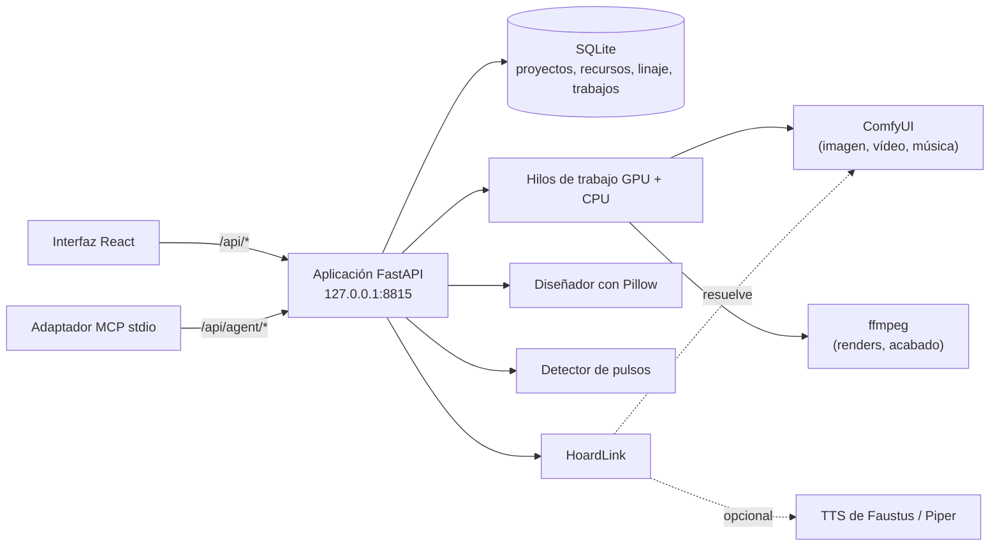

# Prospero's Hoard
### Estamos hechos de la misma materia que los sueños: ¿puede un agente dirigir una producción entera?
**Un estudio multimedia local que maneja tu ComfyUI, ffmpeg y una voz sintética local para crear personajes coherentes, photocards, portadas y videoclips montados al ritmo, a mano o por completo desde MCP, y que recuerda exactamente cómo se hizo cada recurso.**

[English](README.md) · [Inicio rápido](#inicio-rápido) · [Producción real de ejemplo](#la-ejecución-real) · [Conectar con Faustus](#conectarlo-a-faustus) · [Referencia MCP](docs/MCP.md) · [Estudio de voz](docs/VOICE.md) · [Portfolio](https://luissalet.github.io/Portfolio/#projects)


*Aplicación real, datos de demostración sintéticos. Todas las imágenes salen del backend de demostración incluido, un sustituto procedural de ComfyUI que dibuja escenas de relleno rotuladas; con tu ComfyUI conectado, las mismas pantallas muestran resultados reales de los modelos.*

## Por qué

Un modelo de lenguaje al que se le pide ayuda con una pequeña producción
musical (un grupo inventado, sus photocards, una portada, un vídeo para el
single) solo puede describir lo que haría. No puede ejecutar un grafo de
nodos, no puede mantener la cara de un personaje en cuarenta imágenes, no
encuentra el pulso de una canción y nadie sabrá después qué semilla y qué
checkpoint hicieron esa tarjeta. Hacerlo a mano obliga a saltar entre un
editor de nodos, un editor de imagen, una herramienta de audio y un editor
de vídeo que no comparten memoria.

Prospero convierte cada paso en una operación tipada, encolable y con su
receta guardada: los personajes se mencionan como `@Nombre` y su
descripción se inserta cada vez, cada recurso conserva los parámetros
exactos que lo produjeron (y se puede repetir byte a byte en el mismo
backend), las canciones se analizan para sacar tempo y secciones, y un
montaje se corta al ritmo y se renderiza con ffmpeg. El modelo local dirige;
el estudio hace el trabajo y responde con identificadores e imágenes.


*Aplicación real, datos de demostración sintéticos: el montaje automático de la canción de 30 s (120 BPM, suave-fuerte-suave), dos pulsos por plano en la parte fuerte, cuatro en las suaves, y la vista previa que renderizó con ffmpeg.*

## Casos de uso

- **Un músico independiente con un single terminado** importa la canción,
  deja que el detector de pulsos encuentre el tempo y las secciones,
  sincroniza la letra y obtiene una portada, una tarjeta de letra y un vídeo
  9:16 cortado al ritmo, sin abrir un editor de nodos ni uno de vídeo.
- **Una guionista o diseñadora de juegos con un reparto original** da a
  cada personaje un prompt de aspecto y una referencia canónica y pide
  «@Iris y @Mika entre bastidores»: vuelven las mismas caras en decenas de
  imágenes (`consistent=true`) y cada tarjeta dice qué semilla y qué
  checkpoint la hicieron.
- **Un modelo local en Faustus** al que se le pide «haz un teaser del
  single» llama a `studio_generate_image`, `studio_timeline` y
  `studio_render`, recibe identificadores cortos, solo mira una imagen cuando
  la pide y cada llamada que hace queda en **Actividad del asistente**.
- **Quien divulga para ganarse la vida** escribe un tema («por qué brilla
  el mar de noche») y recibe un short vertical narrado: un guion con gancho
  que escribe el modelo local, la locución, subtítulos que se encienden
  palabra a palabra, vídeo de archivo o imágenes generadas cortadas a lo que
  se dice, una música que se aparta bajo la voz y el título, los hashtags y
  los créditos listos para pegar.
- **Quien ya usa ComfyUI con sus propios flujos** importa la exportación en
  formato de interfaz, la ve convertida, comprobada contra la lista de nodos
  en vivo y con sus parámetros con nombre, y a partir de ahí genera con ella
  desde el estudio o desde un agente, con linaje.

## Qué hay implementado

El estudio reúne imagen y vídeo con referencias opcionales de identidad, ropa,
lugar, estilo y pose, monitor amplio, ampliación con un clic y comparación de
tomas. La mesa **Texto y tomas** permite importar TXT/LRC/SRT/VTT y vincular
frases y tiempos al storyboard; crear desde una idea sigue sin exigir guion.
Las herramientas completas permanecen en el cajón buscable. El montaje evita
rellenar silenciosamente fuentes demasiado cortas con fotogramas congelados.
Consulta [investigación y pruebas del rediseño](docs/PROSPERO_STUDIO_RESEARCH_2026-10-05.md).

| Área | Disponible ahora | Límite |
| --- | --- | --- |
| Proyectos y reparto | Proyectos, personajes (prompt de aspecto, negativo, paleta, referencia canónica, voz), **lugares y objetos** (un escenario, una calle, una guitarra: aspecto e imagen de referencia, en sus propias pestañas del Reparto), grupos ordenados, menciones `@Nombre` que reconocen nombres de varias palabras y avisan de los desconocidos, 6 estilos predefinidos. Un lugar u objeto mencionado con imagen entra en el render como referencia numerada con Qwen-Image 2.1 (la vista previa de Generar lo enseña en «Entran solas»), un segundo personaje en un plano consistente recibe su propia referencia en vez de desaparecer, el editor de planos ofrece los lugares y objetos del proyecto como botones de un clic y el planificador de vídeos los escribe en los planos como `@Nombre` | Un único usuario local; los nombres no se pueden repetir en un proyecto (son la mención); lo borrado del reparto se recupera desde la página Reparto, un grupo borrado no; como mucho 10 referencias por render; los motores de una sola referencia insertan el aspecto de los demás en el texto |
| Generación (ComfyUI) | Qwen-Image 2.1 (int8) txt2img y edición multi-referencia (1 a 10 referencias, hasta 2K nativo), SDXL txt2img, img2img, inpaint y ampliación en dos pasadas («hires fix»), ampliación con modelo (x2 o x4, familia ESRGAN) y eliminación de fondo a PNG transparente (BiRefNet) sobre cualquier imagen, SD 1.5 txt2img, SVD imagen a vídeo, FLUX.1 schnell txt2img, FLUX.1 Kontext (edición guiada por referencia), Wan 2.2 TI2V imagen a vídeo, todo como plantillas en formato API, cada una con sus propios valores de sampler y tamaño; motor de imagen `auto \| qwen21 \| flux \| sdxl` por proyecto y por llamada («auto» usa Qwen-Image 2.1 si está instalado, si no Flux, si no SDXL, e indica siempre cuál usó); el prompt entero se comprueba contra `/object_info` antes de encolarlo (nodos, cada archivo de modelo, samplers, opciones, rangos), un archivo de modelo que falta se reporta como «descárgalo», nunca como un fallo, con las opciones instaladas en el error; importador de flujos en formato de interfaz **o** API cuyo conversor coincide entrada a entrada con la exportación del propio frontend de ComfyUI 0.37 en las plantillas oficiales (subgrafos y widgets promovidos, combos dinámicos, sockets autogrow, `PrimitiveNode`/`Reroute`, bypass/mute), con mapa de parámetros editable y una copia de la lista de nodos para cuando ComfyUI está apagado; `consistent=true` mantiene el diseño exacto de un `@Personaje` vía una plantilla de edición (Qwen-Image 2.1 o Kontext, según el motor) y su referencia canónica, recortada a una pose de la hoja de referencia | Prospero no aloja ningún modelo; Kontext admite una sola referencia (Qwen-Image 2.1 hasta 10), Wan solo imagen a vídeo; ampliar necesita `RealESRGAN_x4plus.safetensors` y quitar el fondo necesita `birefnet.safetensors` en ComfyUI (ver Modelos) |
| Uso compartido de la GPU | VRAM estimada por familia de flujo (editable), comparada con la tarjeta en la que corre de verdad ComfyUI (su propio `system_stats`, donde los modelos que tiene en caché cuentan como libres; nvidia-smi si no responde); si falta memoria, el trabajo espera en `waiting_gpu` con el motivo, reintentando cada 15 s hasta 30 min; se puede cancelar en cualquier momento; un grupo de render (`render_pool` en `backend.json`, un ComfyUI por GPU) reparte los trabajos en cola entre todas las tarjetas a la vez | Nunca se descarga nada salvo que pulses «Liberar memoria de ComfyUI» |
| Linaje | Cada recurso generado guarda plantilla, hash de la plantilla, checkpoint, todos los parámetros y la semilla, entradas y tiempos; «Repetir receta» reproduce una imagen byte a byte en el mismo backend (probado), «Variar semilla» la repite con semillas nuevas | La reproducción solo está garantizada con el mismo backend, modelos y versión de ComfyUI |
| Diseño | Renderizador con Pillow, sin navegador: photocard anverso y reverso, portada de álbum (4 composiciones), cartel teaser, tarjeta de letra, contraportada con lista de canciones, miniatura, con una variante «night» de terror/thriller para portada, cartel, tarjeta de letra y contraportada; degradados, lámina holográfica, modos de fusión, viñeta, espaciado de letras, sombras, texto que se encoge para caber y columnas para la lista de canciones; sets de photocards de un grupo entero o de un solista en varios looks, con hoja de contactos; modo imprenta con 3 mm de sangrado a 300 ppp; 6 familias tipográficas incluidas | La capa QR dibuja un recuadro de relleno (no hay librería de QR fijada) |
| Audio | Importación (mp3, wav, flac, ogg, m4a), forma de onda, detector de pulsos propio (flujo espectral equilibrado por bandas, preferencia de tempo y programación dinámica) probado a menos de 1 BPM y 50 ms con metrónomos y patrones de bombo y caja de 90 a 140 BPM, estimación de tiempos fuertes y secciones, letras LRC con herramienta para sincronizarlas pulsando una tecla y una primera sincronización automática a partir de las etiquetas `[Section]` de la letra y los compases | La sincronización automática es una estimación por estructura, no alineación con la voz; las secciones se llaman «section A/B» con energía baja/media/alta, no estrofa/estribillo; las canciones muy rápidas (170 BPM) se detectan a la mitad |
| Pistas | Separa una canción en voz, batería, bajo y resto con Demucs (`htdemucs`), ejecutado con el Python propio de ComfyUI en la GPU con más memoria libre (al menos 3 GB) o, si no hay, en la CPU; Demucs se instala una sola vez en la carpeta de datos (`tools/demucs-lib`), nunca en el entorno de ComfyUI; cada pista es un recurso de audio derivado (el visor tiene una sección Pistas con reproductores), y al separar también se mezcla una versión **instrumental** (batería, bajo y resto, sin la voz) como un recurso más; el lip sync (S2V e InfiniteTalk) da al codificador de audio la voz limpia mientras el clip conserva la mezcla completa (`use_vocals=false` lo desactiva), y los efectos al ritmo pueden seguir una pista (véase Vídeo) | La primera vez instala Demucs; en CPU es lento |
| Voces | Piper TTS con diez voces seleccionadas (español, inglés, francés, italiano, portugués y alemán) que se descargan la primera vez que se usan; TTS de Faustus mediante Hoard Link con Piper como respaldo; voz y velocidad por personaje | Voces sintéticas genéricas para la narración de personajes; la clonación se hace en el estudio de voz de abajo |
| Estudio de voz | Un registro de motores TTS/STT conectables (Piper más motores de clonación locales opcionales - Coqui XTTS-v2, F5-TTS, Kokoro, Chatterbox - y un flujo de trabajo de TTS por ComfyUI opcional; faster-whisper y opcionalmente openai-whisper para voz a texto), instalados solo cuando se piden, nunca en silencio; una biblioteca de voces a partir de una muestra subida (normalización de volumen, recorte de silencios, un control de calidad de SNR/recorte, una transcripción de referencia automática, preajustes con nombre); transcripción y dictado de clips cortos con marcas de tiempo por palabra y exportación a SRT/VTT/TXT; narración de audiolibros a partir de texto o un archivo `.txt`/`.md`/`.epub` como trabajo en segundo plano reanudable (archivos por capítulo, MP3 o M4B con marcadores de capítulo, un SRT/LRC alineado); doblaje de vídeo (extraer el audio, transcribir con marcas de tiempo, traducir segmento a segmento con el modelo local y un glosario, resintetizar con la voz elegida, ajustar el ritmo al original, volver a montarlo) guardando los archivos de cada etapa para poder corregir y rehacer un solo segmento sin repetir el resto | Los motores de clonación hay que instalarlos (un `pip install` documentado, a veces con GPU); el doblaje necesita un modelo local detrás de Hoard Link para traducir y falla con un mensaje claro si no lo hay; usa solo una voz que tengas derecho a reproducir |
| Generación de música | `studio_compose` (etiquetas, letra, bpm, tonalidad, idioma) vía ACE-Step 1.5 en ComfyUI (`ComfyMusic`, se activa solo al instalar el checkpoint) o una API HTTP mínima documentada para otro servidor local; las canciones compuestas guardan linaje y se analizan automáticamente | Necesita el checkpoint de ACE-Step en ComfyUI (el single del ejemplo se compuso con ACE-Step 1.5 turbo); las canciones importadas funcionan del todo igualmente |
| Vídeo | Montaje automático al ritmo (densidad según la energía - según las marcas de estrofa/estribillo de la letra cuando las hay - destellos al inicio de cada frase musical, plano nuevo en cada sección y, si se pide, en cada verso cantado, guiones por sección en orden de historia, sin repetir plano seguido, cubre la canción entera) en un montaje editable; renderizador ffmpeg con movimientos Ken Burns, transiciones de corte, fundido, fundido a negro y destello que mantienen los cortes en el pulso, subtítulos de la letra incrustados con karaoke opcional y la canción mezclada; vista previa a 540p o final a 1080p; los clips de SVD/Wan se convierten a mp4; acabado opcional (gradación de color, grano, viñeta, barras de cine, destellos glitch en los tiempos fuertes, ocho estilos de letra - normal, terror (mayúsculas condensadas), negrita, **pop** (una palabra grande cada vez, que aparece de golpe), **pulso** (la frase entera en mayúsculas que se hincha con cada pulso), **máquina de escribir**, **manuscrita** y **cine** (serif de título de película, fundidos lentos) - y un **encuadre** para los clips de otra forma: `fill` recorta, `blur` encaja el clip sobre una copia desenfocada de sí mismo, `fit` añade barras) y **efectos al ritmo**: zoom de golpe, destello y temblor de cámara en cada golpe de bombo (detectado en los graves de la canción), en cada pulso o en cada compás, aplicados por clip para que una canción larga no genere expresiones de filtro enormes, y con la canción ya separada pueden seguir una sola pista (`source` `drums`, `bass`, `vocals` u `other`: los ataques de esa pista); panel de **Look** (en Montaje y en la página de la producción) con looks de un clic (Limpio, Club, Directo, Terror, Cine) y controles, donde aplicar un look a un vídeo terminado vuelve a renderizar solo su montaje; **Canvas de Spotify**: un bucle vertical de 8 s sin sonido del estribillo cuyo final funde con su inicio, renderizado de nuevo desde el montaje sin la letra incrustada | El Ken Burns es un rango de zoom más una dirección de desplazamiento, no rectángulos libres de inicio y fin; las gradaciones de color son aproximaciones con `eq`/`colorbalance`/`curves`, no una LUT 3D; el zoom y el temblor duplican más o menos el tiempo de render del montaje; el detector de bombo escucha la mezcla entera salvo que la canción esté separada en pistas, y entonces lee la batería; una fuente de pista antes de separar vuelve al bombo |
| Reencuadre | Cualquier imagen o clip a 9:16, 16:9, 1:1, 4:5, 2:3, 3:2 o 21:9 sin volver a generarlo: `fill` recorta alrededor del sujeto (se busca solo a partir del detalle más nítido, o en `focus_x`/`focus_y`, de 0 a 1), `blur` lo encaja sobre una copia desenfocada de sí mismo, `fit` añade barras; la calidad `preview` hace un clip a 720p; el resultado es un recurso nuevo y el original se queda (trabajo `reframe`, carril de CPU; el visor tiene una fila Reencuadrar; `studio_reframe`) | El punto de enfoque automático es el detalle más nítido de la imagen: indica `focus_x`/`focus_y` cuando se equivoque |
| Repetir un tramo de un clip | Rehace solo un tramo de un clip (`start_s`..`end_s`, como máximo ~4 s) con Wan VACE: los fotogramas justo antes y después lo guían, un prompt dice qué ocurre en él y el resultado es un clip nuevo con el tramo nuevo empalmado a los fps y con el sonido del propio clip; `draft` es Wan 2.1 VACE 1.3B (rápido), `final` es Wan 2.2 Fun VACE 14B (expertos de ruido alto y bajo) con los LoRA lightx2v de 4 pasos; trabajo `retake` (carril de GPU), plantillas `wan21_vace_retake` y `wan22_vace_retake`; el visor tiene una fila «Rehacer un tramo»; `POST /api/assets/{id}/retake`, `studio_retake` | Los modelos VACE están instalados pero todavía no se han ejecutado en una GPU real (las tarjetas estaban ocupadas): solo los ha renderizado el ComfyUI falso de las pruebas; si falta un modelo da `no_vace`; un tramo va de 0,25 s a ~4 s |
| Editar un clip con una instrucción | Rehace un clip entero a partir de una instrucción («que sea de noche», «ponle un abrigo rojo», «cambia la guitarra por un violín», «conviértelo en acuarela») con Bernini-R, un renderizador Wan afinado para editar vídeo, a través del nodo básico de ComfyUI `BerniniConditioning`: hasta 5 s del clip (81 fotogramas a 16 fps en un lienzo de 480p, 848x480 / 480x848 / 640x640 según la orientación) se redibujan siguiendo la instrucción y el movimiento se mantiene, un clip de más de 5 s se edita por ventanas desde `start_s` y la ventana se empalma de nuevo, y el resultado es un clip nuevo con el tamaño, los fps y el sonido del original (`recipe.operation = "clip_edit"`, `recipe.edit_of`); `mode` `auto` (un primer fotograma editado propaga, las imágenes hacen una edición con referencias, y si no una edición normal), `edit` (sustituir, añadir, quitar, recolorear), `restyle` (otro aspecto, luz, colores o un cambio de pose), `reference` (hasta 4 imágenes llamadas image0, image1... en el texto; el `@Nombre` de un miembro del reparto con imagen se reescribe como «la persona de image0») o `propagate` (el primer fotograma de la ventana, editado como imagen - `studio_video_frames` con `at_s` lo saca - guía el resto); `draft` es Bernini-R 1.3B (plantilla `wan21_bernini_edit`), `final` son los expertos Bernini-R de Wan 2.2 A14B con el LoRA de destilación de pasos lightx2v (plantilla `wan22_bernini_edit`); salvo con `exact=true`, la instrucción se reescribe en el párrafo «qué cambia / qué se queda igual» con el que se entrenó el modelo (el modelo de visión mirando 3 fotogramas de la ventana si lo hay y, si no, el modelo de lenguaje con el prompt del propio clip; sin ninguno va tal cual, `how: "no_model"`) y «Ver la instrucción» en el visor la enseña antes de renderizar; trabajo `clip_edit` (carril de GPU); el visor tiene una sección «Editar el clip con una instrucción»; una edición del clip de un plano de una producción es una toma de ese plano (insignia «editado»); un nodo de espacio «Editar clip» (`clip_edit`); `POST /api/assets/{id}/clip-edit`, `studio_clip_edit` | Los modelos Bernini-R todavía no se han ejecutado en una GPU real (las tarjetas están ocupadas con un modelo de lenguaje): solo los ha renderizado el ComfyUI falso de las pruebas; si faltan modelos da `no_bernini`; como máximo 5 s por ventana, 4 imágenes y un lienzo de 480p; `first_frame_required`, `reference_required` y `clip_too_short` en los demás casos |
| Producciones y recetas | Un videoclip entero como un solo trabajo reanudable y con puntos de control (protagonista y su hoja de referencia, canción, fotogramas, sincronización de la letra, clips de Wan, photocards, arte del single, el montaje y sus renders, un `REPORT.md`) que encola sus fotogramas y clips como trabajos normales, así que un pool de render los reparte entre todas las tarjetas; «cambiar planos» (otra variante, clip sí o no, otro prompt u otra semilla) rehace solo lo que depende de ellos. Una producción terminada - hecha en la app o con el script de producción - se convierte en una **receta** con el protagonista abstraído en un hueco de reparto `{lead}`; «Recrea esto con…» la ejecuta con otro personaje del estudio o con una descripción nueva, reutilizando la canción y los fotogramas y clips en los que no sale el protagonista; un protagonista de otro proyecto entra en el reparto del proyecto del vídeo en cuanto se crea la producción; un plano puede **continuar desde** otro anterior (su clip empieza en el último fotograma de ese clip y acaba en su propio fotograma: una toma continua, que se rehace sola cuando cambia el clip de origen); los **clips borrador** (`clip_quality: draft`) se renderizan rápido con el modelo 5B y «Pasar N borradores a final» los vuelve a renderizar con el 14B y las mismas semillas; los **planos aprobados (bloqueados)** no cambian, y «Clips nuevos para el resto» / «Fotogramas nuevos para el resto» rehacen solo los no aprobados con semillas nuevas; **Reencuadrar** añade formas de montaje (9:16, 16:9, 1:1) y un encuadre y solo vuelve a renderizar el montaje (la tarjeta «Otros formatos» en la pestaña Ver de la producción); **tomas**: se guarda cada juego de fotogramas y cada clip que ha tenido un plano (hasta 12 por plano), la fila Tomas del editor de planos compara dos lado a lado y «Usar esta» la devuelve (un fotograma trae de vuelta su juego y descarta los clips hechos con el otro fotograma; un clip sustituye al actual; una continuación elegida a mano se queda) y las repeticiones de un tramo y las ediciones de un clip aparecen como tomas de su plano (`studio_production_takes` y luego `take` en `studio_production_shots`) | El script de producción no guarda el ritmo del montaje (pulsos por plano), así que una receta exportada de una ejecución del script usa los valores por defecto; los prompts que describen objetos del protagonista anterior se señalan, no se reescriben; el fotograma final de un plano continuado necesita el modelo de primer a último fotograma (si no, se descarta) y los borradores no llevan fotograma final |
| Animático | Antes de los clips caros (cada clip de Wan de 5 s tardó unos 9,5 min en la ejecución real), la producción corta sus fotogramas justo donde cortará el montaje final - el mismo montaje automático sobre la misma toma de la canción, las mismas marcas de letra y sección y las mismas opciones - con un movimiento Ken Burns y un fundido por plano, subtítulos y acabado, renderizado a 720p en cada formato previsto, más un `plan.json` (cada corte, el tiempo en pantalla y el fotograma de cada plano, qué planos serán clips de Wan, los minutos de GPU estimados); la producción se detiene en `awaiting_review` hasta **Continuar** (o sigue sola con `animatic_autocontinue`), y **Cambiar planos** cambia fotogramas, activa o quita clips o reescribe un plano antes | El animático funde todos los cortes (el final conserva sus destellos y glitches); los minutos de GPU son estimaciones con los tiempos de la ejecución real (configurables) |
| Director de calidad | Una revisión de las salidas de una producción, por etapa o de todas, durante la producción tras cada etapa (`settings.qa.enabled`) o cuando se pida: fotogramas planos o con ruido, bandas negras o rojas en un borde (la franja de ffmpeg 8), saltos de exposición dentro de un clip, movimiento donde se pidió quietud (o un clip congelado), una cabeza de photocard que toca el borde superior, cobertura de la letra de un LRC alineado, duraciones frente a lo previsto; con un modelo de visión detrás de Hoard Link cada salida recibe además una nota de 0 a 10 contra la biblia, el prompt del plano y la referencia, con una línea de motivo. Los fotogramas, clips y photocards que fallan se regeneran con otra semilla y un arreglo concreto (ruido -> denoise 1, salto de exposición -> otro sampler, caminar -> el negativo de quietud, cabeza cortada -> aire arriba), hasta un límite de reintentos, y cada reintento queda en el historial y en REPORT.md | Las comprobaciones son heurísticas con umbrales editables, no un crítico entrenado; sin modelo de visión solo corren las comprobaciones sin modelo (nunca bloquea); una producción hecha con el script se revisa en solo lectura |
| Kit de personaje | Cada personaje lleva un kit: **hoja de modelo** (la canónica redibujada por el motor de edición desde hasta 12 vistas fijas - frente, tres cuartos, perfil, espalda, primer plano, expresiones, acción, sentado, noche - etiquetadas por vista y con hoja de contacto rotulada); **dataset** formado por la canónica, las referencias, la hoja y las buenas tomas, con descripciones que nombran una palabra disparadora y solo describen lo que cambia, un informe de preparación (pocas imágenes, borrosas, casi duplicadas, descripciones sin la palabra, vistas que faltan) y descripciones automáticas con el modelo de visión; **entrenamiento LoRA local** con un entrenador configurable (`ai_toolkit`, `musubi`, un comando propio o el entrenador de demostración), un plan ajustado al dataset (pasos, rango, lr, 512 px por defecto, VRAM y minutos estimados), la GPU más libre, registro en vivo y el resultado instalado en la carpeta de loras de ComfyUI; **adaptadores** por arquitectura (Qwen-Image, Flux, SDXL, SD 1.5, Wan 2.2 5B, Z-Image) que se cargan solos - con la palabra disparadora - cada vez que se menciona al personaje con un motor compatible, guardados en la receta para que reutilizar y variar los reproduzcan, y `prefer_adapter` para posturas libres en vez de editar la canónica; **tomas**: cada render del personaje agrupado por plano (toma N de M), con una nota de parecido 0-10 contra las referencias (modelo de visión o, si no hay, una comprobación aproximada por color que lo dice), que se puede ascender a canónica, referencia o dataset, o descartar; un paquete portátil **`.hoardchar`** (aspecto, voz, paleta, imágenes, hoja, dataset con descripciones, pesos LoRA) y una **biblioteca de reparto** global con versiones, que sirve como protagonista de una receta | Entrenar requiere un entrenador instalado y el modelo base de la arquitectura; VRAM y tiempo son estimaciones; la comprobación aproximada solo detecta derivas de color o vestuario |
| Shorts narrados | Un tema (el guion - gancho, 5-9 bloques con un prompt de imagen y palabras de búsqueda en inglés cada uno, título, descripción, hashtags - lo escribe el modelo local a través de Hoard Link) o tu propio guion se convierte en un vídeo vertical como una producción reanudable: cada frase locutada (una voz del estudio de voz, Piper o el TTS de Faustus) con sus tiempos exactos, los tiempos de cada palabra desde el reconocimiento de voz alineados sobre las palabras del propio guion (o una estimación por sílabas), un plan de planos sobre el reloj de la locución relleno con vídeo de archivo o imágenes generadas (`auto`/`stock`/`generate`/`mix`, generando cuando no encuentra nada), clips de Wan opcionales tras revisar un animático, una música (ninguna, un recurso, una instrumental de ACE-Step o una pista de `data/music/`) que se aparta bajo la voz con un compresor sidechain, -14 LUFS, subtítulos «bold» con la palabra dicha resaltada, cada formato renderizado y un `publish.txt` con título, descripción, hashtags y los créditos del metraje; pausa opcional para leer el guion, edición del guion que rehace solo lo que depende de él (la música se conserva) y de 2 a 8 variantes en una llamada | Los datos del guion son del modelo: léelo (`settings.script_review`) antes de publicar; sin reconocimiento de voz el tiempo de cada palabra es una estimación; no sube nada a las plataformas |
| Vídeo de archivo | Búsqueda en Pexels y Pixabay (vídeos o fotos, filtrados por orientación y duración) con una clave gratuita por proveedor, el fichero más pequeño que alcanza la resolución del render, importado con proveedor, autor, página y licencia en su receta, y las líneas de crédito a partir de ahí | Necesita clave (Ajustes > Vídeo de archivo); los resultados dependen de palabras clave en inglés |
| Espacios (lienzo de nodos) | Un lienzo por proyecto (Espacios en la barra lateral) donde se conectan nodos de texto, medios, reparto, imagen, clip, canción, asistente, retoque, unir clips, capas, editar clip, lista y nota con conexiones tipadas y de colores (texto azul, imagen morado, clip verde, audio naranja): una imagen recibe prompts, hasta 10 referencias, un mapa de **pose** (la postura que copiar) y un mapa de profundidad de **composición** (`layout`, la composición que mantener), ambos como referencias extra con su nota, un clip recibe imágenes de inicio (un clip por cada una), una imagen **final** (`end`: un clip de primer a último fotograma con Wan 2.2 14B, plantilla `wan22_flf2v`), un prompt, un clip de movimiento que copiar o una canción que cantar (lip sync, con «Elegir frase»: se transcribe la canción y una frase cantada fija dónde empieza y cuánto dura; el motor de canto es `auto`, `s2v` para frases cortas de hasta 19 s o `infinitetalk` para las largas, hasta 90 s en ventanas encadenadas, y `auto` usa InfiniteTalk a partir de 10 s si está instalado; el clip cantado se recorta a la duración exacta de la frase); el **asistente** escribe un texto o una lista con el modelo local, y los textos que llegan de una lista o de un asistente en modo lista **se reparten** (un render por elemento); un clip entrega también el **último fotograma** de cada clip, para que el plano siguiente empiece donde acabó el anterior, y **Unir clips** los pone en orden con una canción debajo; **Retoque** reescala ×2/×4, quita fondos o saca un **mapa de pose** (esqueleto SDPose, plantilla `control_pose`) o un **mapa de profundidad** (Depth Anything 3, plantilla `control_depth`); **Variaciones** convierte una imagen en 2-9 que cambian una sola cosa (ángulos, expresiones, edades, iluminación, un storyboard o tu propia lista, un cambio por línea); **Capas** pone hasta 8 imágenes o clips encima de un fondo (una salida por fondo; por capa, una mezcla - normal, pantalla, multiplicar, superponer, sumar, aclarar, oscurecer, luz suave, diferencia - una opacidad, una escala como parte del ancho del fondo, un centro x/y y una clave de negro o de blanco; un clip si alguna entrada es un clip y, si no, una imagen; con ffmpeg); **Editar clip** rehace cada clip conectado a partir de una instrucción (entradas `clip`, `prompt`, hasta 4 imágenes en `refs` y un primer fotograma editado en `first`; `mode`, `quality`, `start_s`; Bernini-R, plantillas `wan21_bernini_edit` y `wan22_bernini_edit`); un **Grupo** es un marco con color, título y tamaño ajustable cuyos nodos viajan con él al arrastrarlo; las imágenes y los clips tienen opciones de **cámara** (plano, ángulo, movimiento, lente, luz, composición de la guía de cine); una ejecución recorre el grafo por oleadas, así que los generadores independientes se renderizan a la vez en todas las GPU, la imagen de arriba alimenta al clip de abajo en la misma ejecución, «Ejecutar» se salta los nodos que no han cambiado, «Ejecutar hasta aquí» (botón en la cabecera del nodo) ejecuta ese nodo y los nodos desactualizados que lo alimentan y **Parar** cancela una ejecución y sus renders; una **estimación** en la barra de herramientas («≈ N min · M renders», a partir de los tiempos de render anteriores de este ordenador, mediana por plantilla, con una cuenta aproximada para los nodos que esperan a generadores previos); desmarca una toma y deja de pasar a los nodos siguientes; las ejecuciones anteriores se pueden recuperar; suelta una conexión en un hueco vacío para añadir un nodo que encaje, clic derecho para añadir, suelta archivos para importarlos; «Mejorar» reescribe un prompt con el modelo local respetando los `@nombres`, las etiquetas `<imageN>` y el diseño del reparto; guardado con versiones (un asistente que edita el mismo espacio nunca se pisa), plantillas (película con referencias, plano cantando, corto a partir de una idea, en blanco), espacios borrados recuperables; **Modo app**: marca nodos de texto, medios y reparto como entradas y generadores como salidas (botones en la cabecera del nodo, con una etiqueta de campo opcional) y el espacio se ejecuta como un formulario sencillo (el interruptor App de la barra de herramientas o el botón App de la lista de espacios); las **técnicas**: un espacio, o uno de sus grupos, se exporta como técnica portátil (nodos y conexiones, con los nodos de medios vaciados, los de reparto guardados por nombre y los modelos que necesita; botón de exportar en la barra de herramientas y en la cabecera de cada grupo) y «Importar técnica» en la lista de espacios crea un espacio nuevo o la añade a uno, enlazando el reparto por nombre y listando lo que falta por rellenar; el cuadro **Construir** de la barra de herramientas toma una frase y el modelo local añade los nodos y las conexiones (un `@Nombre` que nadie del reparto responde se escribe como palabras normales); los asistentes montan, editan, estiman, ejecutan y paran espacios, y los usan como apps, con `studio_spaces` | Los generadores son los del estudio (Qwen-Image, Wan 2.2, S2V, InfiniteTalk, Animate, ACE-Step, SDPose, Depth Anything 3); los mapas de pose y profundidad, InfiniteTalk y los clips de primer a último fotograma necesitan sus modelos instalados (ver Modelos); una ejecución a la vez por espacio; Construir, el asistente y «Mejorar» necesitan un modelo local detrás de Hoard Link; la estimación es aproximada hasta que una plantilla se ha renderizado en este ordenador |
| Guía de cine | Una guía del lenguaje de la cámara (Guía de cine en la barra lateral): 57 entradas - tipos de plano, ángulos, movimientos de cámara, lentes y foco, luz y composición - cada una con su dibujo (los movimientos, el cambio de foco y otros, animados), qué es, cuándo usarlo y las palabras en inglés que entiende el modelo; «Copiar» y «Usar en Generar»; en cualquier cuadro de prompt (Generar, el editor de planos, los nodos de un espacio) escribir `/` la abre ahí: `/plano`, `/shot`, `/angulo`, `/movimiento`, `/lente`, `/luz`, `/composicion` o un nombre (`/contrapicado`, `/primer`) muestra lo que coincide con su dibujo e Intro escribe las palabras en el prompt; `studio_cinema` da a los asistentes el mismo vocabulario y `camera={...}` en un render lo añade | Las palabras guían al modelo; no garantizan el encuadre |
| Control por agentes | 89 herramientas MCP equivalentes a `/api/agent/*` (76 del estudio, 7 de ellas para el kit de personaje y 3 para shorts y vídeo de archivo, más 9 del estudio de voz y 4 para las demás apps de la familia Hoard), resultados compactos con identificadores, imágenes solo cuando se piden explícitamente (`include_image=true`), errores con código y siguiente paso, y un registro auditable «Lo que hizo el asistente» | Las herramientas MCP consultan los trabajos (`studio_job`/`voice_job` puede esperar en el servidor); el hub de la familia oye además los eventos de trabajo |
| Interfaz | Estudio en React: Resumen, Reparto (con el Kit de cada personaje: resumen, hoja de modelo, dataset, entrenamiento, tomas; importación de paquetes y biblioteca), Generar, Biblioteca con visor, Diseño, Audio, Montaje, Tableros, Espacios (el lienzo de nodos), Guía de cine, Vídeos (los videoclips y shorts de cada proyecto) y Producciones (todos, con Recetas y Nuevo short), Voz, Trabajos, Backends, Actividad del asistente y Ajustes (con las claves de vídeo de archivo); tema oscuro y claro, español e inglés, atajos de teclado (Escape cierra solo el diálogo de encima); un proyecto sin portada elegida enseña su imagen favorita más reciente («Elegir portada» en su Resumen); «Mejorar» (el modelo local reescribe un prompt) junto al prompt en Generar, en el editor de planos del storyboard y en los espacios; Audio analiza una canción en cuanto se elige, con las secciones de su letra sincronizada si la tiene; los mensajes del servidor, los nombres de los trabajos y los errores salen en el idioma de la app | El montaje se edita por planos (duración, transición, cámara, orden, sustitución), no fotograma a fotograma |


*Aplicación real, datos de demostración sintéticos: el set de photocards de los cinco miembros inventados, abierto en el visor con su receta y sus entradas.*


*La aplicación real, con datos sintéticos de demostración: el espacio «Película con referencias» tras una ejecución - tres fichas alimentan un fotograma por sus referencias, el fotograma arranca un clip borrador y el texto de estilo llega a ambos.*

## Modelos

| Familia | Checkpoint / archivos | VRAM (aprox.) | Mejor para |
| --- | --- | --- | --- |
| Qwen-Image 2.1 (int8) | `qwen_image_2.1_int8_convrot.safetensors` (difusión), `qwen3vl_8b_int8_convrot.safetensors` (encoder de texto), `qwen_image_2.1_vae_bf16.safetensors` (VAE) | ~7,3 GB + 9,4 GB cargados uno tras otro; pico ~10-12 GB a 1 MP, más a 2K nativo | Mejor fidelidad al prompt, tipografía dentro de la imagen, identidad multi-referencia (1-10 imágenes) |
| FLUX.1 schnell | `flux1-schnell-fp8.safetensors` | ~13 GB | Bocetos más rápidos (4 pasos) |
| FLUX.1 Kontext dev | `flux1-dev-kontext_fp8_scaled.safetensors` + CLIP/VAE | ~13 GB | Edición con una sola referencia |
| SDXL / SD 1.5 | `sd_xl_base_1.0.safetensors` / `v1-5-pruned-emaonly-fp16.safetensors` | ~7 GB / ~3,5 GB | Alternativa siempre disponible, boceto con poca VRAM |
| SVD | `svd_xt.safetensors` | ~10 GB | Imagen a vídeo corto |
| Wan 2.2 TI2V (5B) | `wan2.2_ti2v_5B_fp16.safetensors` + VAE | ~12 GB | Imagen a vídeo, 1280x704 nativo |
| Wan 2.2 I2V 14B (fp8) | `wan2.2_i2v_high_noise_14B_fp8_scaled.safetensors` + `wan2.2_i2v_low_noise_14B_fp8_scaled.safetensors`, LoRAs lightx2v de 4 pasos, `umt5_xxl_fp8_e4m3fn_scaled.safetensors`, `wan_2.1_vae.safetensors` | ~10 GB (descarga el resto) | Movimiento real y movimientos de cámara (órbita, grúa, acercamiento) desde un fotograma, 832x480 / 480x832, 5 s a 16 fps en ~2,5 min |
| Wan Animate 2 (destilado) | `wan_animate_2_distill_fp8_e4m3fn.safetensors` (una conversión fp8 del bf16 oficial, ver abajo; la versión int8 también funciona pero se arrastra cuando no cabe en VRAM), `clip_vision_h.safetensors`, `Wan2_1_VAE_bf16.safetensors` | una tarjeta de 16 GB (los trabajos esperan a una; en 12 GB tarda minutos por paso) | Transferencia de movimiento: el personaje de un fotograma hace el movimiento de un vídeo guía (un baile, una acrobacia), ~9 min por 3 s en 16 GB |
| Wan 2.2 S2V 14B (fp8) | `wan2.2_s2v_14B_fp8_scaled.safetensors`, `wav2vec2_large_english_fp16.safetensors` (codificador de audio), `wan2.2_t2v_lightx2v_4steps_lora_v1.1_high_noise.safetensors`, `umt5_xxl_fp8_e4m3fn_scaled.safetensors`, `wan_2.1_vae.safetensors` | una tarjeta de 16 GB | Labios sincronizados: el personaje de un fotograma canta o habla un tramo de audio, 832x480 a 16 fps; unos 5 min por 4,8 s en una 5060 Ti de 16 GB; los versos largos encadenan extensiones (hasta 4, unos 19 s) |
| Wan 2.1 InfiniteTalk 14B (480p) | `wav2vec2-chinese-base_fp16.safetensors` (codificador de audio), `wan2.1_infiniteTalk_single_fp16.safetensors` (parche del modelo), `Wan2_1-I2V-14B-480p` fp8 y el LoRA lightx2v I2V 480p | una tarjeta de 16 GB | Lip sync largo: hasta 90 s en ventanas encadenadas (plantilla `wan21_infinitetalk`); un clip de Espacios con canción lo elige a partir de 10 s si está instalado (`auto`) |
| Wan 2.2 primer-último fotograma (14B) | plantilla `wan22_flf2v` | una tarjeta de 16 GB | Un clip que empieza en una imagen y acaba en otra (la entrada `end` de un clip de Espacios, los planos continuados de una producción) |
| Wan 2.1 VACE 1.3B (repetición en borrador) | `wan2.1_vace_1.3B_fp16.safetensors`, `umt5_xxl_fp8_e4m3fn_scaled.safetensors`, `wan_2.1_vae.safetensors` (plantilla `wan21_vace_retake`) | sin medir todavía | Rehacer rápido un tramo de un clip (hasta ~4 s); instalado, aún sin ejecutar en una GPU real |
| Wan 2.2 Fun VACE 14B (repetición final) | `wan2.2_fun_vace_high_noise_14B_fp8_scaled.safetensors` + `wan2.2_fun_vace_low_noise_14B_fp8_scaled.safetensors`, LoRA lightx2v de 4 pasos (`wan2.2_t2v_lightx2v_4steps_lora_v1.1_*`), `umt5_xxl_fp8_e4m3fn_scaled.safetensors`, `wan_2.1_vae.safetensors` (plantilla `wan22_vace_retake`) | una tarjeta de 16 GB | Rehacer un tramo de un clip con calidad final; instalado, aún sin ejecutar en una GPU real |
| Bernini-R 1.3B (edición de clip en borrador) | `wan2.1_bernini_1.3B_fp16.safetensors`, `umt5_xxl_fp8_e4m3fn_scaled.safetensors`, `wan_2.1_vae.safetensors` (plantilla `wan21_bernini_edit`; uni_pc, 30 pasos, cfg 4, shift 5) | sin medir todavía | Edición rápida de un clip a partir de una instrucción (hasta 5 s por ventana); aún sin ejecutar en una GPU real |
| Bernini-R 14B (edición de clip final) | `wan2.2_bernini_r_high_noise_fp8_scaled.safetensors` + `wan2.2_bernini_r_low_noise_fp8_scaled.safetensors`, LoRA `lightx2v_T2V_14B_cfg_step_distill_v2_lora_rank64_bf16.safetensors` (3.0 en ruido alto, 1.5 en bajo), `umt5_xxl_fp8_e4m3fn_scaled.safetensors`, `wan_2.1_vae.safetensors` (plantilla `wan22_bernini_edit`; 6 pasos partidos en 3, cfg 1, res_multistep) | una tarjeta de 16 GB | Edición de un clip con calidad final a partir de una instrucción; aún sin ejecutar en una GPU real |
| SDPose cuerpo entero | `sdpose_wholebody_fp16` en `ComfyUI/models/checkpoints/` | ~3 GB | Mapa de pose (esqueleto) de una imagen (plantilla `control_pose`) |
| Depth Anything 3 | `depth_anything_3_mono_large` en `ComfyUI/models/geometry_estimation/` | ~3 GB | Mapa de profundidad de una imagen (plantilla `control_depth`) |
| ACE-Step 1.5 | `ace_step_1.5_turbo_aio.safetensors` | ~8 GB | Composición de canciones con voz |
| Real-ESRGAN x4 | `ComfyUI/models/upscale_models/RealESRGAN_x4plus.safetensors` | ~2,5 GB | Ampliar x2 o x4 cualquier imagen |
| BiRefNet | `ComfyUI/models/background_removal/birefnet.safetensors` | ~3,5 GB | Quitar el fondo, PNG con transparencia |

Wan Animate 2 se publica en bf16 (33 GB) e int8: convierte el bf16 a fp8 con
`python -m prosperos_hoard.devtools.cast_fp8 wan_animate_2_distill_bf16.safetensors
ComfyUI/models/diffusion_models/wan_animate_2_distill_fp8_e4m3fn.safetensors`
(con el Python de ComfyUI, que trae torch; solo los pesos de los bloques, un
minuto); Prospero carga el fp8 cuando existe. Una plantilla puede pedir el
tamaño de tarjeta que necesita (`min_card_mb`): con varios servidores, el
trabajo espera a uno cuya tarjeta lo aguante y los demás siguen con el resto.
Animate renderiza 3 s (73 fotogramas a 24 fps) por defecto: en una tarjeta
de 16 GB 81 fotogramas ya se salen de la VRAM y se arrastran. El lanzador
de Prospero arranca ComfyUI sin descarga a disco (un modelo grande pasa
desde la RAM, no desde el disco, en cada paso); en Windows, en una tarjeta
que también usan apps de escritorio, `"comfyui": {"args": ["--reserve-vram",
"2.5"]}` en `~/.hoard/backends.json` evita que empujen el render a memoria
compartida.

El parámetro `engine` de `studio_generate_image` (y el ajuste `image_engine`
de cada proyecto) elige entre las familias de imagen: `auto` (por defecto)
usa Qwen-Image 2.1 si sus clases de nodo y sus archivos de modelo están
instalados, si no Flux schnell, si no SDXL - el resultado siempre dice cuál
usó realmente. Un `template` explícito siempre gana a `engine` cuando se
dan los dos. Cómo el conversor pasa la exportación en formato de interfaz
de cada plantilla al formato API de arriba, y cómo se reporta un archivo de
modelo que falta: [docs/ARCHITECTURE.md](docs/ARCHITECTURE.md).

### Ampliar y quitar el fondo

Dos ediciones de `studio_edit_image` (y los botones del visor **Ampliar ×2**,
**Ampliar ×4** y **Quitar fondo**) que usan solo nodos del núcleo de ComfyUI,
sin prompt, sobre cualquier imagen:

- `upscale` amplía con un modelo de la familia ESRGAN (plantilla
  `esrgan_upscale`). El modelo trabaja a 4x y el resultado se reduce al
  `scale` pedido, 2 o 4 (por defecto 2). Cualquier otro valor se rechaza
  (`bad_parameter`), igual que un resultado de más de 8192 px por lado
  (`too_large`; el mensaje da el tamaño de origen y el máximo). `model` puede
  nombrar otro archivo instalado en `upscale_models`; por defecto
  `RealESRGAN_x4plus.safetensors`. Una imagen con transparencia (un recorte)
  usa `esrgan_upscale_alpha`, que devuelve el alfa original al nuevo tamaño:
  el recorte sigue siendo un recorte.
- `remove_background` recorta el sujeto con BiRefNet (plantilla
  `birefnet_remove_background`, el mismo grafo que el blueprint «Remove
  Background (BiRefNet)» del propio ComfyUI) e importa un PNG que conserva el
  canal alfa. El archivo es `birefnet.safetensors`, salvo que `backend.json`
  indique otro en `"bg_removal_model"`.

Las dos producen siempre una imagen y guardan el origen en la receta
(`edit_image:upscale`, `edit_image:remove_background`). Los modelos no vienen
incluidos; colócalos aquí (carpetas relativas a tu instalación de ComfyUI):

| Archivo | Carpeta | Origen |
| --- | --- | --- |
| `RealESRGAN_x4plus.safetensors` | `ComfyUI/models/upscale_models/` | https://huggingface.co/Comfy-Org/Real-ESRGAN_repackaged |
| `birefnet.safetensors` | `ComfyUI/models/background_removal/` | https://huggingface.co/Comfy-Org/BiRefNet |

Si falta un archivo, el trabajo falla con `model_missing`, indicando la carpeta
y los archivos que ComfyUI sí lista. Ambos nodos requieren un ComfyUI reciente
(el cargador de eliminación de fondo no existe en versiones antiguas); una
versión anterior avisa de los nodos que faltan. Las estimaciones de VRAM son
2500 MB (`esrgan`) y 3500 MB (`birefnet`), editables como las demás.

## Inicio rápido

```
git clone https://github.com/Luissalet/ProsperosHoard.git
cd ProsperosHoard
```

Hace falta Python 3.11 o posterior (se recomienda 3.13), Node.js 22 para la
interfaz y ffmpeg en el PATH (si no, se usa el binario incluido en
`imageio-ffmpeg`). ComfyUI es opcional: `--demo` lo ejecuta todo contra un
sustituto procedural.

### Windows

Haz doble clic en **`Iniciar Prospero's Hoard.cmd`** (o ejecuta
`scripts\start.ps1`). La primera vez crea `.venv` con Python 3.13, instala
`requirements-lock.txt`, compila la interfaz con npm y abre
http://127.0.0.1:8815; las siguientes veces solo reinstala si cambió el
archivo de bloqueo. **`Detener Prospero's Hoard.cmd`** la para (solo después
de comprobar que el puerto es de verdad de Prospero).

Pasos manuales:

```powershell
C:\Python313\python.exe -m venv .venv
.venv\Scripts\python.exe -m pip install -r requirements-lock.txt
cd frontend; npm ci; npm run build; cd ..
.venv\Scripts\python.exe -m prosperos_hoard            # datos reales en .\data
.venv\Scripts\python.exe -m prosperos_hoard --demo     # datos de demostración en .\data-demo
```

### Linux / macOS

```bash
python3 -m venv .venv
.venv/bin/python -m pip install -r requirements-lock.txt
(cd frontend && npm ci && npm run build)
.venv/bin/python -m prosperos_hoard --demo --no-browser
```

La primera ejecución con `--demo` prepara sus datos (alrededor de un minuto
con dos CPU) antes de que el servidor responda. Después abre
<http://127.0.0.1:8815> (`curl http://127.0.0.1:8815/api/health` responde
`"service": "prosperos-hoard"`).

Opciones: `--port`, `--data-dir` (o `PROSPERO_DATA_DIR`), `--demo` y
`--no-browser`. `PROSPERO_ALLOWED_HOSTS` (separados por comas) deja que la API responda a un nombre de la red local o de la tailnet. `--demo` arranca el backend procedural de demostración (con `PROSPERO_DEMO_MOTION=1` su ComfyUI falso lista además los modelos de vídeo grandes - Wan 14B, VACE, Bernini-R - para poder probar esas funciones) y
crea un grupo original de cinco miembros con retratos, fotos en el
escenario, una portada, un set de photocards, una canción sintética de 30 s
con la letra sincronizada y un montaje automático, y renderiza su vista
previa. Para usar tu ComfyUI, déjalo en 127.0.0.1:8188 (Hoard Link lo
encuentra) o pon su URL en Ajustes. Si la GPU la comparte un modelo de
lenguaje, los renders van mucho más lentos; `PROSPERO_COMFY_TIMEOUT_S` sube
cuánto puede tardar un trabajo (por defecto: vídeo 1 h, audio 30 min, imagen 20 min).


*Aplicación real, datos de demostración sintéticos: la canción sintética analizada con el detector de pulsos integrado, con la estimación de secciones y la letra LRC sincronizada.*

## Conectarlo a Faustus

Prospero's Hoard es un plugin de [Faustus](https://github.com/Luissalet/Faustus),
el espacio de trabajo de IA local, y se declara con
[`faustus-plugin.json`](faustus-plugin.json). Arráncala y, en Faustus, abre **Connectors -> Nearby apps -> Add**:
Faustus la encuentra en el puerto 8815, lee el manifiesto y lanza el
adaptador MCP (`prosperos_hoard/mcp_server.py`, stdio). El backend de
modelos es compartido: el estudio pregunta a Hoard Link qué ComfyUI y qué
TTS están ya en marcha en vez de cargar nada propio.

### Herramientas MCP

| Herramienta | Qué hace | Solo lectura |
| --- | --- | --- |
| `studio_status` | Backends, checkpoints, VRAM libre, cola | sí |
| `studio_services` / `studio_service_start` / `studio_service_stop` | Ver, arrancar y parar los servidores locales (ComfyUI, el grupo de render, Ollama) sin Faustus | sí / no / no |
| `studio_gpu_memory` | Qué tiene cada GPU y qué servidor lo ocupa, frente a lo que necesita cada motor de imagen | sí |
| `studio_video_plan` / `studio_video_from_plan` | Proponer un videoclip a partir de un concepto (planos, sonido y letra en el idioma elegido, y después una revisión de director que reescribe los planos débiles) y arrancarlo desde el borrador editado | no / no |
| `studio_delete_assets` / `studio_trash` | Mandar resultados malos a la papelera (rechazado si están en uso salvo `force`); listar, recuperar o vaciar la papelera | no / no |
| `studio_projects` / `studio_create_project` | Listar o crear producciones | sí / no |
| `studio_cast` | Listar, crear y editar personajes y grupos | no (listar sí lo es) |
| `studio_generate_image` | Encolar txt2img/edición con @menciones, estilos y motor de imagen | no |
| `studio_edit_image` | img2img, inpaint, hires fix, ampliar con modelo x2/x4, quitar fondo, repetir receta, variar semilla | no |
| `studio_reframe` / `studio_stems` | Una imagen o un clip en otra forma (9:16, 16:9, 1:1...) sin volver a generarlo / separar una canción en voz, batería, bajo y resto (más una mezcla instrumental) | no / no |
| `studio_retake` | Rehacer un tramo de un clip (hasta ~4 s) con Wan VACE, `draft` o `final`, empalmado en un clip nuevo | no |
| `studio_clip_edit` | Editar un clip entero a partir de una instrucción con Bernini-R (`mode` auto/edit/restyle/reference/propagate, `draft` o `final`, `preview=true` enseña el texto que recibe el modelo), empalmado en un clip nuevo; `studio_video_frames` saca el primer fotograma con `at_s` | no |
| `studio_animate` | Imagen a vídeo corto (SVD) | no |
| `studio_compose` | Componer una canción con voz (ACE-Step) | no |
| `studio_voice` | Frase hablada con la voz de un personaje | no |
| `studio_import` | Importar un archivo local de una carpeta permitida | no |
| `studio_analyze_audio` | Tempo, pulsos y secciones | sí |
| `studio_design` / `studio_photocard_set` | Renderizar un diseño / un set de photocards | no |
| `studio_timeline` / `studio_render` | Montaje automático, lectura y edición / renderizado | no |
| `studio_jobs` / `studio_job` / `studio_cancel_job` | Cola, un trabajo (con espera), cancelar | sí / sí / no |
| `studio_assets` / `studio_show` / `studio_lineage` | Buscar recursos, verlos y su receta | sí |
| `studio_productions` / `studio_production` | Listar producciones / etapas, renders y siguiente paso de una producción | sí |
| `studio_production_create` / `studio_production_continue` / `studio_production_shots` | Lanzar una producción entera desde una especificación / reanudarla o aprobarla / cambiar planos antes del render (incluye `continue_from` y aprobar planos con `locked`) | no |
| `studio_production_takes` | Todas las tomas que ha tenido un plano (fotogramas y clips, con la que está en uso marcada); devuelve una con `studio_production_shots` `{"key", "take"}` | sí |
| `studio_production_regenerate` / `studio_production_promote` / `studio_production_reframe` | Rehacer solo los planos no aprobados con semillas nuevas / pasar los clips borrador a final / añadir formas de montaje (9:16, 16:9, 1:1) y un encuadre | no |
| `studio_recipe_export` / `studio_recipes_list` / `studio_recipe_get` | Convertir una producción terminada en receta con un hueco `{lead}` / listar recetas / leer una | no / sí / sí |
| `studio_recipe_run` | «Recrea esto con X»: una producción nueva a partir de una receta con otro protagonista | no |
| `studio_animatic` | Los fotogramas cortados como el final, a 720p, con plan y estimación de GPU, antes de renderizar ningún clip | no |
| `studio_qa_run` / `studio_qa_report` | Revisión de calidad de una producción (revisar, o revisar y regenerar lo que falla) / su última hoja de resultados y reintentos | no / sí |
| `studio_short_create` / `studio_production_script` | Un short narrado (o de 2 a 8 variantes) desde un tema o un guion / leer o cambiar el guion de un short | no |
| `studio_stock_search` | Buscar metraje en Pexels/Pixabay e importar resultados con su crédito | no |
| `studio_character_sheet` | Hoja de modelo: la canónica redibujada desde vistas fijas, añadida al dataset | no |
| `studio_character_dataset` | Imágenes y descripciones de entrenamiento: crear, editar, describir automáticamente, informe | no (get/report solo lectura) |
| `studio_character_train` | Entrenadores y ajustes, plan de entrenamiento, lanzar un LoRA local, estado y registro | no (plan/status solo lectura) |
| `studio_character_adapters` | Adaptadores LoRA (adjuntar, fuerza, activar) y ajustes del kit (palabra, uso automático, umbral de parecido) | no |
| `studio_character_takes` | Renders del personaje como tomas, notas de parecido, ascender/descartar | no (list solo lectura) |
| `studio_character_pack` / `studio_character_library` | Exportar/inspeccionar/importar `.hoardchar` / biblioteca de reparto con versiones | no |
| `studio_spaces` | Lienzos de nodos: listar, crear desde plantilla, leer, editar con operaciones (add_node, set, move, connect, disconnect, remove), ejecutar (un nodo, lo que va detrás, hasta aquí o todo), estimar, construir a partir de una frase, formulario de app (`app`, `app_run`), exportar / importar una técnica, parar, borrar, restaurar; entre los nodos, `composite` (capas) | no (list/get solo lectura) |
| `studio_prompt_enhance` | Reescribe un prompt de imagen, clip o canción con el modelo local, respetando `@nombres` y etiquetas `<imageN>` | sí |
| `studio_cinema` | La guía de cine (tipos de plano, ángulos, movimientos, lentes, luz, composición) con las palabras que entiende el modelo | sí |
| `studio_production_finishing` / `studio_canvas` | El look, el estilo de letra, el encuadre y los efectos al ritmo de un videoclip (solo se vuelve a renderizar el montaje) / un bucle sin cortes para el Canvas de Spotify | no / no |
| `voice_engines` / `voice_create` / `voice_list` | Estado de los motores y cómo instalarlos / clonar una voz a partir de una muestra / listar voces guardadas | sí / no / sí |
| `voice_speak` / `voice_transcribe` | Sintetizar una frase / transcribir audio con marcas de tiempo | no / sí |
| `voice_audiobook` / `voice_dub` | Narrar un texto por capítulos / doblar un vídeo a otro idioma | no |
| `voice_resynthesize_segment` / `voice_job` | Corregir y rehacer un segmento de doblaje / consultar un trabajo del estudio de voz | no / sí |

| `production_export_lumiere` | Escribe el montaje de una producción como FCP7 XML + EDL y lo abre como proyecto en Lumiere's Hoard | no |
| `cast_import_character` | Un miembro del reparto a partir de un nombre, una descripción, un aspecto e imágenes de referencia (el mismo nombre y `source_ref` dos veces es el mismo miembro) | no |
| `production_from_storyboard` | Un borrador de producción a partir de planos `{text, duration_s?, image?}`; no se encola, aún necesita una canción | no |
| `voice_tts` | Lee un texto con una voz guardada, un motor elegido (`engine`) o el mejor instalado, a una `speed` de 0,5 a 2,0; devuelve la ruta de un WAV | no |

También funciona con cualquier cliente MCP por stdio:

```json
{"mcpServers": {"prosperos-hoard": {
  "command": "C:/.../Prospero's Hoard/.venv/Scripts/python.exe",
  "args": ["C:/.../Prospero's Hoard/prosperos_hoard/mcp_server.py"],
  "env": {"PROSPERO_URL": "http://127.0.0.1:8815"}}}}
```

Argumentos, formato de las respuestas y límites de cada herramienta:
[docs/MCP.md](docs/MCP.md). La receta completa que sigue el agente:
[skills/idol-production/SKILL.md](skills/idol-production/SKILL.md).

## La familia Hoard

Prospero se une a las demás apps Hoard con el contrato común de la familia (el `hoard_link` incluido):

- **Contrato de agente común.** `GET /api/agent/tools` lista todas las rutas por herramienta (argumentos de query y de cuerpo,
  `readOnlyHint`, las mismas descripciones que el adaptador MCP) y `POST /api/agent/call {name, arguments}` ejecuta una con el token de
  la familia (`data/mcp-token`); ejecuta la misma función que la ruta de esa herramienta. Ambas van antes de las rutas comodín.
  `/api/health` trae un bloque `hoard_link`. `faustus-plugin.json` lo declara.
- **Eventos de trabajo.** Renders, canciones, clips y producciones enteras envían `prospero.job.queued|started|progress|done|failed|
  cancelled` con `job_id`, `title`, `kind` (`render`, `song`, `clip`, `production`), `progress`, `gpu`, `url`; el progreso se limita a un
  evento cada 5 s. Una producción que se detiene para ti termina su trabajo como `done` con `status: "awaiting_review"` y `awaiting`
  (`take`, `animatic`, `script` o `review`).
- **Avisos.** Solo de producciones, lo único que espera a una persona: necesita una toma, el animático o una revisión, ha terminado o ha
  fallado (fallo = prioridad alta). Van por el hub de la familia y enlazan a la página de la producción. **Ajustes > Avisos de
  producciones** (o `GET|PUT /api/family/settings`): `notify.via` = `auto` (el hub cuando responde), `hub` (siempre lo intenta) u `off`;
  `notify.language` = `es` o `en`. Se guarda en `data/family.json`.
- **Reserva de GPU.** Un trabajo del carril de GPU toma la reserva del hub para su clase de modelo (`hoard_link.lease`) además de la
  comprobación de VRAM que ya existía (dimensionada por operación de retoque - mapas de pose y profundidad 3 GB, ampliar, quitar fondo - y por plantilla de clip - InfiniteTalk, primer a último fotograma 14B, S2V - en lugar de por el motor de imagen), para que la transcripción del editor y los modelos de lenguaje no carguen a la vez. Sin hub no
  cambia nada; si el hub la mantiene en cola más de dos minutos el trabajo pasa a `waiting_gpu` y reintenta. `PROSPERO_GPU_LEASE=0` la
  desactiva.
- **Para Lumiere.** En la página de una producción, **Exportar a Lumiere** (también la herramienta `production_export_lumiere`) escribe el
  XML y el EDL del montaje en `data/exports/lumiere/` y pide a Lumiere's Hoard que lo abra como proyecto; si no está en marcha o no puede
  leer esa carpeta, la respuesta lo dice y los archivos se quedan ahí. Lumiere solo puede leer algunas carpetas (`LUMIERE_FILE_ROOTS`):
  permite la carpeta de datos de Prospero.

## Lo que viene de la librería común de la familia

La librería compartida (HoardLink 0.8) sustituye código que esta app llevaba por su cuenta:

- **Descargas desde un enlace** (Biblioteca > Descargar de un enlace, `studio_download_media`): van primero al descargador de la familia
  (Links Hoard), con los mismos límites de antes (tramos, 20 minutos, 1080p). Solo si no responde, Prospero ejecuta yt-dlp él mismo,
  localizado con el buscador de herramientas compartido (su binario o `python -m yt_dlp`). Los enlaces pasan por las reglas compartidas de
  direcciones públicas: se rechazan direcciones privadas, de bucle local, de enlace local y de metadatos, hosts numéricos y URL con
  credenciales. Las descargas de stock (Pexels, Pixabay) pasan la misma comprobación en cada redirección, con la conexión fijada a la
  dirección comprobada y un tope de 400 MB.
- **Voz a texto** (el motor faster-whisper del estudio de voz): pregunta primero a Funes's Hoard (un solo Whisper para la familia) y, si no
  está, usa aquí el transcriptor compartido, en la GPU cuando el hub la presta, filtrando lo que Whisper se inventa sobre el silencio.
- **Voz para otras apps**: `voice_tts` admite `engine` (el id de un motor instalado; el motor de una voz guardada manda) y `speed` (0,5 a 2,0).
- **ffmpeg y ffprobe** los encuentra el buscador compartido (`HOARD_FFMPEG`, PATH, las carpetas habituales de Windows y después la rueda
  incluida); los procesos hijos son los compartidos (un tiempo agotado, o un render o entrenamiento cancelado, mata todo el árbol).
- **Subtítulos y letras**: SRT, VTT, TXT, LRC y el escapado de texto ASS son compartidos (se omiten las líneas vacías; al importar LRC se
  leen varias marcas por línea, `[offset:]` y las marcas de palabra). Los ajustes, el estado de una producción y las recetas se escriben de
  forma atómica con reintentos ante bloqueos de Windows; los ids son los ULID compartidos.
- **El guardia** delante de la API (Host, Origin, comprobaciones entre sitios, también websockets) es el compartido: una petición rechazada
  recibe un `403` con un mensaje corto. `PROSPERO_ALLOWED_HOSTS` añade nombres de la red local o de la tailnet (`studio.lan`, `*.ts.net`).
  Se rechaza una petición entre sitios que no sea una navegación. El puente MCP ignora las variables de proxy y la espera más larga en el
  servidor es de 150 s (`wait_s`).
- **Avisos de producción**: usan el selector compartido `auto | hub | off` (un aviso que el hub retiene por horas de silencio cuenta como
  entregado).

## Modelos compartidos (HoardLink)

Prospero no aloja ningún modelo. Pide a [HoardLink](https://github.com/Luissalet/HoardLink)
(incluido en [`prosperos_hoard/hoard_link/`](prosperos_hoard/hoard_link),
copia byte a byte de HoardLink 0.8.0) el backend de `image`/`video`
(ComfyUI) y de `tts` (el TTS de Faustus, con Piper como alternativa local),
el mismo resolutor que usan todos los plugins de Faustus. El orden de
resolución, en una línea: un ajuste explícito en Ajustes, en
`data/backend.json` o en una variable de entorno `HOARD_*`; después el
registro de una instancia de Faustus en marcha; después un servidor que ya
escuche en loopback (ComfyUI en el 8188). La música sale de ACE-Step a
través del mismo ComfyUI o de un pequeño servidor HTTP documentado al que
apuntes con `HOARD_MUSIC_URL`. La pantalla **Backends** y `studio_status`
dicen siempre qué se ha encontrado y por qué; nada se carga ni se descarga
a tus espaldas.

### Un videoclip desde la app

**Productions > Nuevo videoclip**: título, el protagonista del reparto (su
imagen canónica mantiene el aspecto) o uno nuevo, el concepto, la canción
(compuesta - sonido, idioma de la letra, duración - o una que ya tengas, con
su letra), cuántos planos, qué planos llevan clip Wan (todos los que se
mueven, solo los del protagonista o ninguno para un montaje de fotogramas) y
los formatos. **Planificar con el modelo local** escribe los planos, la
estética común y, si se compone, el sonido y la letra - en el idioma
elegido (si responde en otro, se le pide una vez más y si no, se avisa) -
sin razonamiento y con un tiempo de espera largo, así que un 27B repartido en
cuatro tarjetas responde en uno o dos minutos. El botón cuenta el tiempo y
**Dejar de esperar** lo abandona. La respuesta llega en streaming: si el
modelo no empieza a escribir, o se calla, durante cuatro minutos
(normalmente porque un render ha llenado las GPU que comparte), el plan se
para con un mensaje que dice qué render estorba en vez de quedarse colgado.
Si la respuesta no sirve (sin planos, con otra forma o cortada), se pide
otra vez una sola vez y con sitio para todos los planos; la última que no
se pudo leer queda en `data/logs/plan_last_bad_reply.txt`. Un render que se queda sin tiempo también se para en ComfyUI, para que no
siga ocupando la tarjeta con una imagen que nadie recoge. Después el plan se revisa (`critic`, activo por defecto en `studio_video_plan`): una rúbrica que no usa modelo (planos casi duplicados, el mismo tamaño de plano en todas partes, el protagonista nunca o siempre en pantalla, el mismo movimiento en todos, secciones de la canción sin plano) y una pasada de director que reescribe los planos débiles; en el diálogo la primera lista sale enseguida y la revisión va aparte (`POST /api/productions/plan/critique`) mientras ya la editas: sus notas llegan en el idioma de la app (`notes_language`) y su reescritura es una propuesta, **Aplicar** o **Quedarme con los míos**; una vez aplicada, **Usar la primera lista** devuelve la lista anterior a la revisión (`draft.first_shots`). Todo se edita
antes de renderizar; **Escribo yo los planos** se salta el modelo. **Crear la
producción** lanza lo de siempre: el protagonista, las tomas de la canción
(si hay más de una, se para para que las escuches y pulses **Usar esta
toma**), los fotogramas con Qwen-Image desde la imagen canónica, el animático para
revisar, los clips Wan y el montaje al ritmo. En el visor, **Animar** hace un
clip Wan 2.2 (SVD solo si no está Wan) y **Editar con la instrucción** edita
la imagen con Qwen-Image conservando el sujeto.

La página de la producción mantiene la **lista de planos editable** en todo
momento: cada plano enseña su fotograma, su parte de la canción, dónde suena
(según el corte del animático) y, mientras renderiza, cómo va («fotograma ·
1:23 / ~2:00», en cola, falló). Pulsa un plano para cambiar qué muestra, el
texto del movimiento, si sale el protagonista, su parte de la canción (con
los versos de esa parte al lado), fijo o clip, qué variante es el
fotograma, o para regenerarlo o borrarlo; **+** entre dos planos añade uno
nuevo ahí. Cada plano admite sus propias **referencias**, cada una con qué
tomar de ella («copia esta pose de baile», «estos Pokémon bailan al
fondo», «este lugar»): de la biblioteca, fotogramas sacados de un vídeo o
un GIF animado, una subida, o un enlace de YouTube / X / Instagram (solo se
descarga el trozo entre *desde* y *hasta*). Van detrás de la imagen
canónica del protagonista como `<image2>`, `<image3>`... Los cambios se
aplican con la producción en pausa (**Pausar para editar** conserva lo ya
renderizado); **Guardar y renderizar** rehace solo lo que ha cambiado.
**Letra** le da a una canción existente su letra con etiquetas
`[Verse]`/`[Chorus]`: sincronizada, hace que cada plano suene sobre su
parte. Un plano con protagonista se edita desde la imagen canónica
conservando su diseño (cara, cuerpo, colores, accesorios) pero con la pose
y la acción del texto del plano. Las referencias dan forma al fotograma; el
clip anima ese fotograma con el texto de movimiento con Wan 2.2 I2V 14B si
está instalado (atajos de cámara en el editor: órbita, grúa de pies a
cabeza, acercamiento, travelling, contrapicado, cámara en mano), si no con
Wan 2.2 TI2V 5B.

**Movimiento de un vídeo**: un plano puede tomar un vídeo (biblioteca,
subida o enlace, desde el segundo que elijas) como referencia de
movimiento. Su clip usa entonces Wan Animate 2: el personaje del fotograma
hace ese movimiento - un baile, un gesto, una acrobacia - fotograma a
fotograma, sin esqueleto, con el fondo del texto del plano. El vídeo solo
aporta el movimiento: nada de su imagen acaba en el clip.

**Reparto de fondo**: una imagen y un nombre por cada personaje que puede
salir en el fondo (hasta 24). Los planos marcados **Fondo con el reparto**
toman varios (tres por defecto, rotando para que salgan todos; o
exactamente los elegidos en el plano) como referencia, con la orden de que
solo ellos aparecen detrás del protagonista, tal como están dibujados, sin
inventar a nadie. Cambiar el reparto redibuja solo los planos cuyo público
cambió. Cuando el corte usa clips, corta en compases enteros cada ~4 s (2 s
en el estribillo), para que un baile se entienda (`clip_settings.cut_s`, o
las opciones `beats_*`).

**Biblioteca > Descargar de un enlace** trae un vídeo (o solo un trozo, o
su audio) de YouTube, X, Instagram y los demás sitios que conoce yt-dlp,
como mp4 en el proyecto (vídeos enteros de hasta 20 minutos, o el trozo
entre dos tiempos), con el descargador de la familia cuando está en marcha y
con yt-dlp aquí si no. Los GIF animados entran como vídeos.

**Backends > Estos ComfyUI son solo para Prospero**: cuando un servidor
está libre, un trabajo puede cargar su modelo en lugar del anterior en vez
de esperar VRAM libre (apagado por defecto, para GPU compartidas con otras
apps). Un modelo estimado más grande que la tarjeta nunca espera más del
85% de ella: ComfyUI descarga el resto.

### Sin Faustus

La cabecera lleva las constantes de la máquina en todas las pantallas: uso
de GPU, un depósito por tarjeta (tan ancho como grande es la tarjeta), VRAM,
la temperatura de la tarjeta más caliente, RAM y CPU. Al pulsarla se ve cada
tarjeta (uso, temperatura, consumo, VRAM y los servidores y modelos que
tiene), la RAM con la memoria comprometida (RAM + archivo de paginación, lo
que acaba usando un modelo que no cabe) y la CPU, con Liberar ComfyUI y
Parar para los servidores que se pueden parar.

Los resultados malos se borran: **Seleccionar** en Generar y en la
Biblioteca y después **Borrar** (también la tecla Supr en la Biblioteca);
**Borrar** en el visor (o Supr dos veces) pasa al siguiente. Lo borrado va a
la papelera (ficheros en `data/trash/<id>/`) con diez segundos para
**Deshacer**, y **Biblioteca > Papelera** lo recupera o la vacía para
siempre. Un recurso usado como portada, imagen canónica o de referencia de
un personaje, logo de grupo o en un tablero se rechaza con el motivo y un
**Quitarlo de ahí y borrar** (al recuperarlo vuelve a su sitio); uno usado en
un timeline se rechaza siempre.

La pantalla **Generar** empieza con la cabecera del modelo: el motor de
imagen (Automático = Qwen-Image 2.1 si está instalado, FLUX.1, SDXL, SD 1.5,
tus flujos importados) y su fichero de modelo, dónde corre ComfyUI (con
**Iniciar** si está apagado y **Liberar ComfyUI**) y si el motor cabe en la
GPU que va a usar: «Qwen-Image 2.1 necesita unos 12 GB; la GPU 3 tiene 3 GB…
la ocupa llama.cpp (qwen3.8-27b)», con el botón **Parar llama.cpp** ahí
mismo. **Memoria GPU** lista cada tarjeta con lo que mantiene cargado cada
servidor (ComfyUI, llama.cpp y su modelo, Ollama y los suyos) y las
acciones de arrancar y parar. Con Qwen-Image o Kontext las imágenes de
referencia van a la edición del propio motor (hasta 10 con Qwen, `<image1>`
es el sujeto) con denoise completo; la intensidad de img2img y los ajustes
del sampler solo se aplican a SDXL, y los campos vacíos de **Avanzado** usan
los valores ajustados de cada motor. Una edición conserva el tamaño y el
encuadre de `<image1>` (**Como <image1>**, que se elige en cuanto entra la
primera referencia; un formato fuerza ese lienzo exacto), y escribir `<` en el prompt lista las referencias (`<image1>` con su miniatura...;
Tab o Intro la inserta), y con varias
referencias el panel avisa si la instrucción no nombra alguna: di qué tomar
de cada una, p. ej. `<image1> wearing the jacket from <image2>`, y no le
repitas colores que no son los de la referencia, porque la edición sigue al
texto antes que a la imagen. Un ComfyUI ocupado con un render pesado sale
como en marcha (**ocupado**), no como apagado.

Prospero no necesita a Faustus en marcha. **Backends > Servicios locales**
lista los servidores que usa - el ComfyUI principal, cada servidor del grupo
de render, Ollama y cualquier servidor que describas en
`~/.hoard/backends.json` - con un botón **Iniciar** (y la GPU para ComfyUI:
por defecto la que más memoria libre tenga) y otro **Parar** para los que
haya arrancado la familia Hoard. Con **«Arrancar ComfyUI solo cuando un
trabajo lo necesite»** activado (lo está de serie), un render encolado con
ComfyUI apagado lo arranca primero y después se ejecuta; desactivado, el
trabajo falla con un mensaje que apunta al botón Iniciar. Arrancar ComfyUI
no carga ningún modelo: la memoria solo se usa cuando corre un trabajo. El
agente hace lo mismo con `studio_services`, `studio_service_start` y
`studio_service_stop`.

ComfyUI se busca en `COMFYUI_DIR`, en la carpeta guardada en Backends o en
los sitios de siempre (`D:\LocalAI\ComfyUI`, `C:\ComfyUI`, `~/ComfyUI`, la
versión portable...), con el Python de su `venv`, `.venv` o
`python_embeded`. Se arranca en loopback con `--cuda-device` para la GPU
elegida; un servidor en cualquier puerto distinto del 8188 tiene sus propias
carpetas de salida, temporales, de usuario y de base de datos en
`~/.hoard/backends/`, para que dos instancias nunca se pisen. Ollama se busca
en el `PATH` o en su carpeta de instalación. El lanzador es
`hoard_link/launch.py` de HoardLink, compartido con Hoard Hub y el resto de
la familia: `~/.hoard/backends.json` dice dónde está instalado cada cosa y
`~/.hoard/backends/state.json` qué procesos ha arrancado la familia (pid y
hora de creación, con los logs al lado). Un ComfyUI arrancado desde Hoard Hub
aparece aquí y se puede parar aquí, y al revés; uno arrancado a mano o por
Faustus se muestra en marcha y nunca se para.

## Ejemplo de producción

[`scripts/productions/no_mires_atras.py`](scripts/productions/no_mires_atras.py)
produce un sencillo de FAROL, «NO MIRES ATRÁS» en español o, con `--lang en`,
«DON'T LOOK BACK» en inglés (una criatura nocturna
original: cabeza de farolillo de papel, siempre quieta, siempre un poco más
cerca), de principio a fin **solo a través del adaptador MCP**: lanza
`mcp_server.py` por stdio, el mismo camino que usa Faustus, y falla si algún
resultado trae una imagen que no pidió. Nueve pasos: el proyecto (con un
motor `--engine auto|qwen21|flux`, guardado como su valor por defecto); una
hoja de referencia recortada a su vista frontal como referencia canónica de
FAROL; la canción con ACE-Step; doce fotogramas (una plantilla de edición
con esa referencia cuando FAROL sale en plano, un txt2img nuevo con la
misma estética nocturna cuando no - Qwen-Image 2.1 si está instalado, si no
Flux); clips de Wan a partir de los mejores fotogramas; un set de
photocards de solista en cinco looks idol con su hoja de contactos; la
portada, contraportada, cartel teaser y tarjeta de letra en variante
«night»; la letra sincronizada con los compases; montajes 9:16 y 16:9 que
siguen un guion por sección y cambian de plano en cada verso cantado, con
gradación sodium-night, grano, viñeta y destello + glitch de separación de color en los
tiempos fuertes del estribillo, y subtítulos karaoke de terror; y un
`REPORT.md` con cada id de recurso, los tiempos y qué revisar. Guarda cada
fotograma, clip, tarjeta y render según termina, así que una ejecución
interrumpida sigue donde se quedó; `--only <paso>` repite un paso.

En Windows, con la aplicación en marcha y ComfyUI arrancado en una tarjeta
de 16 GB:

```powershell
# el backend de demostración (sin GPU), unos minutos
.venv\Scripts\python.exe scripts\productions\no_mires_atras.py --backend fake --quality draft
# la producción real contra la aplicación y ComfyUI en marcha
.venv\Scripts\python.exe scripts\productions\no_mires_atras.py --backend real --quality final
# fijar el motor de imagen en vez de dejar que «auto» use Qwen-Image 2.1 primero
.venv\Scripts\python.exe scripts\productions\no_mires_atras.py --backend real --quality final --engine flux
# la versión inglesa sobre una ejecución terminada: mismas imágenes, canción cantada, un clip por plano
.venv\Scripts\python.exe scripts\productions\no_mires_atras.py --backend real --quality final --lang en --reuse-from data\productions\no_mires_atras --motion full --song-takes 4
# tras resincronizar la letra de oído en Audio > Sincronizar letra y exportar el LRC
.venv\Scripts\python.exe scripts\productions\no_mires_atras.py --backend real --quality final --only timeline --lrc-path C:\Users\<tu-usuario>\Music\no_mires_atras.lrc
```

### En la app: producciones y recetas

La misma cadena se ejecuta también dentro de la app como una **producción**
(`studio_production_create`, o la pantalla **Producciones**): un solo
trabajo orquestador que encola la hoja de referencia, la canción, cada
fotograma y cada clip como trabajos normales (un pool de render los hace a
la vez), guarda cada elemento en `data/productions/<slug>/state.json` y
escribe un `REPORT.md`. Tras los fotogramas y la canción hace un
**animático** (los fotogramas cortados igual que el final, a 720p, con un
`plan.json` y los minutos de GPU que costarán los clips) y espera a que lo
revises antes de renderizar un solo clip. Se reanuda donde se quedó tras un fallo, una
cancelación o un reinicio; `studio_production_shots` cambia un fotograma por
otra variante, activa o quita un clip o reescribe un plano, y solo se rehace
lo que depende de él.

Una producción terminada - también una hecha con el script de arriba - se
convierte en una **receta**: `studio_recipe_export(production, name)` escribe
`data/recipes/<name>.json` con cada etapa, prompt, semilla, plantilla y
ajuste, y el protagonista abstraído en un hueco de reparto `{lead}`
(`{lead}`, `{lead.look}`, `{lead.negative}`, `{lead.palette[0]}`…), además de
avisos para los prompts de plano que aún describen objetos del protagonista
anterior. `studio_recipe_run(recipe, cast={"lead": <id de personaje o {name,
look}>})` («recrea esto con X», o **Recrea esto con…** en la pantalla
Producciones) lanza una producción nueva con el hueco relleno: un personaje
existente conserva su referencia canónica, uno nuevo recibe antes una hoja de
referencia, y se reutilizan la canción (salvo que su letra nombre al
protagonista anterior) y los fotogramas y clips de los planos en los que no
sale (`options.reuse: ["song", "frames", "clips"]`).

**La página de una producción** funciona como los estudios en los que se
inspira: una cadena con sus etapas (hecha, en marcha, en pausa para revisar,
fallida) y un aviso con lo siguiente que hay que hacer - elegir la toma de la
canción (las tomas suenan ahí mismo), ver el animático y renderizar los
clips (con los minutos de GPU que costará), reanudar tras un fallo (el error
en palabras claras, el texto original a un clic) o continuar tras una
edición - y cuatro pestañas: Storyboard (planos y pista de la canción), Ver
(montaje final y animático), Calidad e Historial. Cada proyecto tiene su
página **Vídeos** (una galería con portada, etapa y barra de progreso por
vídeo) y su Resumen los enseña con un botón «Nuevo videoclip» que lo crea en
ese proyecto. El botón «N activos» de la cabecera abre lo que se está
haciendo ahora, con su progreso, un cancelar y un clic hasta la producción a
la que pertenece. Los diálogos mantienen sus botones a la vista aunque sean
largos.

El **piloto automático** (un interruptor en la producción, o al crearla)
hace todas las etapas sin pararse - la primera toma, sin revisar el
animático - y el diálogo de creación dice lo que costará en esta máquina
(fotogramas, clips, horas de GPU) antes de empezar. Antes de cada ejecución
la página comprueba lo que la pararía - ComfyUI apagado (con un botón para
arrancarlo), sin modelo de música para una canción por componer, sin
ffmpeg, ninguna GPU con memoria libre suficiente - y lo dice claro. Un
montaje terminado se descarga para **Premiere Pro o DaVinci Resolve** (FCP7
XML + EDL CMX 3600, la letra como marcadores, los medios referenciados
donde están en este ordenador) desde la pestaña Ver de la producción o
desde Montaje (`studio_export_timeline`).

La pantalla **Audio** también compone canciones (estilo, letra, BPM,
duración, tonalidad, tomas) e importa archivos de audio; un personaje sin
imagen de referencia tiene un botón «Crear referencia» que abre Generar con
un prompt de retrato, y cualquier imagen del visor puede ser la referencia
de un personaje con un clic.

**Canción y letra**, en una producción, es un editor de vídeo puesto en
vertical: la letra sincronizada con la canción en una línea (las secciones al
lado y un cabezal mientras suena) y, junto a ella, una **pista de planos**.
Los planos se van poniendo uno detrás de otro - arrastrándolos desde la lista
de planos, o con **Añadir siguiente** - y luego se mueven o se recortan por
cualquiera de sus bordes (se ajustan a los versos; con Alt se colocan
libres, y también se ajustan a los pulsos de la canción: las líneas de
compás cruzan la pista), y cada bloque enseña la letra sobre la que suena y
cuántos compases dura. Donde el montaje puso los planos que no están en la
pista aparece en marcas tenues; clic en una para fijar ese plano ahí. Un plano colocado
suena exactamente ahí en el animático y en el montaje final (`span {start_s,
end_s}` en el plano; los tramos no se pueden solapar); los que no están en la
pista los coloca el montaje por su sección. Haciendo clic en versos (mayús
para varios) se crea un plano nuevo para exactamente esas palabras.
**Cambiar canción** cambia la canción sin rehacer fotogramas ni clips: una de
la biblioteca de cualquier proyecto (con su propia letra si se compuso aquí),
un archivo subido, otra toma o una nueva composición con otro estilo, tempo,
duración o letra; la letra se sincroniza con ella al momento.
`studio_production_song` y `studio_production_timing` hacen lo mismo para un
agente. Los selectores de la biblioteca (referencias, vídeos de movimiento,
reparto de fondo, canciones) son un menú con buscador y vista previa: clic
para verlo (los vídeos y canciones se reproducen), doble clic o Intro para
usarlo, «Todos los proyectos» para buscar fuera de este.

**Borrar un proyecto** (la papelera de su tarjeta en Proyectos, o
`studio_delete_project`) lo manda a la papelera con todo lo que tiene y sus
producciones: desaparece de todas las listas y de la búsqueda en todos los
proyectos. «Proyectos borrados», al final de Proyectos, lo recupera tal como
estaba o lo borra para siempre (filas, archivos, miniaturas, assets en la
papelera y sus producciones; no se puede deshacer). Un proyecto con un
trabajo en cola o en marcha no se borra.

Una producción cuya ejecución murió sin escribir su final (se cerró la app, o
Windows rechazó la escritura del estado porque otro lector tenía el archivo
abierto) ya no se queda en «running»: aparece como fallida y se puede editar
y reanudar. Las escrituras del estado y de las recetas reintentan el reemplazo
un momento ante un bloqueo de Windows en vez de hacer fallar la ejecución.

### Shorts narrados

`studio_short_create(topic="por qué brilla el mar de noche", options={"language":
"es", "visuals": {"source": "auto"}, "music": {"mode": "compose"}})` (o
**Nuevo short** en la pantalla Producciones) convierte un tema en un vídeo
vertical, como una producción de su propio tipo (`kind: "short"`) con la
misma reanudación, trabajos y linaje:

1. **guion** - el modelo local escribe un gancho y de 5 a 9 bloques, cada
   uno con la locución, un prompt de imagen en inglés y palabras de búsqueda
   en inglés, además de título, descripción y hashtags; o pasa tu propio
   guion (texto con un párrafo por bloque, o bloques). Con
   `settings.script_review` se para aquí para que lo leas.
2. **locución** - cada frase locutada y colocada en un mismo reloj (tiempos
   exactos de frase y bloque); con faster-whisper instalado, los tiempos de
   las palabras que oye se alinean sobre las palabras del guion, así que los
   subtítulos conservan tu ortografía.
3. **música** - ninguna, un recurso existente, una instrumental de ACE-Step
   o una pista elegida de `data/music/`.
4. **imágenes** - cada bloque partido en planos de unos 3 s, rellenos con
   vídeo de archivo (Pexels/Pixabay, con una clave gratuita en Ajustes) o
   imágenes generadas con el motor del proyecto; `visuals.clips` anima con
   Wan las más largas tras revisar un animático.
5. **mezcla** - la voz sobre la música, que un compresor sidechain baja
   mientras se habla, normalizada a -14 LUFS.
6. **montaje y render** - los planos sobre el reloj de la locución,
   subtítulos de dos o tres palabras con la palabra dicha resaltada, en cada
   formato pedido; después `REPORT.md` y `publish.txt` (título, descripción,
   hashtags y créditos del metraje).

`studio_production_script(production, script)` cambia el guion y rehace la
locución, las imágenes, la mezcla y el render (la música se conserva);
`count=3` hace tres variantes con otras semillas (otro metraje, otras
imágenes generadas y, desde un tema, otro guion).

### La ejecución real

El mismo script se ejecutó contra un ComfyUI 0.37 real en tarjetas de 16 GB,
en dos versiones que comparten todas las imágenes y clips. **DON'T LOOK
BACK** (`--lang en --motion full`) es un himno de terror cantado en inglés y
contado por la criatura, con un clip para cada plano, renderizado en un grupo
de tres servidores ComfyUI, uno por tarjeta. **NO MIRES ATRÁS** es la primera
toma, un rap de terror en español montado con siete clips en una sola
tarjeta. Qwen-Image 2.1 hizo la hoja de referencia, los fotogramas y las
photocards; Wan 2.2 TI2V 5B, los clips, y ACE-Step 1.5, las canciones. La
referencia canónica, la mejor variante de cada plano y la toma de la canción
se eligieron a ojo y a oído. La letra se alineó con la voz con faster-whisper
(fuera de Prospero) y se importó como LRC con marcas de sección. Todo lo de
abajo sale tal cual de la aplicación, solo reducido de tamaño para esta
página: no hay retoques. Los prompts, semillas, ajustes, tiempos y los nueve
problemas que encontró la ejecución (todos corregidos) están en el
[ejemplo completo](docs/examples/no-mires-atras.es.md).


<p>

</p>


En tarjetas de 16 GB: 48 fotogramas en 57 min, los primeros siete clips de
5 s en unos 70 min en una tarjeta y otros once en unos 40 min en tres, cuatro
tomas de canción en 2 min y los dos montajes (vista previa y final a 1080p)
en unos 7 min.

## Arquitectura

FastAPI y SQLite (WAL, una conexión por hilo) con un hilo de trabajo para la
GPU, otro para la CPU y un orquestador (producciones enteras) sobre una tabla
de trabajos persistente; la lógica vive en módulos sin dependencias web
(`engine`, `comfy_driver`, `design`, `audio`, `timeline`, `video`, `voices`,
`productions`, `recipes`); Hoard Link va incluido para resolver
los backends; el adaptador MCP es un script stdio aparte que solo habla HTTP
con la aplicación.


```mermaid
flowchart LR
  UI["Interfaz React"] -->|"/api/*"| API["Aplicación FastAPI<br/>127.0.0.1:8815"]
  MCP["Adaptador MCP stdio"] -->|"/api/agent/*"| API
  API --> DB[("SQLite<br/>proyectos, recursos, linaje, trabajos")]
  API --> JOBS["Hilos de trabajo GPU + CPU"]
  JOBS --> COMFY["ComfyUI<br/>(imagen, vídeo, música)"]
  JOBS --> FF["ffmpeg<br/>(renders, acabado)"]
  API --> DESIGN["Diseñador con Pillow"]
  API --> AUDIO["Detector de pulsos"]
  API --> LINK["HoardLink"] -. "resuelve" .-> COMFY
  LINK -. "opcional" .-> TTS["TTS de Faustus / Piper"]
```

Detalles, modelo de datos y decisiones:
[docs/ARCHITECTURE.md](docs/ARCHITECTURE.md). Todos los endpoints:
[docs/API.md](docs/API.md).

## Privacidad y seguridad

Todo en local: la aplicación escucha en 127.0.0.1, no envía telemetría y
solo sale a internet cuando pides una voz de Piper que aún no está
descargada (del repositorio rhasspy/piper-voices en Hugging Face). Se
rechazan las peticiones con una cabecera `Host` ajena (DNS rebinding) y las
escrituras que llegan desde otras webs (comprobación de `Origin` y
`Sec-Fetch-Site`). Los agentes solo pueden importar archivos de tu carpeta
personal, de `data/inbox` y de las carpetas que añadas en Ajustes, y solo si
el contenido coincide con su tipo; los archivos se sirven siempre por id,
nunca por una ruta que mande el cliente. Cada llamada que hace un asistente
se guarda en la tabla de auditoría `agent_calls` y se ve en **Actividad del
asistente** (herramienta, resumen de argumentos, duración y resultado). La
demostración usa únicamente personas inventadas. La clonación de voz se
ejecuta por completo en motores locales que instalas explícitamente (nada
se descarga en silencio); una voz clonada solo se crea a partir de una
muestra que tú proporcionas, y usar la voz de otra persona sin su
consentimiento es responsabilidad tuya, no de la herramienta. Los datos se
quedan en `data/` (o en tu `--data-dir`); el token de Faustus se guarda en
`data/backend.json` y la API nunca lo devuelve.

## Desarrollo

```powershell
.venv\Scripts\python.exe -m pytest -q
cd frontend; npm ci; npm run build
```

En Linux/macOS, lo mismo con `.venv/bin/python`. **Pasan unas 675 pruebas**,
sin red, sin GPU
y sin descargar modelos (el backend de demostración sustituye a ComfyUI, y la
suite propia del estudio de voz añade motores TTS/STT falsos más pruebas
reales opcionales contra Piper y faster-whisper cuando están instalados).
Cubren el registro de motores de voz (estado e instrucciones de instalación
sin importar nunca una dependencia pesada), el procesado de muestras y el
control de calidad de la biblioteca de voces, los flujos de audiolibro y
doblaje de principio a fin (incluidas las matemáticas de ajuste de ritmo, la
traducción con glosario a través de un modelo local falso y la
resíntesis de un solo segmento), la superficie HTTP `/api/voice/*` y las 9
herramientas MCP de voz manejadas por el protocolo MCP real; y el
protocolo MCP de principio a fin (el adaptador lanzado por stdio contra la
aplicación en marcha: palabras clave y anotaciones de cada herramienta,
generación con imagen, linaje, diseño, errores legibles y el mensaje de
aplicación apagada); el conversor de flujos de formato de interfaz a API
contra siete plantillas oficiales de ComfyUI (ComfyUI 0.37, incluidas las
dos de Qwen-Image 2.1, sus subgrafos de widgets promovidos, combos
dinámicos y sockets autogrow), comparado entrada a entrada con lo que
exporta el frontend real (subgrafos y widgets promovidos, combos
dinámicos, entradas autogrow, bypass/mute, `PrimitiveNode`/`Reroute`) y la
importación de exportaciones de interfaz por la API con y sin ComfyUI; las
seis plantillas convertidas así (Flux schnell, edición Kontext, Wan 2.2
TI2V, canción ACE-Step, Qwen-Image 2.1 txt2img y edición) pasando la
validación del servidor con sus propios valores - incluido que un archivo
de modelo ausente de `/object_info` se reporta como «descárgalo», nunca
como un fallo - y generando contra el `/object_info` real del backend
falso; el motor de imagen `auto|qwen21|flux|sdxl` (detección de modelo
instalado, valor por defecto por proyecto, anulación por llamada, reserva
elegante) y la edición multi-referencia de Qwen-Image 2.1 (1-10 imágenes,
los nodos de referencia extra conectados o retirados según haga falta); la
sincronización de letras por secciones, los guiones por sección y el corte
por verso; un render largo con transiciones que debe conservar su
duración; el enrutado de consistencia de
personaje y su error `consistent_needs_reference`; los grafos de filtro del
acabado (gradación de color, grano, viñeta, barras, glitch) probados por
comparación exacta más un renderizado real con ffmpeg; la reproducción byte
a byte con «repetir receta»; casos límite de las @menciones; la validación
de checkpoints, samplers y nodos que faltan; importaciones hostiles de
flujos; rutas con `..`, enlaces
simbólicos, archivos renombrados y carpetas permitidas al importar; rutas
maliciosas contra la SPA y los recursos; la protección contra ataques desde
el navegador; la recuperación de trabajos tras un reinicio, la espera de
VRAM y la cancelación; el detector de pulsos con metrónomos, patrones de
batería y la canción de demostración; las invariantes del montaje
automático; el escapado ASS de letras hostiles; renders reales con ffmpeg
en una carpeta llamada como la instalación de Windows (apóstrofo, espacios y
tildes); hashes de referencia del diseño, sangrado y ajuste de texto; el uso
del almacén desde varios hilos y la comprobación del manifiesto de Faustus.

`npm run build` en `frontend/` termina sin errores de TypeScript. La
[CI](.github/workflows/ci.yml) ejecuta las pruebas en Ubuntu y Windows con
Python 3.11, 3.12 y 3.13 y compila la interfaz con Node.js 22.

## Personajes que no cambian

El kit es lo que mantiene a un personaje igual en muchos planos, motores y
proyectos ([docs/CHARACTERS.md](docs/CHARACTERS.md), en inglés, tiene el detalle):

1. **Canónica**: una buena imagen del personaje (Reparto -> Editar).
2. **Hoja de modelo**: Kit -> Hoja de modelo redibuja la canónica desde
   vistas fijas con el motor de edición; cada vista entra en el dataset con
   su descripción.
3. **Dataset**: añade las mejores tomas, corrige descripciones (la palabra
   disparadora representa el aspecto permanente; las descripciones cuentan
   pose, encuadre y luz) y mira el informe de preparación.
4. **Entrenamiento**: elige la arquitectura del motor con el que renderizas
   y lánzalo; el adaptador se instala en ComfyUI y se asocia al personaje.
   Desde ahí, cada render con `@Nombre` y ese motor lo carga, y las
   producciones hacen los planos del protagonista txt2img + adaptador
   (posturas libres) en vez de editar la canónica.
5. **Tomas**: puntúa el parecido, quédate con las buenas, descarta las que
   derivan y asciende una canónica mejor.
6. **Paquete / biblioteca**: exporta un `.hoardchar` o guarda una versión en
   la biblioteca; llévalo a cualquier proyecto o úsalo como protagonista de
   una receta (`cast={"lead": "lib_..."}`).

El entrenamiento lo hace un programa entrenador aparte. Se configura en
Kit -> Entrenamiento -> Configurar (o `training` en `data/backend.json`):

```json
"training": {
  "lora_dir": "D:/LocalAI/ComfyUI/models/loras",
  "gpu": "auto",
  "trainers": [{"kind": "ai_toolkit", "name": "ai-toolkit", "dir": "D:/LocalAI/ai-toolkit"}],
  "base_models": {"qwen_image": "Qwen/Qwen-Image", "flux1": "black-forest-labs/FLUX.1-dev"}
}
```

Con `--demo` se configura un entrenador falso para probar el flujo entero sin GPU.

## Hoja de ruta y límites conocidos

- Las comprobaciones del director de calidad son heurísticas (umbrales en
  `settings.qa.thresholds`); sus notas contra la biblia, el prompt y la
  referencia necesitan un modelo de visión detrás de Hoard Link, y elegir la
  toma final a oído sigue siendo cosa tuya.
- Una receta abstrae el nombre, el aspecto, el negativo, la paleta y la bio
  del protagonista; los prompts de plano que describen objetos del
  protagonista anterior («la cabeza de farol») salen como avisos para que los
  reescribas, no se reescriben solos.
- `consistent=true` mantiene el diseño de un personaje a partir de su
  referencia canónica; Kontext admite una sola referencia (Qwen-Image 2.1
  hasta 10) y Wan solo hace imagen a vídeo.
- La sincronización automática de la letra es una estimación a partir de la
  estructura de la canción, no una alineación con la voz; para el montaje
  final, resincronízala de oído en **Audio > Sincronizar letra** o importa un
  LRC alineado fuera (el ejemplo usó faster-whisper).
- Las secciones se llaman «section A/B» con un nivel de energía, no
  estrofa/estribillo; las canciones muy rápidas (unos 170 BPM) se detectan a
  la mitad.
- Las herramientas MCP consultan los trabajos (`studio_job` puede esperar en
  el servidor); el hub de la familia oye los eventos `prospero.job.*`, otros
  clientes no.
- El montaje se edita por planos, el Ken Burns es un rango de zoom más una
  dirección de desplazamiento y las gradaciones de color son aproximaciones
  con filtros, no LUT 3D.
- La capa QR del diseñador dibuja un recuadro de relleno.
- El guion de un short lo escribe el modelo local que encuentre Hoard Link:
  comprueba los datos antes de publicar (`settings.script_review` se para
  para eso). No se sube nada a las plataformas; `publish.txt` es para pegar.

## Licencia

MIT - ver [LICENSE](LICENSE). Las tipografías incluidas conservan sus
licencias: SIL Open Font License (`prosperos_hoard/fonts/*/OFL.txt`), salvo
Special Elite (Apache License 2.0, `prosperos_hoard/fonts/SpecialElite/LICENSE.txt`).

## Ampliación de la familia · 2026-10-04

El estudio incluye creación directa y **Spaces · Crear con nodos**. El inicio
persona + vestuario → imagen → clip admite una guía de movimiento opcional.
Puedes subir referencias en sus nodos, asignarles un propósito, revisar a
tamaño completo y reutilizar resultados. Todos los tipos de nodo y las
técnicas anteriores permanecen disponibles en el buscador. La duración del
clip controla el motor real; las referencias sobrantes o guías incompatibles
se explican antes de generar. Investigación y recibos en
[Prospero Studio, 5 octubre](docs/PROSPERO_STUDIO_RESEARCH_2026-10-05.md).

`studio_outpaint` amplía el lienzo y crea una máscara con procedencia; envía la generación por la cola de inpainting existente. El original queda conservado; revisa el resultado, incluida la reconstrucción del VAE. Tamaños múltiplos de ocho hasta 4096 px y anclajes normalizados. La biblioteca ofrece ampliar +50 % tras introducir una instrucción.

El séptimo adaptador de voz conecta con un servicio local Yovoice/audio.cpp ya instalado. Configura `YOVOICE_URL`, `YOVOICE_MODEL` y `YOVOICE_API_TOKEN` (32+ caracteres) o `YOVOICE_TOKEN_FILE`. `studio_voices` consulta el estado real del motor y del modelo. Usa identificadores de trabajo, espera, cancelación y validación WAV. Opciones y licencias varían por modelo; no se descargan modelos automáticamente. Las pruebas del protocolo no acreditan calidad de audio de un modelo instalado.
