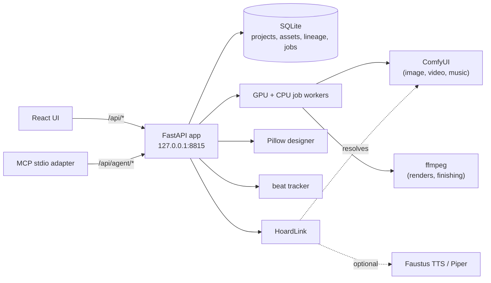

# Prospero's Hoard
### Such stuff as dreams are made on: can an agent direct a whole production?
**A local media studio that drives your ComfyUI, ffmpeg and a local TTS to make consistent characters, photocards, album art and music videos cut on the beat, by hand or entirely over MCP, and remembers exactly how every asset was made.**

[Español](README.es.md) · [Quick start](#quick-start) · [Real production example](#the-real-run) · [Connect to Faustus](#connect-it-to-faustus) · [MCP reference](docs/MCP.md) · [Voice studio](docs/VOICE.md) · [Portfolio](https://luissalet.github.io/Portfolio/#projects)


*Actual application, synthetic demo data. Every picture comes from the bundled demo backend, a procedural stand-in for ComfyUI that draws labelled placeholder scenes; with your ComfyUI connected the same screens show real model output.*

## Why

A language model asked to help with a small music production (an invented
group, its photocards, a cover, a video for the single) can only describe
what it would do. It cannot run a node graph, it cannot keep a character's
face consistent across forty images, it cannot find the beat of a song, and
nobody can later answer "which seed and checkpoint made this card?". Doing
it by hand means juggling a node editor, an image editor, an audio tool and
a video editor that share no memory.

Prospero turns each step into a typed, queueable operation with a recorded
recipe: characters are mentioned as `@Name` and their description is
inlined every time, every asset keeps the exact parameters that made it
(and can be re-run to the byte on the same backend), songs are analysed for
tempo and sections, and a timeline is cut on the beat and rendered with
ffmpeg. The local model directs; the studio does the work and reports back
with ids and pictures.


*Actual application, synthetic demo data: the auto-cut of the 30 s demo song (120 BPM, quiet-loud-quiet), two beats per shot in the loud section, four in the quiet ones, and the preview it rendered with ffmpeg.*

## Use cases

- **An independent musician with a finished single** imports the song, lets
  the beat tracker find tempo and sections, times the lyrics, and gets a
  cover, a lyric card and a 9:16 video cut on the beat - without opening a
  node editor or a video editor.
- **A writer or game designer with an original cast** gives each character
  a look prompt and a canonical reference, then asks for "@Iris and @Mika
  backstage": the same faces come back across dozens of images
  (`consistent=true`), and every card says which seed and checkpoint made it.
- **A local model in Faustus** asked to "make a teaser for the single" calls
  `studio_generate_image`, `studio_timeline` and `studio_render`, gets short
  ids back, looks at a picture only when it asks for one, and every call it
  made is listed under **Assistant activity**.
- **A ComfyUI user with their own workflows** imports the UI-format export,
  gets it converted, checked against the live node list and mapped to
  named parameters, and from then on generates with it from the studio or
  from an agent, with lineage.

## What is implemented

| Area | Available now | Boundary |
| --- | --- | --- |
| Projects and cast | Projects, characters (look prompt, negative, palette, canonical reference, voice), ordered groups, `@Name` mentions that match multi-word names and report unknown ones, 6 style presets | Single local user; names must be unique per project (they are the mention) |
| Generation (ComfyUI) | Qwen-Image 2.1 (int8) txt2img and a multi-reference edit (1-10 references, up to native 2K), SDXL txt2img, img2img, inpaint and a two-pass hires fix, SD 1.5 txt2img, SVD image-to-video, FLUX.1 schnell txt2img, FLUX.1 Kontext reference-guided edits, Wan 2.2 TI2V image-to-video, all as API-format templates; each with its own sampler/size defaults; an `auto \| qwen21 \| flux \| sdxl` image engine choice per project and per call ("auto" reaches for Qwen-Image 2.1 when it is installed, else Flux, else SDXL, and always says which one it used); the whole prompt checked against `/object_info` before queueing (nodes, every model file, samplers, combo choices, ranges), a missing model file read as "download it" rather than a crash, with the installed options in the error; a UI-format **or** API-format workflow importer whose converter matches the real ComfyUI 0.37 frontend's export input for input on the official templates (subgraphs and promoted widgets, dynamic combos, autogrow sockets, `PrimitiveNode`/`Reroute`, bypass/mute), with an editable parameter map and a cached node list for when ComfyUI is off; `consistent=true` keeps a `@Character`'s exact design via an edit template (Qwen-Image 2.1 or Kontext, per engine) and their canonical reference, cropped to one pose of a turnaround sheet | Prospero hosts no model; Kontext is single-reference (Qwen-Image 2.1 takes up to 10), Wan is image-to-video only |
| GPU etiquette | VRAM estimate per workflow family (editable) checked against the card ComfyUI really runs on (its own `system_stats`, where models it keeps cached count as free; nvidia-smi as the fallback); a job that does not fit waits in `waiting_gpu` with the reason, every 15 s for up to 30 min; cancel at any time; a render pool (`render_pool` in `backend.json`, one ComfyUI per GPU) renders queued jobs on every card at once | Nothing is ever unloaded unless you press "Free ComfyUI memory" |
| Lineage | Every generated asset records template, template hash, checkpoint, every parameter and seed, inputs and timing; "Reuse recipe" reproduces an image byte for byte on the same backend (tested), "Vary seed" re-runs it with new seeds | Reproduction is only guaranteed on the same backend, models and ComfyUI version |
| Design | Pillow renderer, no browser: photocard front and back, album cover (4 layouts), teaser poster, lyric card, tracklist back, thumbnail, with a "night" horror/thriller variant for the cover, poster, lyric card and tracklist; gradients, holographic foil, blends, vignette, letter spacing, shadows, shrink-to-fit text, tracklist columns; photocard sets for a whole group or a solo artist in several looks, with a contact sheet; print mode with 3 mm bleed at 300 dpi; 6 bundled font families | The QR layer draws a placeholder box (no QR library is pinned) |
| Audio | Import (mp3, wav, flac, ogg, m4a), waveform, own beat tracker (band-balanced spectral flux, tempo prior, dynamic programming) tested within 1 BPM and 50 ms on click tracks and kick-and-snare patterns at 90-140 BPM, downbeat and section estimates, LRC lyrics with a tap-to-time tool and a first-pass auto-timing from the lyrics' `[Section]` tags and the song's bars | Auto-timing is an estimate from the structure, not vocal alignment; section labels are "section A/B" with low/mid/high energy, not verse/chorus; very fast songs (170 BPM) are reported at half time |
| Voices | Piper TTS, six curated Spanish and English voices downloaded on first use; Faustus TTS through Hoard Link with Piper as fallback; per-character voice and speed | Generic synthetic voices for character narration; see the voice studio below for cloning |
| Voice studio | A pluggable TTS/STT engine registry (Piper plus optional local cloning engines - Coqui XTTS-v2, F5-TTS, Kokoro, Chatterbox - and an optional ComfyUI TTS workflow; faster-whisper and optional openai-whisper for speech-to-text), installed on request, never silently; a voice library from an uploaded sample (loudness normalisation, silence trim, an SNR/clipping quality check, an automatic reference transcript, named presets); transcription and short-clip dictation with word timestamps and SRT/VTT/TXT export; audiobook narration from text or a `.txt`/`.md`/`.epub` file as a resumable background job (per-chapter files, MP3 or M4B with chapter markers, an aligned SRT/LRC); video dubbing (extract audio, transcribe with timestamps, translate segment by segment through the local model with a glossary, re-synthesise in the chosen voice, time-fit to the original pacing, mux back in) with every stage's files kept so one segment can be fixed and re-run without repeating the rest | Cloning engines must be installed (a documented `pip install`, sometimes a GPU); dubbing needs a local LLM behind Hoard Link for translation and fails with a clear message without one; only use a voice you have the right to reproduce |
| Music generation | `studio_compose` (tags, lyrics, bpm, key, language) via ACE-Step 1.5 on ComfyUI (`ComfyMusic`, resolves automatically once the checkpoint is installed) or a small documented HTTP API for another local server; composed songs get lineage and are analysed automatically | Needs the ACE-Step checkpoint in ComfyUI (the example single was composed with ACE-Step 1.5 turbo); imported songs work fully either way |
| Video | Beat-synced auto-cut (density per energy - from the lyrics' verse/chorus markers when present - flashes on phrase downbeats, a new shot per section and optionally per sung line, per-section storyboards in story order, no immediate repeats, whole song covered) into an editable timeline; ffmpeg renderer with Ken Burns moves, cut/crossfade/dip/flash transitions that keep cuts on the beat, burned lyric captions with optional karaoke, the song muxed in; 540p preview or 1080p final; SVD/Wan clips converted to mp4; optional finishing pass (colour grade presets, film grain, vignette, letterbox, downbeat glitch flashes, a condensed-uppercase horror caption style) | Ken Burns is a zoom range plus pan direction, not free start/end rectangles; colour grades are `eq`/`colorbalance`/`curves` approximations, not a 3D LUT |
| Productions and recipes | A whole music video as one resumable, checkpointed job (lead and its reference sheet, song, stills, lyric timing, Wan clips, photocards, album art, the cut and its renders, a `REPORT.md`) that queues its frames and clips as ordinary jobs, so a render pool spreads them over every card; "change shots" (another variant, clip on/off, a new prompt or seed) redoes only what depends on them. A finished production - made in the app or by the production script - becomes a **recipe** with the lead abstracted into a `{lead}` casting slot; "Recreate with..." runs it with another character from the studio or a new description, reusing the song and the stills and clips the lead is not in | The cut's pace (beats per shot) is not recorded by the production script, so a recipe exported from a scripted run uses the defaults; prompts that describe the old lead's props are flagged, not rewritten |
| QA director | A pass over a production's outputs, per stage or all of them, inline after each stage (`settings.qa.enabled`) or on demand: flat or noisy stills, black/red bands along an edge (the ffmpeg 8 stripe), exposure jumps inside a clip, motion where stillness was asked (or a frozen clip), a photocard head touching the top edge, lyric coverage of an aligned LRC, durations against the plan; with a vision model behind Hoard Link each output is also scored 0-10 against the bible, the shot prompt and the reference, with a one-line reason. Failing stills, clips and photocards are regenerated with a new seed and a targeted fix (noise -> denoise 1, exposure jump -> another sampler, walking -> the stillness negative, a cropped head -> headroom), up to a retry cap, and every retry is written to the lineage and REPORT.md | The checks are heuristics with editable thresholds, not a trained critic; without a vision model only the model-free checks run (it never blocks); a scripted production is checked read-only |
| Agent control | 42 MCP tools mirroring `/api/agent/*` (33 production tools plus 9 for the voice studio), compact id-first results, pictures only when explicitly asked (`include_image=true` - a text-only local model does not want one by default), errors with a code and a next step, an audited "What the assistant did" log | Jobs are polled (`studio_job`/`voice_job` can wait server-side); no push events |
| Interface | React studio: Overview, Cast, Generate, Library with lightbox, Designer, Audio, Timeline, Boards, Productions (with Recipes), Voice, Jobs, Backends, Assistant activity, Settings; dark and light, Spanish and English, keyboard shortcuts | Timeline editing is clip-level (duration, transition, camera, order, swap), not frame-level |


*Actual application, synthetic demo data: the photocard set rendered for the five invented members, opened in the lightbox with its recipe and inputs.*

## Models

| Family | Checkpoint / files | VRAM (approx.) | Best for |
| --- | --- | --- | --- |
| Qwen-Image 2.1 (int8) | `qwen_image_2.1_int8_convrot.safetensors` (diffusion), `qwen3vl_8b_int8_convrot.safetensors` (text encoder), `qwen_image_2.1_vae_bf16.safetensors` (VAE) | ~7.3 GB + 9.4 GB loaded one after the other; peak ~10-12 GB at 1 MP, more at native 2K | Best prompt adherence, in-image typography, multi-reference identity (1-10 images) |
| FLUX.1 schnell | `flux1-schnell-fp8.safetensors` | ~13 GB | Fastest drafts (4 steps) |
| FLUX.1 Kontext dev | `flux1-dev-kontext_fp8_scaled.safetensors` + CLIP/VAE | ~13 GB | Single-reference edits |
| SDXL / SD 1.5 | `sd_xl_base_1.0.safetensors` / `v1-5-pruned-emaonly-fp16.safetensors` | ~7 GB / ~3.5 GB | Always available fallback, low-VRAM draft |
| SVD | `svd_xt.safetensors` | ~10 GB | Image to short video |
| Wan 2.2 TI2V (5B) | `wan2.2_ti2v_5B_fp16.safetensors` + VAE | ~12 GB | Image to video, native 1280x704 |
| ACE-Step 1.5 | `ace_step_1.5_turbo_aio.safetensors` | ~8 GB | Song composition with vocals |

`studio_generate_image`'s `engine` parameter (and a project's own `image_engine`
setting) picks between the image families: `auto` (default) resolves to
Qwen-Image 2.1 when its node class and model files are installed, else Flux
schnell, else SDXL - every result says which one it actually used. A
`template` name always wins over `engine` when both are given. See
[docs/ARCHITECTURE.md](docs/ARCHITECTURE.md) for how the converter turns
ComfyUI's own UI-format export of each template into the API-format
workflow above, and how a missing model file is reported.

## Quick start

```
git clone https://github.com/Luissalet/ProsperosHoard.git
cd ProsperosHoard
```

You need Python 3.11+ (3.13 recommended), Node.js 22 for the interface and
ffmpeg on PATH (or the bundled `imageio-ffmpeg` binary is used). ComfyUI is
optional: `--demo` runs everything against a procedural stand-in.

### Windows

Double-click **`Iniciar Prospero's Hoard.cmd`** (or run `scripts\start.ps1`).
The first run creates `.venv` with Python 3.13, installs
`requirements-lock.txt`, builds the interface with npm and opens
http://127.0.0.1:8815; later runs reinstall only when the lock file changed.
**`Detener Prospero's Hoard.cmd`** stops it (only after checking that the
port really belongs to Prospero).

Manual steps:

```powershell
C:\Python313\python.exe -m venv .venv
.venv\Scripts\python.exe -m pip install -r requirements-lock.txt
cd frontend; npm ci; npm run build; cd ..
.venv\Scripts\python.exe -m prosperos_hoard            # real data in .\data
.venv\Scripts\python.exe -m prosperos_hoard --demo     # demo data in .\data-demo
```

### Linux / macOS

```bash
python3 -m venv .venv
.venv/bin/python -m pip install -r requirements-lock.txt
(cd frontend && npm ci && npm run build)
.venv/bin/python -m prosperos_hoard --demo --no-browser
```

The first `--demo` run seeds its data (about a minute on two CPUs) before
the server answers. Then open <http://127.0.0.1:8815>
(`curl http://127.0.0.1:8815/api/health` answers `"service": "prosperos-hoard"`).

Flags: `--port`, `--data-dir` (or `PROSPERO_DATA_DIR`), `--demo`,
`--no-browser`. `--demo` starts the procedural demo backend, seeds an
original five-member group with portraits, stage shots, a cover, a photocard
set, a synthetic 30 s song with timed lyrics and an auto-cut timeline, and
renders its preview video. To use your ComfyUI, leave it on
127.0.0.1:8188 (Hoard Link finds it) or set its URL in Settings. On a GPU
shared with a language model, renders slow down a lot; `PROSPERO_COMFY_TIMEOUT_S`
raises how long a job may run (defaults: video 1 h, audio 30 min, image 20 min).


*Actual application, synthetic demo data: the synthetic demo song analysed by the built-in beat tracker, with the section estimates and the LRC lyrics timed to it.*

## Connect it to Faustus

Prospero's Hoard is a plugin for [Faustus](https://github.com/Luissalet/Faustus),
the local AI workspace, and declares itself with
[`faustus-plugin.json`](faustus-plugin.json). Start it, then in Faustus open **Connectors -> Nearby apps -> Add**: Faustus
finds it on port 8815, reads the manifest and launches the MCP adapter
(`prosperos_hoard/mcp_server.py`, stdio). The model backend is shared: the
studio asks Hoard Link which ComfyUI and TTS are already running instead of
loading anything of its own.

### MCP tools

| Tool | What it does | Read-only |
| --- | --- | --- |
| `studio_status` | Backends, checkpoints, free VRAM, queue | yes |
| `studio_projects` / `studio_create_project` | List or create productions | yes / no |
| `studio_cast` | List, create, update characters and groups | no (list is read-only) |
| `studio_generate_image` | Queue txt2img/edit with @mentions, presets and an image engine choice | no |
| `studio_edit_image` | img2img, inpaint, upscale, reuse recipe, vary seed | no |
| `studio_animate` | Image to short video (SVD) | no |
| `studio_compose` | Compose a song with vocals (ACE-Step) | no |
| `studio_voice` | Spoken line with a character's voice | no |
| `studio_import` | Import a local file from an allowed folder | no |
| `studio_analyze_audio` | Tempo, beats, sections | yes |
| `studio_design` / `studio_photocard_set` | Render a design / a whole photocard set | no |
| `studio_timeline` / `studio_render` | Auto-cut, read, edit a timeline / render it | no |
| `studio_jobs` / `studio_job` / `studio_cancel_job` | Queue, one job (with wait), cancel | yes / yes / no |
| `studio_assets` / `studio_show` / `studio_lineage` | Find assets, look at them, their recipe | yes |
| `studio_productions` / `studio_production` | List productions / one production's stages, renders and next step | yes |
| `studio_production_create` / `studio_production_continue` / `studio_production_shots` | Start a whole production from a spec / resume or approve it / change shots before the render | no |
| `studio_recipe_export` / `studio_recipes_list` / `studio_recipe_get` | Turn a finished production into a recipe with a `{lead}` slot / list recipes / read one | no / yes / yes |
| `studio_recipe_run` | "Recreate this with X": a new production from a recipe with another lead | no |
| `studio_qa_run` / `studio_qa_report` | QA pass over a production (check, or check and regenerate the failures) / its last scorecard and retries | no / yes |
| `voice_engines` / `voice_create` / `voice_list` | Engine status and install hints / clone a voice from a sample / list saved voices | yes / no / yes |
| `voice_speak` / `voice_transcribe` | Synthesise a line / transcribe audio with timestamps | no / yes |
| `voice_audiobook` / `voice_dub` | Narrate text as chapters / dub a video into another language | no |
| `voice_resynthesize_segment` / `voice_job` | Fix and re-run one dub segment / poll a voice-studio job | no / yes |

It works with any MCP client over stdio too:

```json
{"mcpServers": {"prosperos-hoard": {
  "command": "C:/.../Prospero's Hoard/.venv/Scripts/python.exe",
  "args": ["C:/.../Prospero's Hoard/prosperos_hoard/mcp_server.py"],
  "env": {"PROSPERO_URL": "http://127.0.0.1:8815"}}}}
```

Arguments, result shapes and limits of every tool: [docs/MCP.md](docs/MCP.md).
The end-to-end recipe the agent follows: [skills/idol-production/SKILL.md](skills/idol-production/SKILL.md).

## Shared models (HoardLink)

Prospero hosts no model. It asks [HoardLink](https://github.com/Luissalet/HoardLink)
(vendored in [`prosperos_hoard/hoard_link/`](prosperos_hoard/hoard_link), a
byte-identical copy of HoardLink 0.1.1) for the `image`/`video` backend
(ComfyUI) and `tts` (Faustus TTS, with Piper as the local fallback), the
same resolver every Faustus plugin uses. Resolution order in one line: an
explicit override in Settings, `data/backend.json` or a `HOARD_*`
environment variable, then a running
Faustus instance's own registry, then a server already listening on
loopback (ComfyUI on 8188). Music comes from ACE-Step through the same
ComfyUI, or from a small documented HTTP server you point
`HOARD_MUSIC_URL` at. The **Backends** screen and `studio_status` always
say what was found and why; nothing is loaded or unloaded behind your back.

## Production example

[`scripts/productions/no_mires_atras.py`](scripts/productions/no_mires_atras.py)
produces a single by FAROL, "NO MIRES ATRÁS" in Spanish or, with `--lang en`,
"DON'T LOOK BACK" in English (an original night creature:
a paper-lantern head, always still, always a little closer), end to end
**through the MCP adapter only** - it spawns `mcp_server.py` over stdio,
the same path Faustus uses, and fails if any result carries a picture it
did not ask for. Nine steps: the project (with an `--engine auto|qwen21|flux`
choice, set as its own default); a turnaround sheet cropped to its front
view as FAROL's canonical reference; the song with ACE-Step; twelve stills
(an edit template with that reference when FAROL is in frame, a fresh
txt2img in the same night look when not - Qwen-Image 2.1 when installed,
else Flux); Wan clips from the best stills; a solo
photocard set in five idol looks with its contact sheet; the "night" cover,
tracklist back, teaser poster and lyric card; lyrics timed to the song's
bars; 9:16 and 16:9 cuts that follow a storyboard per section and change
shot on every sung line, graded sodium-night with grain, vignette and a
flash + colour-split glitch on the chorus downbeats, horror karaoke captions; and a
`REPORT.md` with every asset id, timings and what to review. It checkpoints
every still, clip, card and render, so an interrupted run resumes where it
stopped; `--only <step>` redoes one step.

On Windows, with the app running and ComfyUI started on a 16 GB card:

```powershell
# the demo backend (no GPU), a few minutes
.venv\Scripts\python.exe scripts\productions\no_mires_atras.py --backend fake --quality draft
# the real thing against the running app and ComfyUI
.venv\Scripts\python.exe scripts\productions\no_mires_atras.py --backend real --quality final
# pin the image engine instead of "auto" reaching for Qwen-Image 2.1 first
.venv\Scripts\python.exe scripts\productions\no_mires_atras.py --backend real --quality final --engine flux
# the English version on top of a finished run: same pictures, a sung song, a clip for every shot
.venv\Scripts\python.exe scripts\productions\no_mires_atras.py --backend real --quality final --lang en --reuse-from data\productions\no_mires_atras --motion full --song-takes 4
# after re-timing the lyrics by ear in Audio > Lyrics timing and exporting the LRC
.venv\Scripts\python.exe scripts\productions\no_mires_atras.py --backend real --quality final --only timeline --lrc-path C:\Users\<you>\Music\no_mires_atras.lrc
```

### In the app: productions and recipes

The same pipeline also runs inside the app as a **production**
(`studio_production_create`, or the **Productions** screen): one
orchestrator job that queues the reference sheet, the song, every still and
every clip as ordinary jobs (a render pool renders them side by side),
checkpoints each item into `data/productions/<slug>/state.json`, and writes
a `REPORT.md`. It resumes where it stopped after a failure, a cancel or a
restart; `studio_production_shots` swaps a still for another variant, turns
a clip on or off or rewrites a shot, and only what depends on it is redone.

A finished production - including one made by the script above - becomes a
**recipe**: `studio_recipe_export(production, name)` writes
`data/recipes/<name>.json` with every stage, prompt, seed, template and
setting, and the lead abstracted into a `{lead}` casting slot (`{lead}`,
`{lead.look}`, `{lead.negative}`, `{lead.palette[0]}`...), plus warnings
for shot prompts that still describe the old lead's props.
`studio_recipe_run(recipe, cast={"lead": <character id or {name, look}>})`
("recreate this with X", or **Recreate with...** on the Productions
screen) starts a new production with the slot filled: an existing
character keeps its canonical reference, a new one gets a reference sheet
first, and the song (unless its lyrics name the old lead) and the stills
and clips of the shots the lead is not in are reused
(`options.reuse: ["song", "frames", "clips"]`).

### The real run

The same script ran against a real ComfyUI 0.37 on 16 GB cards, in two
versions that share every picture and clip. **DON'T LOOK BACK**
(`--lang en --motion full`) is a sung English horror anthem told by the
creature, with a clip for every shot, rendered on a render pool of three
ComfyUI servers, one per card. **NO MIRES ATRÁS** is the first take, a
Spanish horror rap cut from seven clips on one card. Qwen-Image 2.1 made the
reference sheet, the stills and the photocards, Wan 2.2 TI2V 5B the clips
and ACE-Step 1.5 the songs. The canonical reference, the best variant of each
shot and the song take were picked by eye and by ear. The lyrics were aligned
to the vocals with faster-whisper (outside Prospero) and imported as an LRC
with timed section markers. Everything below comes straight out of the app,
only downscaled for this page: nothing was retouched. The prompts, seeds,
settings, timings and the nine problems the run found (all fixed) are in the
[full example](docs/examples/no-mires-atras.md).


<p>

</p>


On 16 GB cards: 48 stills in 57 min, the first seven 5 s clips in about
70 min on one card and eleven more in about 40 min on three, four song takes
in 2 min, and both cuts (preview and 1080p final) in about 7 min.

## Architecture

FastAPI + SQLite (WAL, one connection per thread) with a GPU worker, a
CPU worker and an orchestrator thread (whole productions) over a persistent
job table; business logic in plain modules (`engine`, `comfy_driver`,
`design`, `audio`, `timeline`, `video`, `voices`, `productions`, `recipes`)
with no web imports; Hoard Link vendored for backend resolution;
the MCP adapter is a separate stdio script that only speaks HTTP to the app.



Details, data model and decisions: [docs/ARCHITECTURE.md](docs/ARCHITECTURE.md).
Every endpoint: [docs/API.md](docs/API.md).

## Privacy and security

Local only: the app binds 127.0.0.1, sends no telemetry and only goes
online when you ask for a Piper voice that is not downloaded yet (from the
rhasspy/piper-voices repository on Hugging Face). Requests with a foreign
`Host` header are refused (DNS rebinding) and so are writes from other
websites (`Origin` and `Sec-Fetch-Site` checks). Agents can import files
only from your home folder, `data/inbox` and folders you add in Settings,
and only files whose content matches their type; files are always served by
id, never by a path the client sends. Every call an assistant makes is
written to the `agent_calls` audit table and shown under **Assistant
activity** (tool, argument summary, duration, result). The demo uses
invented people only. Voice cloning runs entirely on local engines that you
install explicitly (nothing is downloaded silently); a cloned voice is only
ever created from a sample you provide, and using someone else's voice
without their consent is on you, not the tool. Data stays in `data/` (or
your `--data-dir`); the Faustus token is stored in `data/backend.json` and
never returned by the API.

## Development

```powershell
.venv\Scripts\python.exe -m pytest -q
cd frontend; npm ci; npm run build
```

On Linux/macOS the same with `.venv/bin/python`. **296 tests pass** in
about two minutes on a shared 2-CPU Linux machine, offline, with no GPU and no
model downloads (the demo backend stands in for ComfyUI, and the voice
studio's own suite adds fake TTS/STT engines plus real, optional tests
against Piper and faster-whisper when they are installed). The suite covers
the voice engine registry (install-hint status without ever importing a
heavy dependency), the voice library's sample processing and quality check,
the audiobook chunking/assembly and dubbing pipelines end to end (including
the time-fitting maths, glossary-aware translation through a fake local
model, and per-segment re-synthesis), the `/api/voice/*` HTTP surface, and
the 9 voice MCP tools driven over the real MCP protocol; and the MCP protocol end
to end (the adapter spawned over stdio against a live app: tool keywords and
annotations, generation with a picture, lineage, design, readable errors,
the app-not-running message); the UI-format-to-API workflow converter
against seven official ComfyUI templates (ComfyUI 0.37, including the two
Qwen-Image 2.1 ones, its promoted-widget subgraphs, dynamic combo and
autogrow sockets), compared input for input with what the real frontend
exports (subgraphs and promoted widgets, dynamic combos, autogrow inputs,
bypass/mute, `PrimitiveNode`/`Reroute`) and UI exports imported through the
API with and without ComfyUI; the six built-in templates that were converted
this way (Flux schnell, Kontext edit, Wan 2.2 TI2V, ACE-Step song,
Qwen-Image 2.1 txt2img and edit) passing server-side validation with their
own defaults - including that a model file missing from `/object_info`
reads as "download it", never a crash - and generating against the fake
backend's real `/object_info`; the `auto|qwen21|flux|sdxl` image engine
choice (installed-model detection, per-project default, per-call override,
graceful fallback) and Qwen-Image 2.1's multi-reference edit (1-10 images,
extra reference nodes wired or dropped to match); lyric timing from section
tags, storyboard pools and cut-on-lyrics; a long transition render that
must keep its full length; character-consistency routing and its
`consistent_needs_reference` error; the finishing filter graphs (colour
grade, grain, vignette, letterbox, glitch) snapshot-tested plus a real
ffmpeg render; byte-identical reproduction through "reuse recipe";
@mention edge cases; checkpoint, sampler and missing-node validation;
hostile workflow imports; import traversal, symlinks, renamed files and the
allowed-folder rule; SPA and asset path traversal; the browser-attack
guard; job restart recovery, VRAM waiting and cancellation; the beat
tracker on click tracks, drum patterns and the demo song; auto-cut
invariants; ASS escaping of hostile lyrics; real ffmpeg renders in a folder
named like the Windows install (apostrophe, spaces, accents); design
golden hashes, bleed and text fitting; thread safety of the store; and the
Faustus manifest check.

`npm run build` in `frontend/` passes with zero TypeScript errors.
[CI](.github/workflows/ci.yml) runs the tests on Ubuntu and Windows with
Python 3.11, 3.12 and 3.13 and builds the interface with Node.js 22.

## Roadmap / known limits

- The QA director's checks are heuristics (thresholds in
  `settings.qa.thresholds`); its bible/prompt/reference scores need a vision
  model behind Hoard Link, and picking the final take by ear is still yours.
- A recipe abstracts the lead's name, look, negative, palette and bio; shot
  prompts that describe the old lead's props ("the lantern head") are listed
  as warnings for you to rewrite, not rewritten.
- `consistent=true` keeps a character's design from its canonical
  reference; Kontext takes a single reference (Qwen-Image 2.1 up to 10) and
  Wan is image-to-video only.
- Lyric auto-timing is an estimate from the song's structure, not vocal
  alignment; re-time by ear in **Audio > Lyrics timing**, or import an LRC
  aligned elsewhere (the example used faster-whisper), for a final cut.
- Section labels are "section A/B" with an energy level, not verse/chorus;
  very fast songs (around 170 BPM) are reported at half time.
- Jobs are polled (`studio_job` can wait server-side); there are no push
  events.
- Timeline editing is clip-level, Ken Burns is a zoom range plus a pan
  direction, and colour grades are filter approximations, not 3D LUTs.
- The QR layer of the designer draws a placeholder box.

## License

MIT - see [LICENSE](LICENSE). Bundled fonts keep their own licences: SIL
Open Font License (`prosperos_hoard/fonts/*/OFL.txt`), except Special Elite
(Apache License 2.0, `prosperos_hoard/fonts/SpecialElite/LICENSE.txt`).
