# Prospero's Hoard
### Such stuff as dreams are made on: can an agent direct a whole production?
**A local media studio that drives your ComfyUI, ffmpeg and a local TTS to make consistent characters, photocards, album art and music videos cut on the beat, by hand or entirely over MCP, and remembers exactly how every asset was made.**

[Español](README.es.md) · [Quick start](#quick-start) · [Real production example](#the-real-run) · [Connect to Faustus](#connect-it-to-faustus) · [MCP reference](docs/MCP.md) · [Voice studio](docs/VOICE.md) · [Portfolio](https://luissalet.github.io/Portfolio/#projects)

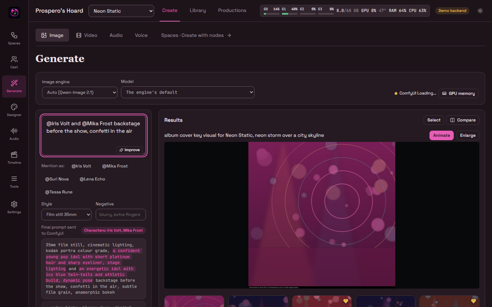
*Actual application, synthetic demo data. Every picture comes from the bundled demo backend, a procedural stand-in for ComfyUI that draws labelled placeholder scenes; with your ComfyUI connected the same screens show real model output.*

## Why

A language model asked to help with a small music production (an invented
group, its photocards, a cover, a video for the single) can only describe
what it would do. It cannot run a node graph, it cannot keep a character's
face consistent across forty images, it cannot find the beat of a song, and
nobody can later answer "which seed and checkpoint made this card?". Doing
it by hand means juggling a node editor, an image editor, an audio tool and
a video editor that share no memory.

Prospero turns each step into a typed, queueable operation with a recorded
recipe: characters are mentioned as `@Name` and their description is
inlined every time, every asset keeps the exact parameters that made it
(and can be re-run to the byte on the same backend), songs are analysed for
tempo and sections, and a timeline is cut on the beat and rendered with
ffmpeg. The local model directs; the studio does the work and reports back
with ids and pictures.

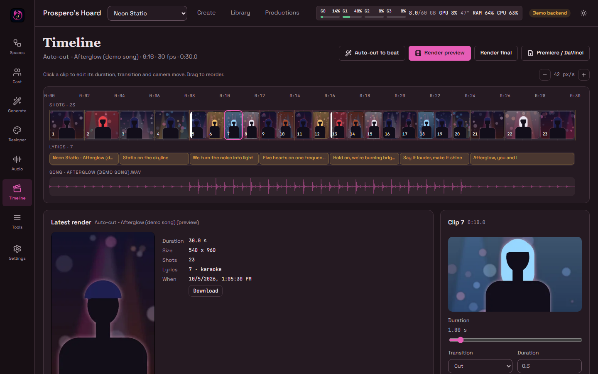
*Actual application, synthetic demo data: the auto-cut of the 30 s demo song (120 BPM, quiet-loud-quiet), two beats per shot in the loud section, four in the quiet ones, and the preview it rendered with ffmpeg.*

## Use cases

- **An independent musician with a finished single** imports the song, lets
  the beat tracker find tempo and sections, times the lyrics, and gets a
  cover, a lyric card and a 9:16 video cut on the beat - without opening a
  node editor or a video editor.
- **A writer or game designer with an original cast** gives each character
  a look prompt and a canonical reference, then asks for "@Iris and @Mika
  backstage": the same faces come back across dozens of images
  (`consistent=true`), and every card says which seed and checkpoint made it.
- **A local model in Faustus** asked to "make a teaser for the single" calls
  `studio_generate_image`, `studio_timeline` and `studio_render`, gets short
  ids back, looks at a picture only when it asks for one, and every call it
  made is listed under **Assistant activity**.
- **Someone who explains things for a living** types a topic ("why the sea
  glows at night") and gets a narrated vertical short: a script with a hook
  written by the local model, a voice-over, captions that light up word by
  word, stock footage or generated pictures cut to what is being said, a
  music bed that ducks under the voice, and the title, hashtags and credits
  ready to paste.
- **A ComfyUI user with their own workflows** imports the UI-format export,
  gets it converted, checked against the live node list and mapped to
  named parameters, and from then on generates with it from the studio or
  from an agent, with lineage.

## What is implemented

| Area | Available now | Boundary |
| --- | --- | --- |
| Projects and cast | Projects, characters (look prompt, negative, palette, canonical reference, voice), **places and objects** (a stage, a street, a guitar: look and reference image, in their own Cast tabs), ordered groups, `@Name` mentions that match multi-word names and report unknown ones, 6 style presets. A mentioned place or object with an image goes into the render as a numbered reference on Qwen-Image 2.1 (shown in Generate's preview as "go in on their own"), a second character in a consistent shot gets its own reference instead of vanishing, the shot editor offers the project's places and objects as one-click chips and the video planner writes them into the shots as `@Name` | Single local user; names must be unique per project (they are the mention); a deleted cast entry can be restored from the Cast page, a deleted group cannot; at most 10 references per render; single-reference engines inline the extra entries' look instead |
| Generation (ComfyUI) | Qwen-Image 2.1 (int8) txt2img and a multi-reference edit (1-10 references, up to native 2K), SDXL txt2img, img2img, inpaint and a two-pass hires fix, model upscale (x2 or x4, ESRGAN-family) and background removal to a transparent PNG (BiRefNet) on any image asset, SD 1.5 txt2img, SVD image-to-video, FLUX.1 schnell txt2img, FLUX.1 Kontext reference-guided edits, Wan 2.2 TI2V image-to-video, all as API-format templates; each with its own sampler/size defaults; an `auto \| qwen21 \| flux \| sdxl` image engine choice per project and per call ("auto" reaches for Qwen-Image 2.1 when it is installed, else Flux, else SDXL, and always says which one it used); the whole prompt checked against `/object_info` before queueing (nodes, every model file, samplers, combo choices, ranges), a missing model file read as "download it" rather than a crash, with the installed options in the error; a UI-format **or** API-format workflow importer whose converter matches the real ComfyUI 0.37 frontend's export input for input on the official templates (subgraphs and promoted widgets, dynamic combos, autogrow sockets, `PrimitiveNode`/`Reroute`, bypass/mute), with an editable parameter map and a cached node list for when ComfyUI is off; `consistent=true` keeps a `@Character`'s exact design via an edit template (Qwen-Image 2.1 or Kontext, per engine) and their canonical reference, cropped to one pose of a turnaround sheet | Prospero hosts no model; Kontext is single-reference (Qwen-Image 2.1 takes up to 10), Wan is image-to-video only; upscale needs `RealESRGAN_x4plus.safetensors` and background removal needs `birefnet.safetensors` in ComfyUI (see Models) |
| GPU etiquette | VRAM estimate per workflow family (editable) checked against the card ComfyUI really runs on (its own `system_stats`, where models it keeps cached count as free; nvidia-smi as the fallback); a job that does not fit waits in `waiting_gpu` with the reason, every 15 s for up to 30 min; cancel at any time; a render pool (`render_pool` in `backend.json`, one ComfyUI per GPU) renders queued jobs on every card at once | Nothing is ever unloaded unless you press "Free ComfyUI memory" |
| Lineage | Every generated asset records template, template hash, checkpoint, every parameter and seed, inputs and timing; "Reuse recipe" reproduces an image byte for byte on the same backend (tested), "Vary seed" re-runs it with new seeds | Reproduction is only guaranteed on the same backend, models and ComfyUI version |
| Design | Pillow renderer, no browser: photocard front and back, album cover (4 layouts), teaser poster, lyric card, tracklist back, thumbnail, with a "night" horror/thriller variant for the cover, poster, lyric card and tracklist; gradients, holographic foil, blends, vignette, letter spacing, shadows, shrink-to-fit text, tracklist columns; photocard sets for a whole group or a solo artist in several looks, with a contact sheet; print mode with 3 mm bleed at 300 dpi; 6 bundled font families | The QR layer draws a placeholder box (no QR library is pinned) |
| Audio | Import (mp3, wav, flac, ogg, m4a), waveform, own beat tracker (band-balanced spectral flux, tempo prior, dynamic programming) tested within 1 BPM and 50 ms on click tracks and kick-and-snare patterns at 90-140 BPM, downbeat and section estimates, LRC lyrics with a tap-to-time tool and a first-pass auto-timing from the lyrics' `[Section]` tags and the song's bars | Auto-timing is an estimate from the structure, not vocal alignment; section labels are "section A/B" with low/mid/high energy, not verse/chorus; very fast songs (170 BPM) are reported at half time |
| Stems | Splits a song into vocals, drums, bass and other with Demucs (`htdemucs`), run in ComfyUI's own Python on the GPU with the most free memory (at least 3 GB), else on the CPU; Demucs is installed once into the data folder (`tools/demucs-lib`), never into ComfyUI's environment; each stem is a derived audio asset (the lightbox has a Stems section with players), and splitting also mixes an **instrumental** (drums, bass and other without the voice) as one more asset; lip sync (S2V and InfiniteTalk) feeds the clean vocals to the audio encoder while the clip keeps the full mix (`use_vocals=false` turns that off), and beat effects can follow a stem (see Video) | The first run installs Demucs; on the CPU it is slow |
| Voices | Piper TTS, ten curated voices (Spanish, English, French, Italian, Portuguese, German) downloaded on first use; Faustus TTS through Hoard Link with Piper as fallback; per-character voice and speed | Generic synthetic voices for character narration; see the voice studio below for cloning |
| Voice studio | A pluggable TTS/STT engine registry (Piper plus optional local cloning engines - Coqui XTTS-v2, F5-TTS, Kokoro, Chatterbox - and an optional ComfyUI TTS workflow; faster-whisper and optional openai-whisper for speech-to-text), installed on request, never silently; a voice library from an uploaded sample (loudness normalisation, silence trim, an SNR/clipping quality check, an automatic reference transcript, named presets); transcription and short-clip dictation with word timestamps and SRT/VTT/TXT export; audiobook narration from text or a `.txt`/`.md`/`.epub` file as a resumable background job (per-chapter files, MP3 or M4B with chapter markers, an aligned SRT/LRC); video dubbing (extract audio, transcribe with timestamps, translate segment by segment through the local model with a glossary, re-synthesise in the chosen voice, time-fit to the original pacing, mux back in) with every stage's files kept so one segment can be fixed and re-run without repeating the rest | Cloning engines must be installed (a documented `pip install`, sometimes a GPU); dubbing needs a local LLM behind Hoard Link for translation and fails with a clear message without one; only use a voice you have the right to reproduce |
| Music generation | `studio_compose` (tags, lyrics, bpm, key, language) via ACE-Step 1.5 on ComfyUI (`ComfyMusic`, resolves automatically once the checkpoint is installed) or a small documented HTTP API for another local server; composed songs get lineage and are analysed automatically | Needs the ACE-Step checkpoint in ComfyUI (the example single was composed with ACE-Step 1.5 turbo); imported songs work fully either way |
| Video | Beat-synced auto-cut (density per energy - from the lyrics' verse/chorus markers when present - flashes on phrase downbeats, a new shot per section and optionally per sung line, per-section storyboards in story order, no immediate repeats, whole song covered) into an editable timeline; ffmpeg renderer with Ken Burns moves, cut/crossfade/dip/flash transitions that keep cuts on the beat, burned lyric captions with optional karaoke, the song muxed in; 540p preview or 1080p final; SVD/Wan clips converted to mp4; optional finishing pass (colour grade presets, film grain, vignette, letterbox, downbeat glitch flashes, eight caption styles - default, horror (condensed uppercase), bold, **pop** (one big word at a time, popping in), **pulse** (the whole line in caps, swelling on every beat), **typewriter**, **handwritten** and **cinema** (film-title serif, slow fades) - and a **framing** for clips of another shape: `fill` crops, `blur` fits the clip over a blurred copy of itself, `fit` adds bars) and **beat effects**: a punch-in zoom, a flash and a camera shake that fire on the bass drum (found in the song's low band), on every beat or on every bar, applied per clip so even a long song keeps short filter expressions, and once the song has been split they can follow one stem instead (`source` `drums`, `bass`, `vocals` or `other`: that stem's own attacks); a **Look** panel (in Timeline and on the production page) with one-click looks (Clean, Club, Live show, Horror, Cinema) and sliders, where applying a look to a finished video re-renders only its cut; a **Spotify Canvas**: an 8 s silent 9:16 loop of the chorus that crossfades its tail into its start, re-rendered from the cut without the burned-in lyrics | Ken Burns is a zoom range plus pan direction, not free start/end rectangles; colour grades are `eq`/`colorbalance`/`curves` approximations, not a 3D LUT; zoom and shake roughly double the render time of the cut; the kick detector hears the whole mix unless the song has been split into stems, then it reads the drums; a stem source before the split falls back to the kick |
| Reframe | Any picture or clip into 9:16, 16:9, 1:1, 4:5, 2:3, 3:2 or 21:9 without generating it again: `fill` crops around the subject (found from the sharpest detail, or at `focus_x`/`focus_y`, 0-1), `blur` fits it over a blurred copy of itself, `fit` adds bars; quality `preview` makes a 720p clip; the result is a new asset and the original stays (job type `reframe`, cpu lane; the lightbox has a Reframe row; `studio_reframe`) | The automatic focus point is the sharpest detail of the picture: set `focus_x`/`focus_y` when it picks wrong |
| Clip retake | Redo only a stretch of a clip (`start_s`..`end_s`, at most ~4 s) with Wan VACE: the frames just before and after guide it, a prompt says what happens in it, and the result is a new clip with the new stretch spliced back at the clip's own fps and sound; `draft` is Wan 2.1 VACE 1.3B (quick), `final` is Wan 2.2 Fun VACE 14B (high and low noise experts) with the lightx2v 4-step LoRAs; job type `retake` (gpu lane), templates `wan21_vace_retake` and `wan22_vace_retake`; the lightbox has a "Redo a stretch" row; `POST /api/assets/{id}/retake`, `studio_retake` | The VACE models are installed but not yet run on a real GPU (the cards were busy): only the fake ComfyUI of the tests has rendered one; a missing model is `no_vace`; a stretch is 0.25 to ~4 s |
| Clip edit | Redraw a whole clip from an instruction ("make it night", "give her a red coat", "turn the guitar into a violin", "make it a watercolour") with Bernini-R, a Wan renderer fine-tuned for video editing, through ComfyUI's core node `BerniniConditioning`: up to 5 s of the clip (81 frames at 16 fps on a 480p canvas, 848x480 / 480x848 / 640x640 by orientation) is redrawn following the instruction while the motion stays, a clip longer than 5 s is edited a window at a time from `start_s` and the window is spliced back, and the result is a new clip at the source's own size, fps and sound (`recipe.operation = "clip_edit"`, `recipe.edit_of`); `mode` `auto` (an edited first frame propagates, pictures make it a reference edit, else a plain edit), `edit` (replace, add, remove, recolour), `restyle` (a new look, light, colours or a change of pose), `reference` (up to 4 pictures named image0, image1... in the text; `@Name` of cast members with a picture is rewritten to "the person in image0") or `propagate` (the window's first frame edited as a picture - `studio_video_frames` with `at_s` takes it - guides the rest); `draft` is Bernini-R 1.3B (template `wan21_bernini_edit`), `final` is Wan 2.2 A14B Bernini-R experts with the lightx2v step-distill LoRA (template `wan22_bernini_edit`); unless `exact=true` the instruction is rewritten into the "what changes / what stays the same" paragraph the model was trained on (the vision model looking at 3 frames of the window when there is one, else the language model with the clip's own prompt; with none it goes as written, `how: "no_model"`) and "See the instruction" in the lightbox shows it before rendering; job type `clip_edit` (gpu lane); the lightbox has an "Edit the clip with an instruction" section; an edit of a production shot's clip is a take of that shot (badge "edited"); a space node "Edit clip" (`clip_edit`); `POST /api/assets/{id}/clip-edit`, `studio_clip_edit` | The Bernini-R models are not yet run on a real GPU (the cards are busy with a language model): only the fake ComfyUI of the tests has rendered one; missing models are `no_bernini`; at most 5 s per window, 4 pictures, a 480p canvas; `first_frame_required`, `reference_required`, `clip_too_short` otherwise |
| Productions and recipes | A whole music video as one resumable, checkpointed job (lead and its reference sheet, song, stills, lyric timing, Wan clips, photocards, album art, the cut and its renders, a `REPORT.md`) that queues its frames and clips as ordinary jobs, so a render pool spreads them over every card; "change shots" (another variant, clip on/off, a new prompt or seed) redoes only what depends on them. A finished production - made in the app or by the production script - becomes a **recipe** with the lead abstracted into a `{lead}` casting slot; "Recreate with..." runs it with another character from the studio or a new description, reusing the song and the stills and clips the lead is not in; a lead taken from another project joins the video's project cast as soon as the production is created; a shot can **continue from** an earlier one (its clip starts on the last frame of that clip and ends on its own still: one continuous take, redone automatically when the source clip changes); **draft clips** (`clip_quality: draft`) render fast on the 5B model, and "Make N drafts final" re-renders them on the 14B model with the same seeds; **approved (locked) shots** cannot change, and "New clips for the rest" / "New stills for the rest" redo only the unapproved ones with new seeds; **Reframe** adds cut shapes (9:16, 16:9, 1:1) and a framing and re-renders only the cut (the "Other shapes" card in the production's Watch tab); **takes**: every still set and clip a shot has had is kept (up to 12 per shot), the shot editor's Takes row compares two side by side and "Use this one" puts it back (a still brings back its set and drops the clips made from the other still; a clip replaces the current one; a continuation picked by hand stays), and retakes and clip edits of a clip show up as takes of its shot (`studio_production_takes`, then `take` in `studio_production_shots`) | The cut's pace (beats per shot) is not recorded by the production script, so a recipe exported from a scripted run uses the defaults; prompts that describe the old lead's props are flagged, not rewritten; the end frame of a continued shot needs the first-last-frame model (otherwise it is dropped), and drafts have no end frames |
| Animatic | Before the expensive clips (every 5 s Wan clip took ~9.5 min in the real run), the production cuts its stills exactly where the final cut will cut - the same auto-cut over the same song take, lyric/section marks and options - with a Ken Burns move and a crossfade per shot, captions and finishing, rendered at 720p in each target aspect, plus a `plan.json` (every cut, each shot's screen time and still, which shots become Wan clips, the estimated GPU minutes); the production pauses at `awaiting_review` until **Continue** (or goes on by itself with `animatic_autocontinue`), and **Change shots** swaps stills, turns clips on or off or rewrites a shot first | The animatic crossfades every cut (the final keeps its flashes and glitches); GPU minutes are estimates from the real run's timings (configurable) |
| QA director | A pass over a production's outputs, per stage or all of them, inline after each stage (`settings.qa.enabled`) or on demand: flat or noisy stills, black/red bands along an edge (the ffmpeg 8 stripe), exposure jumps inside a clip, motion where stillness was asked (or a frozen clip), a photocard head touching the top edge, lyric coverage of an aligned LRC, durations against the plan; with a vision model behind Hoard Link each output is also scored 0-10 against the bible, the shot prompt and the reference, with a one-line reason. Failing stills, clips and photocards are regenerated with a new seed and a targeted fix (noise -> denoise 1, exposure jump -> another sampler, walking -> the stillness negative, a cropped head -> headroom), up to a retry cap, and every retry is written to the lineage and REPORT.md | The checks are heuristics with editable thresholds, not a trained critic; without a vision model only the model-free checks run (it never blocks); a scripted production is checked read-only |
| Character kit | Each character carries a kit: a **model sheet** (the canonical redrawn by the edit engine from up to 12 set views - front, three-quarter, profile, back, close-up, expressions, action, sitting, night - tagged per view, with a labelled contact sheet); a **dataset** built from the canonical, references, sheet and good takes, with captions that name a trigger word and describe only what changes, a readiness report (too few images, blurry, near duplicates, captions without the trigger, missing views) and auto-captions from the vision model; **local LoRA training** through a configurable trainer (`ai_toolkit`, `musubi`, a custom command, or the demo trainer) with a plan sized to the dataset (steps, rank, lr, 512 px by default, VRAM and minutes estimate), the freest GPU picked, a live log, and the result installed in ComfyUI's loras folder; **adapters** per architecture (Qwen-Image, Flux, SDXL, SD 1.5, Wan 2.2 5B, Z-Image) injected automatically - with the trigger word - whenever the character is mentioned and the engine matches, recorded in the recipe so reuse and vary reproduce them, and `prefer_adapter` for free poses instead of an edit of the canonical; **takes**: every render of the character grouped by shot (take N of M), scored 0-10 for identity against the references (vision model, else a rough colour check that says so), promotable to canonical, reference or dataset, or rejected; a portable **`.hoardchar`** pack (look, voice, palette, images, sheet, dataset with captions, LoRA weights) and a global **casting library** with versions, usable as a recipe's lead | Training needs a trainer installed and the base model for the architecture; VRAM and time are estimates; the rough identity check only catches colour/costume drift |
| Narrated shorts | A topic (the script - hook, 5-9 segments with an English image prompt and stock keywords each, title, description, hashtags - is written by the local model through Hoard Link) or your own script becomes a vertical video as one resumable production: every sentence voiced (a voice-studio voice, Piper or Faustus TTS) with exact sentence times, word times from speech-to-text aligned back onto the script's own words (or a syllable-weighted estimate), a shot plan on the narration's clock filled with stock footage or generated stills (`auto`/`stock`/`generate`/`mix`, falling back to generation when nothing is found), optional Wan clips behind an animatic review, a music bed (none, an asset, ACE-Step instrumental, or a track from `data/music/`) that ducks under the voice with a sidechain compressor, -14 LUFS, word-highlighted "bold" captions, every aspect rendered, and a `publish.txt` with title, description, hashtags and the footage credits; an optional pause to read the script first, a script edit that redoes only what depends on it (the music is kept), and 2-8 variants in one call | The script's facts are the model's: read it (`settings.script_review`) before publishing; word timing without speech-to-text is an estimate; no uploading to the platforms |
| Stock footage | Pexels and Pixabay search (videos or photos, filtered by orientation and length) with a free API key per provider, the smallest file that reaches the render's resolution, imported with provider, author, page and licence in its recipe, and credit lines built from them | Needs a key (Settings > Stock footage); results depend on English keywords |
| Spaces (node canvas) | A canvas per project (Spaces in the sidebar) where text, media, cast, picture, clip, song, assistant, edit, join-clips, layers, edit-clip, list and note nodes are wired with typed, coloured connections (text blue, image purple, clip green, audio orange): a picture takes prompts, up to 10 references, a **pose** map (the body pose to copy) and a **layout** depth map (the composition to keep), both as extra references with notes, a clip takes start pictures (one clip each), an **end** picture (a first-last-frame clip on Wan 2.2 14B, template `wan22_flf2v`), a prompt, a motion clip to copy or a song to sing (lip sync, with "Pick a line": the song is transcribed and a sung line sets where and how long the clip sings; the sing engine is `auto`, `s2v` for short lines up to 19 s or `infinitetalk` for long ones up to 90 s in chained windows, and `auto` takes InfiniteTalk past 10 s when it is installed; a sung clip is trimmed to the exact line length), a song takes prompts; the **assistant** writes a text or a list with the local model, and texts from a list or a list-mode assistant **fan out** (one render per item); a clip also hands on each clip's **last frame**, so the next shot starts where the last one ended, and **Join clips** plays them in order with a song under them; **Edit** upscales x2/x4, removes backgrounds or makes a **pose map** (SDPose skeleton, template `control_pose`) or a **depth map** (Depth Anything 3, template `control_depth`); **Variations** turns an image into 2-9 pictures that change one thing (angles, expressions, ages, lighting, a storyboard, or your own list, one change per line); **Layers** lays up to 8 pictures or clips over a background (one output per background; per layer a blend - normal, screen, multiply, overlay, add, lighten, darken, softlight, difference - an opacity, a scale as a share of the background's width, an x/y centre and a black or white key; a clip when any input is a clip, else a picture; ffmpeg); **Edit clip** redraws each wired clip from an instruction (inputs `clip`, `prompt`, up to 4 `refs` pictures, one `first` edited first frame; `mode`, `quality`, `start_s`; Bernini-R, templates `wan21_bernini_edit` and `wan22_bernini_edit`); a **Group** is a coloured, titled, resizable frame whose nodes travel with it when dragged; pictures and clips take **camera** options (shot, angle, move, lens, light, composition from the film guide); a run walks the graph in waves, so independent generators render together on every GPU, the picture made upstream feeds the clip downstream in the same run, "Run" skips nodes whose inputs and settings did not change, "Run to here" (button in a node's header) runs that node and the stale nodes feeding it, and **Stop** cancels a run and its renders; a **run estimate** in the toolbar ("≈ N min · M renders", from the median past render time of each template on this computer, with rough counts for nodes waiting on upstream generators); untick a take and it stops flowing downstream; earlier runs stay selectable; drop a wire on empty canvas to add a node that fits it, right-click to add, drop files to import them; "Improve" rewrites a prompt with the local model keeping `@names`, `<imageN>` tags and the cast's design; versioned saves (an assistant editing the same space never gets overwritten), templates (reference film, singing shot, short film from an idea, blank), deleted spaces restorable; **App mode**: mark text, media and cast nodes as inputs and generators as outputs (buttons in the node header, with an optional field label) and the space runs as a simple form (the toolbar's App toggle, or the App button on the spaces list); **techniques**: a space, or one of its groups, exports as a portable technique (nodes and wires, media nodes emptied, cast nodes kept by name, the models it needs; export button in the toolbar and in each group's header) and "Import technique" on the spaces list makes a new space or adds it into one, binding the cast by name and listing what is left to fill; the toolbar's **Build** box takes one sentence and the local model adds the nodes and wires (an `@Name` nobody in the cast answers to is written as plain words); assistants build, edit, estimate, run and stop spaces, and use them as apps, with `studio_spaces` | Generators are the studio's own (Qwen-Image, Wan 2.2, S2V, InfiniteTalk, Animate, ACE-Step, SDPose, Depth Anything 3): pose and depth maps, InfiniteTalk and first-last-frame clips need their models installed (see Models); one run at a time per space; Build, the assistant and "Improve" need a local model behind Hoard Link; the estimate is rough until a template has rendered on this computer |
| Film guide | A guide to the camera's language (Film guide in the sidebar): 57 entries - shot sizes, camera angles, camera moves, lenses and focus, light and composition - each with its own drawing (the moves, rack focus and others animated), what it is, when to use it and the English words a model understands; "Copy" and "Use in Generate"; in any prompt box (Generate, the shot editor, a space's nodes) typing `/` opens it: `/plano`, `/shot`, `/angulo`, `/movimiento`, `/lente`, `/luz`, `/composicion` or a name (`/contrapicado`, `/close`) lists the matches with their drawing and Enter writes the words into the prompt; `studio_cinema` gives assistants the same vocabulary and `camera={...}` on a render adds it | The words steer the model; they do not guarantee the framing |
| Agent control | 87 MCP tools mirroring `/api/agent/*` (74 studio tools, 7 of them for the character kit and 3 for shorts and stock footage, plus 9 for the voice studio and 4 for the other apps of the Hoard family), compact id-first results, pictures only when explicitly asked (`include_image=true` - a text-only local model does not want one by default), errors with a code and a next step, an audited "What the assistant did" log | Jobs are polled by the MCP tools (`studio_job`/`voice_job` can wait server-side); the family hub also hears the job events |
| Interface | React studio: Overview, Cast (with each character's Kit: overview, model sheet, dataset, training, takes; pack import and the library), Generate, Library with lightbox, Designer, Audio, Timeline, Boards, Spaces (the node canvas), Film guide, Videos (each project's music videos and shorts) and Productions (all of them, with Recipes and New short), Voice, Jobs, Backends, Assistant activity, Settings (with the stock footage keys); dark and light, Spanish and English, keyboard shortcuts (Escape closes only the topmost dialog); a project without a chosen cover shows its newest favourite picture ("Choose a cover" on its Overview); "Improve" (the local model rewriting a prompt) next to the prompt in Generate, the storyboard's shot editor and the spaces; Audio analyses a song as soon as it is picked, in sections taken from its timed lyrics when it has them; backend messages, job names and errors read in the app's language | Timeline editing is clip-level (duration, transition, camera, order, swap), not frame-level |

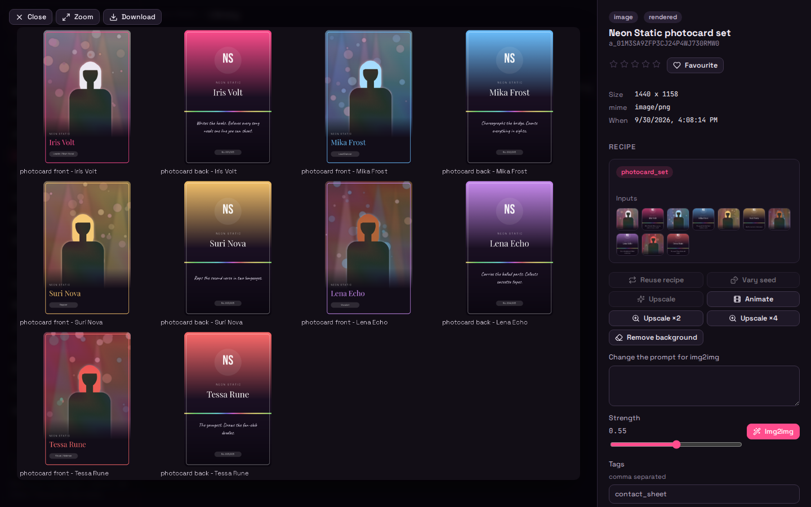
*Actual application, synthetic demo data: the photocard set rendered for the five invented members, opened in the lightbox with its recipe and inputs.*


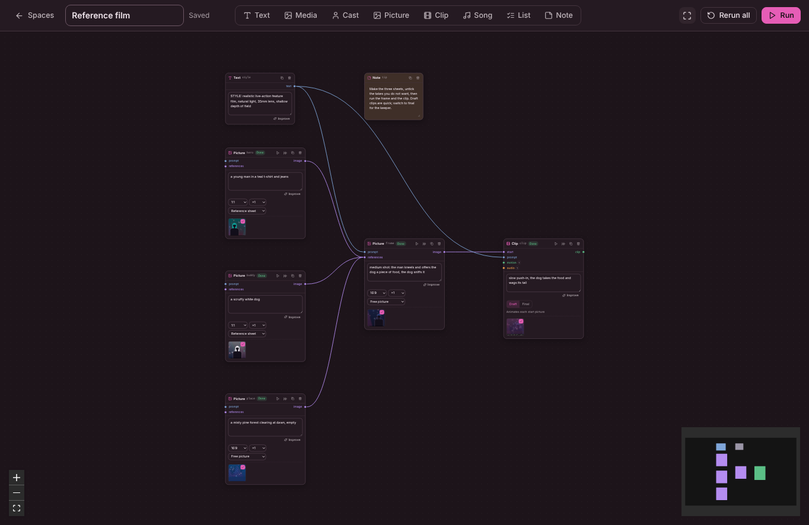
*Actual application, synthetic demo data: the "Reference film" space after one run - three sheets feed a frame through its references, the frame starts a draft clip, the style text reaches both.*

## Models

| Family | Checkpoint / files | VRAM (approx.) | Best for |
| --- | --- | --- | --- |
| Qwen-Image 2.1 (int8) | `qwen_image_2.1_int8_convrot.safetensors` (diffusion), `qwen3vl_8b_int8_convrot.safetensors` (text encoder), `qwen_image_2.1_vae_bf16.safetensors` (VAE) | ~7.3 GB + 9.4 GB loaded one after the other; peak ~10-12 GB at 1 MP, more at native 2K | Best prompt adherence, in-image typography, multi-reference identity (1-10 images) |
| FLUX.1 schnell | `flux1-schnell-fp8.safetensors` | ~13 GB | Fastest drafts (4 steps) |
| FLUX.1 Kontext dev | `flux1-dev-kontext_fp8_scaled.safetensors` + CLIP/VAE | ~13 GB | Single-reference edits |
| SDXL / SD 1.5 | `sd_xl_base_1.0.safetensors` / `v1-5-pruned-emaonly-fp16.safetensors` | ~7 GB / ~3.5 GB | Always available fallback, low-VRAM draft |
| SVD | `svd_xt.safetensors` | ~10 GB | Image to short video |
| Wan 2.2 TI2V (5B) | `wan2.2_ti2v_5B_fp16.safetensors` + VAE | ~12 GB | Image to video, native 1280x704 |
| Wan 2.2 I2V 14B (fp8) | `wan2.2_i2v_high_noise_14B_fp8_scaled.safetensors` + `wan2.2_i2v_low_noise_14B_fp8_scaled.safetensors`, lightx2v 4-step LoRAs, `umt5_xxl_fp8_e4m3fn_scaled.safetensors`, `wan_2.1_vae.safetensors` | ~10 GB (offloads the rest) | Real motion and camera moves (orbit, crane, push-in) from a still, 832x480 / 480x832, 5 s at 16 fps in ~2.5 min |
| Wan Animate 2 (distilled) | `wan_animate_2_distill_fp8_e4m3fn.safetensors` (an fp8 cast of the official bf16, see below; the int8 release also works but crawls when it does not fit in VRAM), `clip_vision_h.safetensors`, `Wan2_1_VAE_bf16.safetensors` | a 16 GB card (jobs wait for one; a 12 GB card takes minutes per step) | Motion transfer: the character of a still performs the motion of a driving video (a dance, a stunt), ~9 min for 3 s on a 16 GB card |
| Wan 2.2 S2V 14B (fp8) | `wan2.2_s2v_14B_fp8_scaled.safetensors`, `wav2vec2_large_english_fp16.safetensors` (audio encoder), `wan2.2_t2v_lightx2v_4steps_lora_v1.1_high_noise.safetensors`, `umt5_xxl_fp8_e4m3fn_scaled.safetensors`, `wan_2.1_vae.safetensors` | a 16 GB card | Lip sync: the character of a still sings or speaks a stretch of audio, 832x480 at 16 fps; ~5 min for 4.8 s on a 5060 Ti 16 GB; longer lines chain extend steps (up to 4, ~19 s) |
| Wan 2.1 InfiniteTalk 14B (480p) | `wav2vec2-chinese-base_fp16.safetensors` (audio encoder), `wan2.1_infiniteTalk_single_fp16.safetensors` (model patch), `Wan2_1-I2V-14B-480p` fp8 and the lightx2v I2V 480p LoRA | a 16 GB card | Long lip sync: up to 90 s in chained windows (template `wan21_infinitetalk`); a Spaces clip with a song picks it past 10 s when installed (`auto`) |
| Wan 2.2 first-last-frame (14B) | template `wan22_flf2v` | a 16 GB card | A clip that starts on one picture and ends on another (a Spaces clip's `end` input, a production's continued shots) |
| Wan 2.1 VACE 1.3B (draft retake) | `wan2.1_vace_1.3B_fp16.safetensors`, `umt5_xxl_fp8_e4m3fn_scaled.safetensors`, `wan_2.1_vae.safetensors` (template `wan21_vace_retake`) | not measured yet | Quick redo of a stretch of a clip (up to ~4 s); installed, not yet run on a real GPU |
| Wan 2.2 Fun VACE 14B (final retake) | `wan2.2_fun_vace_high_noise_14B_fp8_scaled.safetensors` + `wan2.2_fun_vace_low_noise_14B_fp8_scaled.safetensors`, lightx2v 4-step LoRAs high and low (`wan2.2_t2v_lightx2v_4steps_lora_v1.1_*`), `umt5_xxl_fp8_e4m3fn_scaled.safetensors`, `wan_2.1_vae.safetensors` (template `wan22_vace_retake`) | a 16 GB card | Final-quality redo of a stretch of a clip; installed, not yet run on a real GPU |
| Bernini-R 1.3B (draft clip edit) | `wan2.1_bernini_1.3B_fp16.safetensors`, `umt5_xxl_fp8_e4m3fn_scaled.safetensors`, `wan_2.1_vae.safetensors` (template `wan21_bernini_edit`; uni_pc, 30 steps, cfg 4, shift 5) | not measured yet | Quick edit of a clip from an instruction (up to 5 s per window); not yet run on a real GPU |
| Bernini-R 14B (final clip edit) | `wan2.2_bernini_r_high_noise_fp8_scaled.safetensors` + `wan2.2_bernini_r_low_noise_fp8_scaled.safetensors`, LoRA `lightx2v_T2V_14B_cfg_step_distill_v2_lora_rank64_bf16.safetensors` (3.0 high, 1.5 low), `umt5_xxl_fp8_e4m3fn_scaled.safetensors`, `wan_2.1_vae.safetensors` (template `wan22_bernini_edit`; 6 steps split at 3, cfg 1, res_multistep) | a 16 GB card | Final-quality edit of a clip from an instruction; not yet run on a real GPU |
| SDPose whole body | `sdpose_wholebody_fp16` in `ComfyUI/models/checkpoints/` | ~3 GB | Pose map (skeleton) of a picture (template `control_pose`) |
| Depth Anything 3 | `depth_anything_3_mono_large` in `ComfyUI/models/geometry_estimation/` | ~3 GB | Depth map of a picture (template `control_depth`) |
| ACE-Step 1.5 | `ace_step_1.5_turbo_aio.safetensors` | ~8 GB | Song composition with vocals |
| Real-ESRGAN x4 | `ComfyUI/models/upscale_models/RealESRGAN_x4plus.safetensors` | ~2.5 GB | Upscale x2 or x4 of any image |
| BiRefNet | `ComfyUI/models/background_removal/birefnet.safetensors` | ~3.5 GB | Background removal, PNG with transparency |

Wan Animate 2 ships as bf16 (33 GB) and int8: cast the bf16 to fp8 with
`python -m prosperos_hoard.devtools.cast_fp8 wan_animate_2_distill_bf16.safetensors
ComfyUI/models/diffusion_models/wan_animate_2_distill_fp8_e4m3fn.safetensors`
(run it with ComfyUI's Python, which has torch)
(transformer-block weights only, a minute); Prospero loads the fp8 file
when it is there. A template can name the card it needs (`min_card_mb`):
with a render pool, a job waits for a server whose card holds it and the
others keep taking the rest.
Animate renders 3 s (73 frames at 24 fps) by default: on a 16 GB card 81
frames already spill out of VRAM and crawl. Prospero's launcher starts
ComfyUI with disk-backed offload off (a big model then streams from RAM,
not from the disk, on every step); on a Windows card that also draws
desktop apps, `"comfyui": {"args": ["--reserve-vram", "2.5"]}` in
`~/.hoard/backends.json` keeps them from pushing the render into shared
memory.

`studio_generate_image`'s `engine` parameter (and a project's own `image_engine`
setting) picks between the image families: `auto` (default) resolves to
Qwen-Image 2.1 when its node class and model files are installed, else Flux
schnell, else SDXL - every result says which one it actually used. A
`template` name always wins over `engine` when both are given. See
[docs/ARCHITECTURE.md](docs/ARCHITECTURE.md) for how the converter turns
ComfyUI's own UI-format export of each template into the API-format
workflow above, and how a missing model file is reported.

### Upscale and background removal

Two edits of `studio_edit_image` (and the lightbox buttons **Upscale x2**,
**Upscale x4** and **Remove background**) run on ComfyUI core nodes only, with
no prompt, and work on any image asset:

- `upscale` enlarges with an ESRGAN-family model (template `esrgan_upscale`).
  The model works at 4x and the result is scaled down to the requested
  `scale`, 2 or 4 (default 2). Any other value is refused (`bad_parameter`),
  and so is a result larger than 8192 px on a side (`too_large`; the message
  gives the source size and the maximum). `model` may name another file that
  is installed in `upscale_models`; the default is `RealESRGAN_x4plus.safetensors`.
  A source with transparency (a cut-out) runs `esrgan_upscale_alpha`, which
  puts the source alpha back at the new size, so it stays a cut-out.
- `remove_background` cuts out the subject with BiRefNet (template
  `birefnet_remove_background`, the same graph as ComfyUI's own "Remove
  Background (BiRefNet)" blueprint) and imports a PNG that keeps its alpha
  channel. The model file is `birefnet.safetensors` unless `backend.json`
  names another one under `"bg_removal_model"`.

Both always produce one image and record the source in the recipe
(`edit_image:upscale`, `edit_image:remove_background`). The model files are
not bundled; put them here (folders relative to your ComfyUI install):

| File | Folder | Source |
| --- | --- | --- |
| `RealESRGAN_x4plus.safetensors` | `ComfyUI/models/upscale_models/` | https://huggingface.co/Comfy-Org/Real-ESRGAN_repackaged |
| `birefnet.safetensors` | `ComfyUI/models/background_removal/` | https://huggingface.co/Comfy-Org/BiRefNet |

When a file is missing the job fails with `model_missing`, naming the folder
and the files ComfyUI does list. Both nodes need a recent ComfyUI (the
background-removal loader is not in older releases); an older one reports the
missing nodes. VRAM estimates are 2500 MB (`esrgan`) and 3500 MB (`birefnet`),
editable like the others.

## Quick start

```
git clone https://github.com/Luissalet/ProsperosHoard.git
cd ProsperosHoard
```

You need Python 3.11+ (3.13 recommended), Node.js 22 for the interface and
ffmpeg on PATH (or the bundled `imageio-ffmpeg` binary is used). ComfyUI is
optional: `--demo` runs everything against a procedural stand-in.

### Windows

Double-click **`Iniciar Prospero's Hoard.cmd`** (or run `scripts\start.ps1`).
The first run creates `.venv` with Python 3.13, installs
`requirements-lock.txt`, builds the interface with npm and opens
http://127.0.0.1:8815; later runs reinstall only when the lock file changed.
**`Detener Prospero's Hoard.cmd`** stops it (only after checking that the
port really belongs to Prospero).

Manual steps:

```powershell
C:\Python313\python.exe -m venv .venv
.venv\Scripts\python.exe -m pip install -r requirements-lock.txt
cd frontend; npm ci; npm run build; cd ..
.venv\Scripts\python.exe -m prosperos_hoard            # real data in .\data
.venv\Scripts\python.exe -m prosperos_hoard --demo     # demo data in .\data-demo
```

### Linux / macOS

```bash
python3 -m venv .venv
.venv/bin/python -m pip install -r requirements-lock.txt
(cd frontend && npm ci && npm run build)
.venv/bin/python -m prosperos_hoard --demo --no-browser
```

The first `--demo` run seeds its data (about a minute on two CPUs) before
the server answers. Then open <http://127.0.0.1:8815>
(`curl http://127.0.0.1:8815/api/health` answers `"service": "prosperos-hoard"`).

Flags: `--port`, `--data-dir` (or `PROSPERO_DATA_DIR`), `--demo`,
`--no-browser`. `PROSPERO_ALLOWED_HOSTS` (comma-separated) lets the API answer to a LAN or tailnet name. `--demo` starts the procedural demo backend (with `PROSPERO_DEMO_MOTION=1` its fake ComfyUI also lists the big video models - Wan 14B, VACE, Bernini-R - so those features can be tried), seeds an
original five-member group with portraits, stage shots, a cover, a photocard
set, a synthetic 30 s song with timed lyrics and an auto-cut timeline, and
renders its preview video. To use your ComfyUI, leave it on
127.0.0.1:8188 (Hoard Link finds it) or set its URL in Settings. On a GPU
shared with a language model, renders slow down a lot; `PROSPERO_COMFY_TIMEOUT_S`
raises how long a job may run (defaults: video 1 h, audio 30 min, image 20 min).

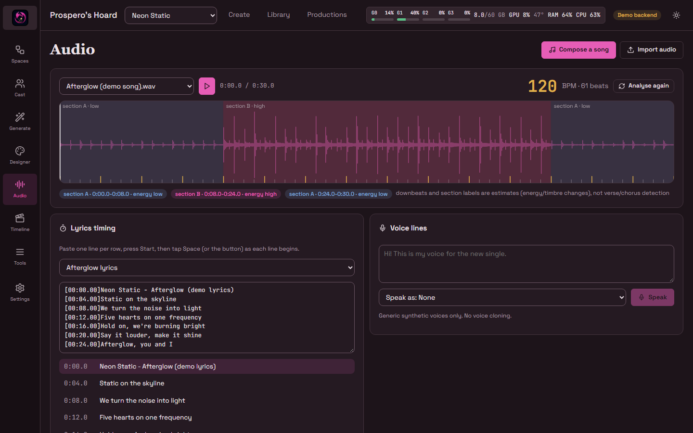
*Actual application, synthetic demo data: the synthetic demo song analysed by the built-in beat tracker, with the section estimates and the LRC lyrics timed to it.*

## Connect it to Faustus

Prospero's Hoard is a plugin for [Faustus](https://github.com/Luissalet/Faustus),
the local AI workspace, and declares itself with
[`faustus-plugin.json`](faustus-plugin.json). Start it, then in Faustus open **Connectors -> Nearby apps -> Add**: Faustus
finds it on port 8815, reads the manifest and launches the MCP adapter
(`prosperos_hoard/mcp_server.py`, stdio). The model backend is shared: the
studio asks Hoard Link which ComfyUI and TTS are already running instead of
loading anything of its own.

### MCP tools

| Tool | What it does | Read-only |
| --- | --- | --- |
| `studio_status` | Backends, checkpoints, free VRAM, queue | yes |
| `studio_services` / `studio_service_start` / `studio_service_stop` | See, start and stop the local servers (ComfyUI, the render pool, Ollama) without Faustus | yes / no / no |
| `studio_gpu_memory` | What each GPU holds and which server holds it, against what each image engine needs | yes |
| `studio_video_plan` / `studio_video_from_plan` | Draft a music video from a concept (shot list, song tags and lyrics in the chosen language, then a director's review that rewrites weak shots) and start it from the edited draft | no / no |
| `studio_delete_assets` / `studio_trash` | Move bad results to the trash (refused while in use unless `force`); list, restore or empty the trash | no / no |
| `studio_projects` / `studio_create_project` | List or create productions | yes / no |
| `studio_cast` | List, create, update characters and groups | no (list is read-only) |
| `studio_generate_image` | Queue txt2img/edit with @mentions, presets and an image engine choice | no |
| `studio_edit_image` | img2img, inpaint, hires fix, model upscale x2/x4, remove background, reuse recipe, vary seed | no |
| `studio_reframe` / `studio_stems` | A picture or clip in another shape (9:16, 16:9, 1:1...) without regenerating it / split a song into vocals, drums, bass and other (plus an instrumental mix) | no / no |
| `studio_retake` | Redo a stretch of a clip (up to ~4 s) with Wan VACE, `draft` or `final`, spliced back into a new clip | no |
| `studio_clip_edit` | Edit a whole clip from an instruction with Bernini-R (`mode` auto/edit/restyle/reference/propagate, `draft` or `final`, `preview=true` shows the text the model gets), spliced into a new clip; `studio_video_frames` takes the first frame with `at_s` | no |
| `studio_animate` | Image to short video (SVD) | no |
| `studio_compose` | Compose a song with vocals (ACE-Step) | no |
| `studio_voice` | Spoken line with a character's voice | no |
| `studio_import` | Import a local file from an allowed folder | no |
| `studio_analyze_audio` | Tempo, beats, sections | yes |
| `studio_design` / `studio_photocard_set` | Render a design / a whole photocard set | no |
| `studio_timeline` / `studio_render` | Auto-cut, read, edit a timeline / render it | no |
| `studio_jobs` / `studio_job` / `studio_cancel_job` | Queue, one job (with wait), cancel | yes / yes / no |
| `studio_assets` / `studio_show` / `studio_lineage` | Find assets, look at them, their recipe | yes |
| `studio_productions` / `studio_production` | List productions / one production's stages, renders and next step | yes |
| `studio_production_create` / `studio_production_continue` / `studio_production_shots` | Start a whole production from a spec / resume or approve it / change shots before the render (including `continue_from` and approving shots with `locked`) | no |
| `studio_production_takes` | Every take a shot has had (stills and clips, the one in use marked); put one back with `studio_production_shots` `{"key", "take"}` | yes |
| `studio_production_regenerate` / `studio_production_promote` / `studio_production_reframe` | Redo only the unapproved shots with new seeds / re-render draft clips as final / add cut shapes (9:16, 16:9, 1:1) and a framing | no |
| `studio_recipe_export` / `studio_recipes_list` / `studio_recipe_get` | Turn a finished production into a recipe with a `{lead}` slot / list recipes / read one | no / yes / yes |
| `studio_recipe_run` | "Recreate this with X": a new production from a recipe with another lead | no |
| `studio_animatic` | The stills cut like the final, 720p, with a plan and GPU estimate, before any clip is rendered | no |
| `studio_qa_run` / `studio_qa_report` | QA pass over a production (check, or check and regenerate the failures) / its last scorecard and retries | no / yes |
| `studio_short_create` / `studio_production_script` | A narrated short (or 2-8 variants) from a topic or a script / read or replace a short's script | no |
| `studio_stock_search` | Search Pexels/Pixabay footage and import results with their credit | no |
| `studio_character_sheet` | Model sheet: the canonical redrawn from set views, added to the dataset | no |
| `studio_character_dataset` | Training images and captions: build, edit, auto-caption, readiness report | no (get/report read-only) |
| `studio_character_train` | Trainers and settings, a training plan, start a local LoRA run, status and log | no (plan/status read-only) |
| `studio_character_adapters` | LoRA adapters (attach, strength, enable) and kit settings (trigger, auto-use, identity threshold) | no |
| `studio_character_takes` | Renders of a character as takes, identity scores, promote/reject | no (list read-only) |
| `studio_character_pack` / `studio_character_library` | Portable `.hoardchar` export/inspect/import / global casting library with versions | no |
| `studio_spaces` | Node canvases: list, create from a template, read, edit with ops (add_node, set, move, connect, disconnect, remove), run (one node, downstream, up to here or all), estimate, build from a sentence, app form (`app`, `app_run`), export / import a technique, stop, delete, restore; nodes include `composite` (layers) | no (list/get read-only) |
| `studio_prompt_enhance` | Rewrite a picture, clip or song prompt with the local model, keeping `@names` and `<imageN>` tags | yes |
| `studio_cinema` | The film-language guide (shot sizes, angles, moves, lenses, light, composition) with the words a model understands | yes |
| `studio_production_finishing` / `studio_canvas` | A music video's look, caption style, framing and beat effects (re-renders only the cut) / a seamless Spotify Canvas loop | no / no |
| `voice_engines` / `voice_create` / `voice_list` | Engine status and install hints / clone a voice from a sample / list saved voices | yes / no / yes |
| `voice_speak` / `voice_transcribe` | Synthesise a line / transcribe audio with timestamps | no / yes |
| `voice_audiobook` / `voice_dub` | Narrate text as chapters / dub a video into another language | no |
| `voice_resynthesize_segment` / `voice_job` | Fix and re-run one dub segment / poll a voice-studio job | no / yes |

| `production_export_lumiere` | Write a production's cut as FCP7 XML + EDL and open it as a project in Lumiere's Hoard | no |
| `cast_import_character` | A cast member from a name, a description, a look and reference images (the same name and `source_ref` twice is the same member) | no |
| `production_from_storyboard` | A production draft from shots `{text, duration_s?, image?}`; not queued, it still needs a song | no |
| `voice_tts` | Speak a text with a saved voice, a chosen engine (`engine`) or the best installed one, at a `speed` of 0.5 to 2.0; returns the path of a WAV | no |

It works with any MCP client over stdio too:

```json
{"mcpServers": {"prosperos-hoard": {
  "command": "C:/.../Prospero's Hoard/.venv/Scripts/python.exe",
  "args": ["C:/.../Prospero's Hoard/prosperos_hoard/mcp_server.py"],
  "env": {"PROSPERO_URL": "http://127.0.0.1:8815"}}}}
```

Arguments, result shapes and limits of every tool: [docs/MCP.md](docs/MCP.md).
The end-to-end recipe the agent follows: [skills/idol-production/SKILL.md](skills/idol-production/SKILL.md).

## The Hoard family

Prospero joins the other Hoard apps through the shared family contract (the vendored `hoard_link`):

- **Shared agent contract.** `GET /api/agent/tools` lists every per-tool route (query and body arguments, `readOnlyHint`, the same
  descriptions as the MCP adapter) and `POST /api/agent/call {name, arguments}` runs one with the family bearer token
  (`data/mcp-token`); it runs the very function the per-tool route runs. Both are placed before the catch-all routes. `/api/health`
  has a `hoard_link` block. `faustus-plugin.json` declares it.
- **Job events.** Renders, songs, clips and whole productions send `prospero.job.queued|started|progress|done|failed|cancelled` with
  `job_id`, `title`, `kind` (`render`, `song`, `clip`, `production`), `progress`, `gpu`, `url`; progress is throttled to one event every
  5 s. A production that stops for you finishes its job as `done` with `status: "awaiting_review"` and `awaiting` (`take`, `animatic`,
  `script` or `review`).
- **Notifications.** Only productions, the thing that waits for a person: it needs a take, the animatic or a review, it finished, or it
  failed (failed = high priority). They go through the family hub and link to the production's page. **Settings > Production notices**
  (or `GET|PUT /api/family/settings`): `notify.via` = `auto` (the hub when it answers), `hub` (always try) or `off`;
  `notify.language` = `es` or `en`. Stored in `data/family.json`.
- **GPU lease.** A job in the GPU lane holds the hub's lease for its class of model (`hoard_link.lease`) on top of the existing VRAM
  check (sized by edit operation - pose and depth maps 3 GB, upscale, background removal - and by clip template - InfiniteTalk, first-last-frame 14B, S2V - rather than by the image engine), so the editor's transcription and the language models do not load at the same moment. With no hub it changes nothing; when the
  hub keeps the lease queued past two minutes the job goes to `waiting_gpu` and retries. `PROSPERO_GPU_LEASE=0` turns it off.
- **For Lumiere.** On a production's page, **Export to Lumiere** (also the tool `production_export_lumiere`) writes the cut's XML and EDL
  to `data/exports/lumiere/` and asks Lumiere's Hoard to open it as a project; if it is not running or may not read that folder, the
  answer says so and the files stay there. Lumiere may only read some folders (`LUMIERE_FILE_ROOTS`): allow Prospero's data folder.

## Shared models (HoardLink)

Prospero hosts no model. It asks [HoardLink](https://github.com/Luissalet/HoardLink)
(vendored in [`prosperos_hoard/hoard_link/`](prosperos_hoard/hoard_link), a
byte-identical copy of HoardLink 0.8.0) for the `image`/`video` backend
(ComfyUI) and `tts` (Faustus TTS, with Piper as the local fallback), the
same resolver every Faustus plugin uses. Resolution order in one line: an
explicit override in Settings, `data/backend.json` or a `HOARD_*`
environment variable, then a running
Faustus instance's own registry, then a server already listening on
loopback (ComfyUI on 8188). Music comes from ACE-Step through the same
ComfyUI, or from a small documented HTTP server you point
`HOARD_MUSIC_URL` at. The **Backends** screen and `studio_status` always
say what was found and why; nothing is loaded or unloaded behind your back.

### What comes from the family commons

The shared library (HoardLink 0.8) replaces code this app used to carry:

- **Downloads from a link** (Library > Download from a link, `studio_download_media`) go to the family's link downloader (Links Hoard)
  first, with the same limits as before (sections, 20 minutes, 1080p). Only when it cannot be reached does Prospero run yt-dlp itself,
  found with the shared tool finder (its own binary, or `python -m yt_dlp`). Links are checked with the shared public-address rules:
  private, loopback, link-local and metadata addresses, numeric hosts and URLs with credentials are refused. Stock footage downloads
  (Pexels, Pixabay) get the same check on every redirect, a connection pinned to the checked address and a 400 MB cap.
- **Speech to text** (the faster-whisper engine of the voice studio) asks Funes's Hoard first (one Whisper for the family) and otherwise
  uses the shared transcriber here, on the GPU when the hub lends it, with Whisper's inventions over silence filtered out.
- **Speech for other apps**: `voice_tts` takes `engine` (an installed engine id; a saved voice's own engine wins) and `speed` (0.5 to 2.0).
- **ffmpeg, ffprobe** are found by the shared finder (`HOARD_FFMPEG`, PATH, the usual Windows folders, then the bundled wheel); child
  processes are the shared ones (a timeout or a cancelled render or training kills the whole process tree).
- **Subtitles and lyrics**: SRT, VTT, TXT, LRC and the ASS text escape are shared (empty cues are skipped; LRC import reads several
  stamps per line, `[offset:]` and enhanced word tags). Settings, a production's state and recipes are written atomically with
  Windows lock retries; ids are the shared ULIDs.
- **The guard** in front of the API (Host, Origin, cross-site checks, websockets too) is shared: a rejected request is a `403`
  with a short message. `PROSPERO_ALLOWED_HOSTS` adds LAN or tailnet names (`studio.lan`, `*.ts.net`). A cross-site request that is not a
  page navigation is refused. The MCP bridge ignores proxy variables and the longest server-side wait is 150 s (`wait_s`).
- **Production notices** use the shared `auto | hub | off` router (a notice the hub holds for quiet hours counts as delivered).

### A music video from the app

**Productions > New music video**: a title, the lead from the cast (its
canonical image keeps the look) or a new one, the concept, the song
(composed - sound, lyrics language, length - or one you already have, with
its lyrics), how many shots, which shots get Wan clips (every moving shot,
only the lead's, or none for a cut of stills) and the formats. **Plan with
the local model** writes the shot list, the shared look and, for a composed
song, the tags and the lyrics - in the language chosen (an answer in the
wrong language is asked again once, then flagged) - with thinking off and a
long timeout, so a 27B split over four cards answers in a minute or two.
The button counts the time and **Stop waiting** gives up on it. The answer
is streamed: a model that does not start writing, or goes quiet, for four
minutes (typically because a render has filled the GPUs it shares) ends the
plan with a message naming the render in the way, instead of hanging. A reply the planner cannot use (no shots, another
shape, cut short) is asked for again once, with room for every shot; the
last unreadable one is kept in `data/logs/plan_last_bad_reply.txt`. A
render that runs out of time is stopped on ComfyUI too, so it does not keep
the card busy for an image nobody collects.
The plan is then reviewed (`critic`, on by default in `studio_video_plan`): a rubric that needs no model
(near-duplicate shots, one shot size everywhere, the lead never or always on screen, the same motion
everywhere, song sections without a shot) and a director's pass that rewrites the weak shots. In the
dialog the first list shows at once and the review runs on its own (`POST /api/productions/plan/critique`)
while you already edit it: its notes come in the app's language (`notes_language`) and its rewrite is a
proposal, **Apply** or **Keep mine**; once applied, **Use the first list** brings back the list before the
review (`draft.first_shots`).
Everything is editable before anything renders; **I'll write the shots**
skips the model. **Create the production** runs the usual pipeline: the lead,
the song takes (with more than one, it pauses so you listen and **Use this
take**), Qwen-Image stills from the canonical image, the animatic to
review, the Wan clips and the cut on the beat. In the viewer, **Animate**
makes a Wan 2.2 clip (SVD only when Wan is not installed) and **Edit with the
instruction** edits the picture with Qwen-Image keeping its subject.

The production page keeps the **shot list editable** the whole time: every
shot shows its still, its song section, where it plays in the song (from
the animatic's cut) and, while rendering, how it is going ("still · 1:23 /
~2:00", queued, failed). Click a shot to change what it shows, the motion
text, whether the lead is in it, its section (with that section's lyrics
next to it), still or clip, which variant is the still, or to regenerate or
delete it; **+** between two shots adds a new one there. Each shot can take
its own **references**, each with what to take from it ("copy this dance
pose", "these Pokemon dance in the background", "this place"): from the
library, frames taken out of a video or an animated GIF, an upload, or a
YouTube / X / Instagram link (only the part between *from* and *to* is
downloaded). They follow the lead's canonical image as `<image2>`,
`<image3>`... Edits apply when the production is paused (**Pause to
edit** keeps whatever already rendered); **Save and render** rebuilds only
what changed. **Lyrics** gives an existing song its lyrics with
`[Verse]`/`[Chorus]` tags: timed to the song, they make each shot play over
its section. A lead shot is edited from the canonical image keeping its
design (face, body shape, colours, props) but taking the pose and action of
the shot's text. References shape the still; the clip animates that still
from the motion text with Wan 2.2 I2V 14B when it is installed (camera
presets in the editor: orbit, crane from feet to head, push-in, tracking,
low angle, handheld), else Wan 2.2 TI2V 5B.

**Motion from a video**: a shot can take a video (library, upload or a
link, from a chosen second) as its motion reference. Its clip then runs Wan
Animate 2: the character of the shot's still performs that motion - a
dance, a gesture, a stunt - frame by frame, no skeleton needed, with the
background from the shot's text. The video is only a source of movement:
nothing of its picture ends up in the clip.

**Background cast**: one image and a name per character allowed in the
background (up to 24). Shots ticked **Background from the cast** take a few
of them (three by default, rotating so everybody shows up; or exactly the
ones picked in the shot) as references, with the instruction that only they
appear behind the lead, exactly as drawn, nobody invented. Changing the cast
redraws only the shots whose crowd changed. When the cut uses clips it
cuts on whole bars about every 4 s (2 s in the chorus), so a dance has time
to read (`clip_settings.cut_s`, or explicit `beats_*` options).

**Library > Download from a link** brings a video (or just a section of
it, or its audio) from YouTube, X, Instagram and the other sites yt-dlp
knows, as an mp4 in the project (whole videos up to 20 minutes, or the
section between two times), through the family's downloader when it runs and
with yt-dlp here otherwise. Animated GIFs import as videos.

**Backends > These ComfyUI servers are only for Prospero**: when a server
is idle, a job may load its model in place of the last job's instead of
waiting for free VRAM (off by default, for GPUs shared with other apps). A
model estimated bigger than the card never waits for more than 85% of it:
ComfyUI offloads the rest.

### Running without Faustus

The header carries the machine's vitals on every screen: GPU use, one tank
per card (as wide as the card is big), VRAM, the hottest card's temperature,
RAM and CPU. Click it for every card (use, temperature, power, VRAM and the
servers and models on it), RAM with the committed memory (RAM + page file,
what a model that does not fit ends up using) and CPU, with Free ComfyUI and
Stop for the servers that may be stopped.

Bad results go: **Select** in Generate and in the Library, then **Delete**
(the Delete key in the Library too); **Delete** in the viewer (or the Delete
key twice) moves to the next one. Deleted assets go to the trash (files under
`data/trash/<id>/`) with ten seconds of **Undo**, and **Library > Trash**
restores them or empties it for good. An asset used as a cover, a
character's canonical or reference image, a group logo or on a board is
refused with the reason and a **Detach and delete** (restoring puts it
back); one used in a timeline is always refused.

The **Generate** screen opens with the model header: the image engine
(Automatic = Qwen-Image 2.1 when installed, FLUX.1, SDXL, SD 1.5, your
imported workflows) and the model file for it, where ComfyUI runs (with
**Start** when it is off and **Free ComfyUI**), and whether the engine fits
in the GPU it will use: "Qwen-Image 2.1 needs about 12 GB; GPU 3 has 3 GB for
it... held by llama.cpp (qwen3.8-27b)" with a **Stop llama.cpp** button right
there. **GPU memory** lists every card with what each server keeps loaded
(ComfyUI, llama.cpp and its model, Ollama and its models) and the start/stop
actions. With Qwen-Image or Kontext the reference images go to the engine's
own edit (up to 10 with Qwen, `<image1>` is the subject) at full denoise;
the img2img strength and the sampler settings only apply to SDXL, and empty
fields under **Advanced** use each engine's tuned values. An edit keeps the
size and framing of `<image1>` (**Like <image1>**, picked as soon as the
first reference goes in; a ratio forces that exact canvas instead), and
typing `<` in the prompt lists the references (`<image1>` with its thumbnail...; Tab or Enter inserts one), and
with several references the panel warns when the instruction does not name
one of them - say what to take from each, e.g. `<image1> wearing the jacket
from <image2>`, and describe it by what the reference shows rather than
restating its colours, which the edit follows over the image. A ComfyUI
busy with a heavy render shows as running (**busy**), not off.

Prospero does not need Faustus running. **Backends > Local services** lists
the servers it uses - the main ComfyUI, every render-pool server, Ollama and
any server you describe in `~/.hoard/backends.json` - with a **Start** button
(and a GPU choice for ComfyUI: the card with the most free memory by
default) and a **Stop** button for the ones the Hoard family started. With
**"Start ComfyUI by itself when a job needs it"** on (the default), a render
queued while ComfyUI is off starts it first and then runs; with it off, the
job fails with a message pointing at the Start button. Starting ComfyUI
loads no model: memory is only used when a job runs. The agent does the
same with `studio_services`, `studio_service_start` and `studio_service_stop`.

ComfyUI is found in `COMFYUI_DIR`, the folder saved in Backends, or the
usual places (`D:\LocalAI\ComfyUI`, `C:\ComfyUI`, `~/ComfyUI`, the portable
build...), with the Python of its `venv`, `.venv` or `python_embeded`.
It is started on loopback with `--cuda-device` for the chosen GPU; a server
on any port other than 8188 gets its own output, temp, user and database
folders under `~/.hoard/backends/`, so two instances never race. Ollama is
found on `PATH` or in its default install folder. The launcher is
`hoard_link/launch.py` from HoardLink, shared with Hoard Hub and the rest of
the family: `~/.hoard/backends.json` says where things are installed,
`~/.hoard/backends/state.json` which processes the family started (pid and
creation time, logs next to it). A ComfyUI started from Hoard Hub shows up
here and can be stopped here, and the other way round; a server started by
hand or by Faustus is shown as running and never stopped.

```json
{
  "comfyui": {"dir": "D:/LocalAI/ComfyUI", "gpu": "auto", "args": ["--lowvram"]},
  "ollama": {"exe": null},
  "commands": [
    {"id": "llamacpp", "label": "llama.cpp", "argv": ["powershell", "-NoProfile", "-File", "D:/LocalAI/Start-LlamaServer.ps1"],
     "health": "http://127.0.0.1:8081/health", "capabilities": ["llm", "vision"]}
  ]
}
```

## Production example

[`scripts/productions/no_mires_atras.py`](scripts/productions/no_mires_atras.py)
produces a single by FAROL, "NO MIRES ATRÁS" in Spanish or, with `--lang en`,
"DON'T LOOK BACK" in English (an original night creature:
a paper-lantern head, always still, always a little closer), end to end
**through the MCP adapter only** - it spawns `mcp_server.py` over stdio,
the same path Faustus uses, and fails if any result carries a picture it
did not ask for. Nine steps: the project (with an `--engine auto|qwen21|flux`
choice, set as its own default); a turnaround sheet cropped to its front
view as FAROL's canonical reference; the song with ACE-Step; twelve stills
(an edit template with that reference when FAROL is in frame, a fresh
txt2img in the same night look when not - Qwen-Image 2.1 when installed,
else Flux); Wan clips from the best stills; a solo
photocard set in five idol looks with its contact sheet; the "night" cover,
tracklist back, teaser poster and lyric card; lyrics timed to the song's
bars; 9:16 and 16:9 cuts that follow a storyboard per section and change
shot on every sung line, graded sodium-night with grain, vignette and a
flash + colour-split glitch on the chorus downbeats, horror karaoke captions; and a
`REPORT.md` with every asset id, timings and what to review. It checkpoints
every still, clip, card and render, so an interrupted run resumes where it
stopped; `--only <step>` redoes one step.

On Windows, with the app running and ComfyUI started on a 16 GB card:

```powershell
# the demo backend (no GPU), a few minutes
.venv\Scripts\python.exe scripts\productions\no_mires_atras.py --backend fake --quality draft
# the real thing against the running app and ComfyUI
.venv\Scripts\python.exe scripts\productions\no_mires_atras.py --backend real --quality final
# pin the image engine instead of "auto" reaching for Qwen-Image 2.1 first
.venv\Scripts\python.exe scripts\productions\no_mires_atras.py --backend real --quality final --engine flux
# the English version on top of a finished run: same pictures, a sung song, a clip for every shot
.venv\Scripts\python.exe scripts\productions\no_mires_atras.py --backend real --quality final --lang en --reuse-from data\productions\no_mires_atras --motion full --song-takes 4
# after re-timing the lyrics by ear in Audio > Lyrics timing and exporting the LRC
.venv\Scripts\python.exe scripts\productions\no_mires_atras.py --backend real --quality final --only timeline --lrc-path C:\Users\<you>\Music\no_mires_atras.lrc
```

### In the app: productions and recipes

The same pipeline also runs inside the app as a **production**
(`studio_production_create`, or the **Productions** screen): one
orchestrator job that queues the reference sheet, the song, every still and
every clip as ordinary jobs (a render pool renders them side by side),
checkpoints each item into `data/productions/<slug>/state.json`, and writes
a `REPORT.md`. After the stills and the song it makes an **animatic** (the
stills cut exactly like the final, 720p, with a `plan.json` and the GPU
minutes the clips will cost) and waits for your review before rendering a
single clip. It resumes where it stopped after a failure, a cancel or a
restart; `studio_production_shots` swaps a still for another variant, turns
a clip on or off or rewrites a shot, and only what depends on it is redone.

A finished production - including one made by the script above - becomes a
**recipe**: `studio_recipe_export(production, name)` writes
`data/recipes/<name>.json` with every stage, prompt, seed, template and
setting, and the lead abstracted into a `{lead}` casting slot (`{lead}`,
`{lead.look}`, `{lead.negative}`, `{lead.palette[0]}`...), plus warnings
for shot prompts that still describe the old lead's props.
`studio_recipe_run(recipe, cast={"lead": <character id or {name, look}>})`
("recreate this with X", or **Recreate with...** on the Productions
screen) starts a new production with the slot filled: an existing
character keeps its canonical reference, a new one gets a reference sheet
first, and the song (unless its lyrics name the old lead) and the stills
and clips of the shots the lead is not in are reused
(`options.reuse: ["song", "frames", "clips"]`).

**A production's page** works like the studios it borrows from: a pipeline
of its stages (done, running, paused for review, failed) and one banner with
the next thing to do - pick the song take (the takes play right there),
watch the animatic and render the clips (with the GPU minutes it will
take), resume after a failure (the error in plain words, the raw text one
click away) or continue after an edit - and four tabs: Storyboard (shots and
the song track), Preview (final cut and animatic), QA and History. Each
project has its own **Videos** page (a gallery with a cover, the stage and a
progress bar per video) and its Overview shows them with a "New music video"
button that makes it in that project. The header's "N active" button opens
what is running now - with progress, a cancel, and a click through to the
production it belongs to. Dialogs keep their buttons in view however long
they get.

**Autopilot** (a switch on the production, or when creating it) runs every
stage without stopping - the first song take, no animatic review - and the
creation dialog shows what the run will cost on this machine (stills,
clips, GPU hours) before anything starts. Before a run, the page checks what
would stop it - ComfyUI down (with a Start button), no music model for a
song still to compose, no ffmpeg, no GPU with enough free memory - and says
so in plain words. A finished cut downloads for **Premiere Pro or DaVinci
Resolve** (FCP7 XML + CMX 3600 EDL, the lyrics as markers, the media
referenced where they live on this computer), from the production's Preview
tab or the Timeline screen (`studio_export_timeline`).

The **Audio** screen composes songs too (style, lyrics, BPM, length, key,
takes) and imports audio files; a character without a reference image gets
a "Make a reference" button that opens Generate with a portrait prompt, and
any picture in the viewer can become a character's reference image in one
click.

**Song and lyrics** on a production is a video editor standing up: the
lyrics timed to the song on one vertical line (sections beside them, a
playhead while it plays) and a **shot track** next to them. Shots are laid
one after another - dragged in from the shot list, or **Add next** - then
moved or trimmed at either edge (they snap to the lyric lines; Alt places
freely, and they snap to the song's beats too: bar lines are drawn across the
track), and each block shows the words it plays over and how many bars it lasts.
Where the cut put the shots left off the track shows as faint marks; click one
to pin that shot there. A placed shot plays
exactly there in the animatic and the final cut (`span {start_s, end_s}` on
the shot; spans cannot overlap); shots left off the track are placed by the
cut by their section. Clicking lines (shift for several) makes a new shot for
exactly those words. **Change song** swaps the song without redoing the
stills or clips: a song from the library of any project (with its own lyrics
when it was composed here), an uploaded file, another take, or a recompose
with new style/tempo/length/words - the lyrics are timed to it at once.
`studio_production_song` and `studio_production_timing` do the same for an
agent. The library pickers (references, motion videos, background cast,
songs) are a searchable menu with a preview: click to see it (videos and
songs play), double click or Enter to use it, "All projects" to look
beyond this one.

**Deleting a project** (the bin on its card in Projects, or
`studio_delete_project`) moves it to the trash with everything in it and
its productions: it disappears from every list and from the all-projects
search. "Deleted projects" at the bottom of Projects restores it as it was,
or deletes it for good (rows, files, thumbnails, trashed assets and its
productions; no undo). A project with a job queued or running is refused.

A production whose run died without writing its end (the app closed, or
Windows refused the state write because another reader had the file open)
no longer stays "running": it shows as failed, can be edited and resumed.
State and recipe writes retry the replace for a moment on a Windows
sharing violation instead of failing the run.

### Narrated shorts

`studio_short_create(topic="why the sea glows at night", options={"language":
"en", "visuals": {"source": "auto"}, "music": {"mode": "compose"}})` (or
**New short** on the Productions screen) makes a vertical video out of a
topic, as a production of its own kind (`kind: "short"`) with the same
resume, jobs and lineage:

1. **script** - the local model writes a hook and 5-9 segments, each with
   the narration, an English image prompt and English stock keywords, plus
   a title, a description and hashtags; or pass your own script (plain
   text, one paragraph per segment, or segments). With
   `settings.script_review` it stops here for you to read it.
2. **narration** - each sentence voiced and placed on one clock (exact
   sentence and segment times); with faster-whisper installed, the word
   times it hears are aligned onto the script's own words, so the captions
   keep your spelling.
3. **music** - none, an existing asset, an ACE-Step instrumental, or a
   track picked from `data/music/`.
4. **pictures** - each segment split into ~3 s shots, filled with stock
   footage (Pexels/Pixabay, needs a free key in Settings) or generated
   stills in the project's image engine; `visuals.clips` animates the
   longest stills with Wan after an animatic review.
5. **mix** - the voice over the music, which a sidechain compressor pushes
   down while someone speaks, normalised to -14 LUFS.
6. **cut and render** - the shots on the narration's clock, captions two
   or three words at a time with the spoken word highlighted, every aspect
   you asked for; then `REPORT.md` and `publish.txt` (title, description,
   hashtags and the footage credits).

`studio_production_script(production, script)` replaces the script and
redoes the narration, pictures, mix and render (the music is kept);
`count=3` makes three variants with other seeds (other footage, other
generated pictures and, from a topic, another script).

### The real run

The same script ran against a real ComfyUI 0.37 on 16 GB cards, in two
versions that share every picture and clip. **DON'T LOOK BACK**
(`--lang en --motion full`) is a sung English horror anthem told by the
creature, with a clip for every shot, rendered on a render pool of three
ComfyUI servers, one per card. **NO MIRES ATRÁS** is the first take, a
Spanish horror rap cut from seven clips on one card. Qwen-Image 2.1 made the
reference sheet, the stills and the photocards, Wan 2.2 TI2V 5B the clips
and ACE-Step 1.5 the songs. The canonical reference, the best variant of each
shot and the song take were picked by eye and by ear. The lyrics were aligned
to the vocals with faster-whisper (outside Prospero) and imported as an LRC
with timed section markers. Everything below comes straight out of the app,
only downscaled for this page: nothing was retouched. The prompts, seeds,
settings, timings and the nine problems the run found (all fixed) are in the
[full example](docs/examples/no-mires-atras.md).

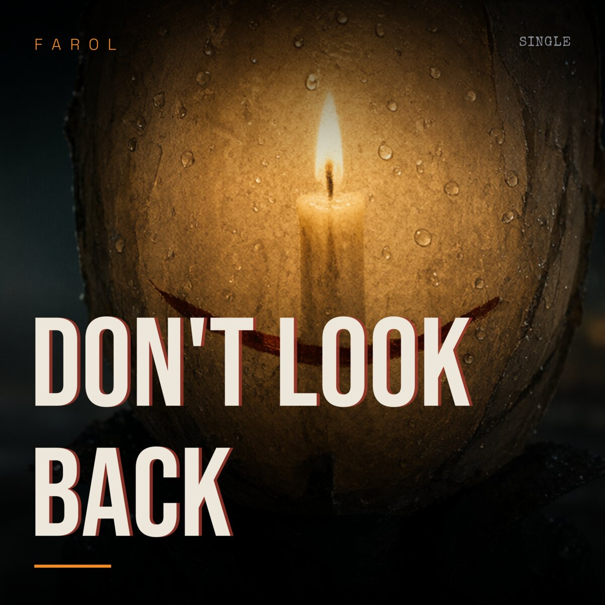

<p>

</p>

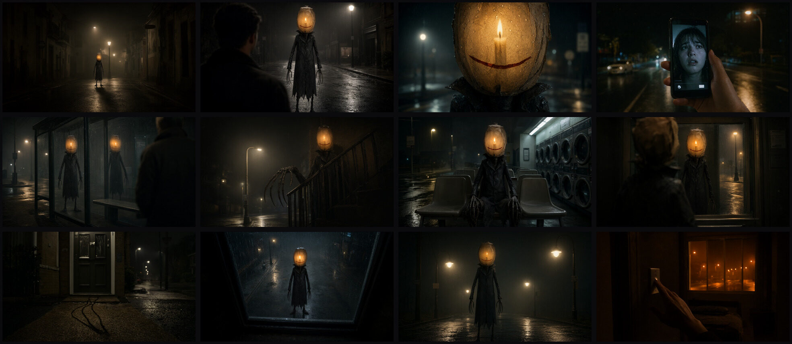

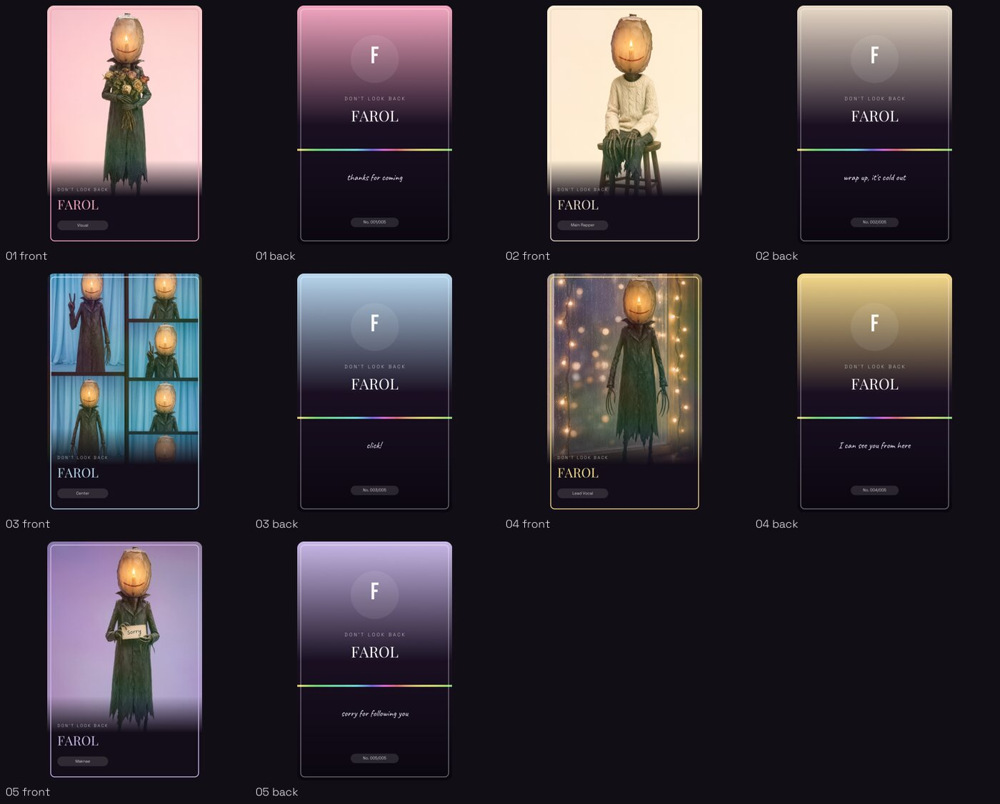

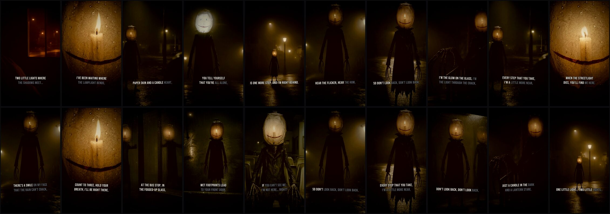

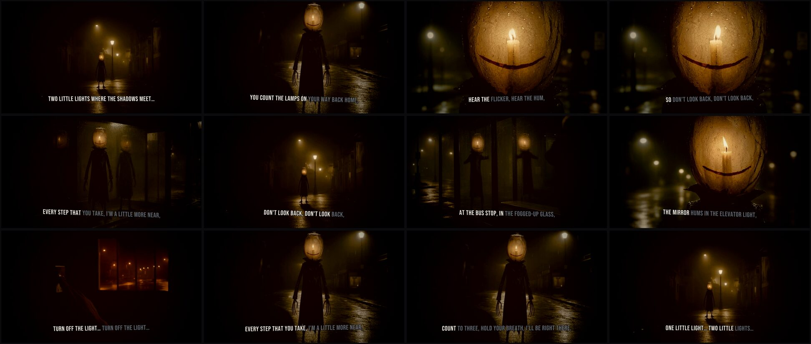

On 16 GB cards: 48 stills in 57 min, the first seven 5 s clips in about
70 min on one card and eleven more in about 40 min on three, four song takes
in 2 min, and both cuts (preview and 1080p final) in about 7 min.

## Architecture

FastAPI + SQLite (WAL, one connection per thread) with a GPU worker, a
CPU worker and an orchestrator thread (whole productions) over a persistent
job table; business logic in plain modules (`engine`, `comfy_driver`,
`design`, `audio`, `timeline`, `video`, `voices`, `productions`, `recipes`)
with no web imports; Hoard Link vendored for backend resolution;
the MCP adapter is a separate stdio script that only speaks HTTP to the app.

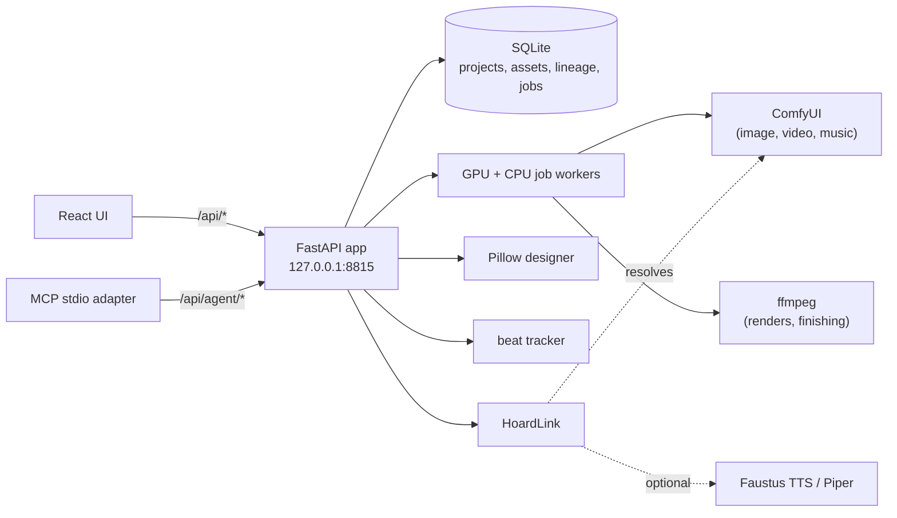
```mermaid
flowchart LR
  UI["React UI"] -->|"/api/*"| API["FastAPI app<br/>127.0.0.1:8815"]
  MCP["MCP stdio adapter"] -->|"/api/agent/*"| API
  API --> DB[("SQLite<br/>projects, assets, lineage, jobs")]
  API --> JOBS["GPU + CPU job workers"]
  JOBS --> COMFY["ComfyUI<br/>(image, video, music)"]
  JOBS --> FF["ffmpeg<br/>(renders, finishing)"]
  API --> DESIGN["Pillow designer"]
  API --> AUDIO["beat tracker"]
  API --> LINK["HoardLink"] -. "resolves" .-> COMFY
  LINK -. "optional" .-> TTS["Faustus TTS / Piper"]
```

Details, data model and decisions: [docs/ARCHITECTURE.md](docs/ARCHITECTURE.md).
Every endpoint: [docs/API.md](docs/API.md).

## Privacy and security

Local only: the app binds 127.0.0.1, sends no telemetry and only goes
online when you ask for a Piper voice that is not downloaded yet (from the
rhasspy/piper-voices repository on Hugging Face). Requests with a foreign
`Host` header are refused (DNS rebinding) and so are writes from other
websites (`Origin` and `Sec-Fetch-Site` checks). Agents can import files
only from your home folder, `data/inbox` and folders you add in Settings,
and only files whose content matches their type; files are always served by
id, never by a path the client sends. Every call an assistant makes is
written to the `agent_calls` audit table and shown under **Assistant
activity** (tool, argument summary, duration, result). The demo uses
invented people only. Voice cloning runs entirely on local engines that you
install explicitly (nothing is downloaded silently); a cloned voice is only
ever created from a sample you provide, and using someone else's voice
without their consent is on you, not the tool. Data stays in `data/` (or
your `--data-dir`); the Faustus token is stored in `data/backend.json` and
never returned by the API.

## Development

```powershell
.venv\Scripts\python.exe -m pytest -q
cd frontend; npm ci; npm run build
```

On Linux/macOS the same with `.venv/bin/python`. **about 675 tests pass**, offline, with no GPU and no
model downloads (the demo backend stands in for ComfyUI, and the voice
studio's own suite adds fake TTS/STT engines plus real, optional tests
against Piper and faster-whisper when they are installed). The suite covers
the voice engine registry (install-hint status without ever importing a
heavy dependency), the voice library's sample processing and quality check,
the audiobook chunking/assembly and dubbing pipelines end to end (including
the time-fitting maths, glossary-aware translation through a fake local
model, and per-segment re-synthesis), the `/api/voice/*` HTTP surface, and
the 9 voice MCP tools driven over the real MCP protocol; and the MCP protocol end
to end (the adapter spawned over stdio against a live app: tool keywords and
annotations, generation with a picture, lineage, design, readable errors,
the app-not-running message); the UI-format-to-API workflow converter
against seven official ComfyUI templates (ComfyUI 0.37, including the two
Qwen-Image 2.1 ones, its promoted-widget subgraphs, dynamic combo and
autogrow sockets), compared input for input with what the real frontend
exports (subgraphs and promoted widgets, dynamic combos, autogrow inputs,
bypass/mute, `PrimitiveNode`/`Reroute`) and UI exports imported through the
API with and without ComfyUI; the six built-in templates that were converted
this way (Flux schnell, Kontext edit, Wan 2.2 TI2V, ACE-Step song,
Qwen-Image 2.1 txt2img and edit) passing server-side validation with their
own defaults - including that a model file missing from `/object_info`
reads as "download it", never a crash - and generating against the fake
backend's real `/object_info`; the `auto|qwen21|flux|sdxl` image engine
choice (installed-model detection, per-project default, per-call override,
graceful fallback) and Qwen-Image 2.1's multi-reference edit (1-10 images,
extra reference nodes wired or dropped to match); lyric timing from section
tags, storyboard pools and cut-on-lyrics; a long transition render that
must keep its full length; character-consistency routing and its
`consistent_needs_reference` error; the finishing filter graphs (colour
grade, grain, vignette, letterbox, glitch) snapshot-tested plus a real
ffmpeg render; byte-identical reproduction through "reuse recipe";
@mention edge cases; checkpoint, sampler and missing-node validation;
hostile workflow imports; import traversal, symlinks, renamed files and the
allowed-folder rule; SPA and asset path traversal; the browser-attack
guard; job restart recovery, VRAM waiting and cancellation; the beat
tracker on click tracks, drum patterns and the demo song; auto-cut
invariants; ASS escaping of hostile lyrics; real ffmpeg renders in a folder
named like the Windows install (apostrophe, spaces, accents); design
golden hashes, bleed and text fitting; thread safety of the store; and the
Faustus manifest check.

`npm run build` in `frontend/` passes with zero TypeScript errors.
[CI](.github/workflows/ci.yml) runs the tests on Ubuntu and Windows with
Python 3.11, 3.12 and 3.13 and builds the interface with Node.js 22.

## Characters that stay the same

The kit is how a character survives many shots, engines and projects
([docs/CHARACTERS.md](docs/CHARACTERS.md) has the details):

1. **Canonical** - one good image of the character (Cast -> Edit).
2. **Model sheet** - Kit -> Model sheet renders the canonical from set views
   with the edit engine; each view lands in the dataset with a caption.
3. **Dataset** - add the best takes, fix captions (the trigger word stands
   for the permanent look; captions describe pose, framing, light), watch
   the readiness report.
4. **Training** - pick the architecture of the engine you render with and
   start; the adapter is installed in ComfyUI and attached. From then on
   every `@Name` render with that engine loads it, and productions render
   the lead's shots txt2img + adapter (free poses) instead of editing the
   canonical.
5. **Takes** - score identity, keep the good ones, reject the drifted ones,
   promote a better canonical.
6. **Pack / library** - export a `.hoardchar` or save a version to the
   library; cast it into any project, or use it as a recipe's lead
   (`cast={"lead": "lib_..."}`).

Training runs a separate trainer program. Configure it in Kit -> Training ->
Configure (or `training` in `data/backend.json`):

```json
"training": {
  "lora_dir": "D:/LocalAI/ComfyUI/models/loras",
  "gpu": "auto",
  "trainers": [{"kind": "ai_toolkit", "name": "ai-toolkit", "dir": "D:/LocalAI/ai-toolkit"}],
  "base_models": {"qwen_image": "Qwen/Qwen-Image", "flux1": "black-forest-labs/FLUX.1-dev"}
}
```

`--demo` configures a fake trainer so the whole flow can be tried without a GPU.

## Roadmap / known limits

- The QA director's checks are heuristics (thresholds in
  `settings.qa.thresholds`); its bible/prompt/reference scores need a vision
  model behind Hoard Link, and picking the final take by ear is still yours.
- A recipe abstracts the lead's name, look, negative, palette and bio; shot
  prompts that describe the old lead's props ("the lantern head") are listed
  as warnings for you to rewrite, not rewritten.
- `consistent=true` keeps a character's design from its canonical
  reference; Kontext takes a single reference (Qwen-Image 2.1 up to 10) and
  Wan is image-to-video only.
- Lyric auto-timing is an estimate from the song's structure, not vocal
  alignment; re-time by ear in **Audio > Lyrics timing**, or import an LRC
  aligned elsewhere (the example used faster-whisper), for a final cut.
- Section labels are "section A/B" with an energy level, not verse/chorus;
  very fast songs (around 170 BPM) are reported at half time.
- The MCP tools poll jobs (`studio_job` can wait server-side); the family
  hub hears `prospero.job.*` events, other clients do not.
- Timeline editing is clip-level, Ken Burns is a zoom range plus a pan
  direction, and colour grades are filter approximations, not 3D LUTs.
- The QR layer of the designer draws a placeholder box.
- A short's script is written by whatever local model Hoard Link finds:
  check its facts before publishing (`settings.script_review` pauses for
  that). Nothing is uploaded to the platforms; `publish.txt` is for pasting.

## License

MIT - see [LICENSE](LICENSE). Bundled fonts keep their own licences: SIL
Open Font License (`prosperos_hoard/fonts/*/OFL.txt`), except Special Elite
(Apache License 2.0, `prosperos_hoard/fonts/SpecialElite/LICENSE.txt`).
