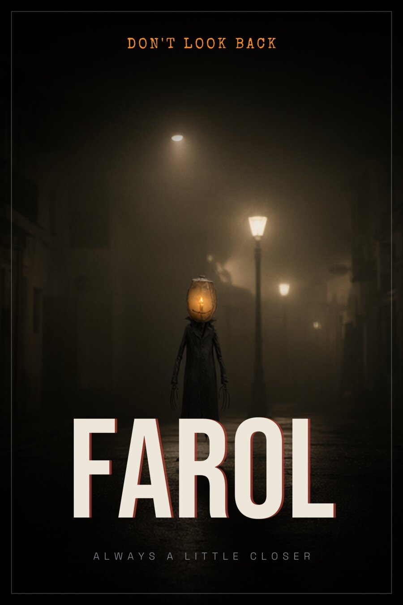
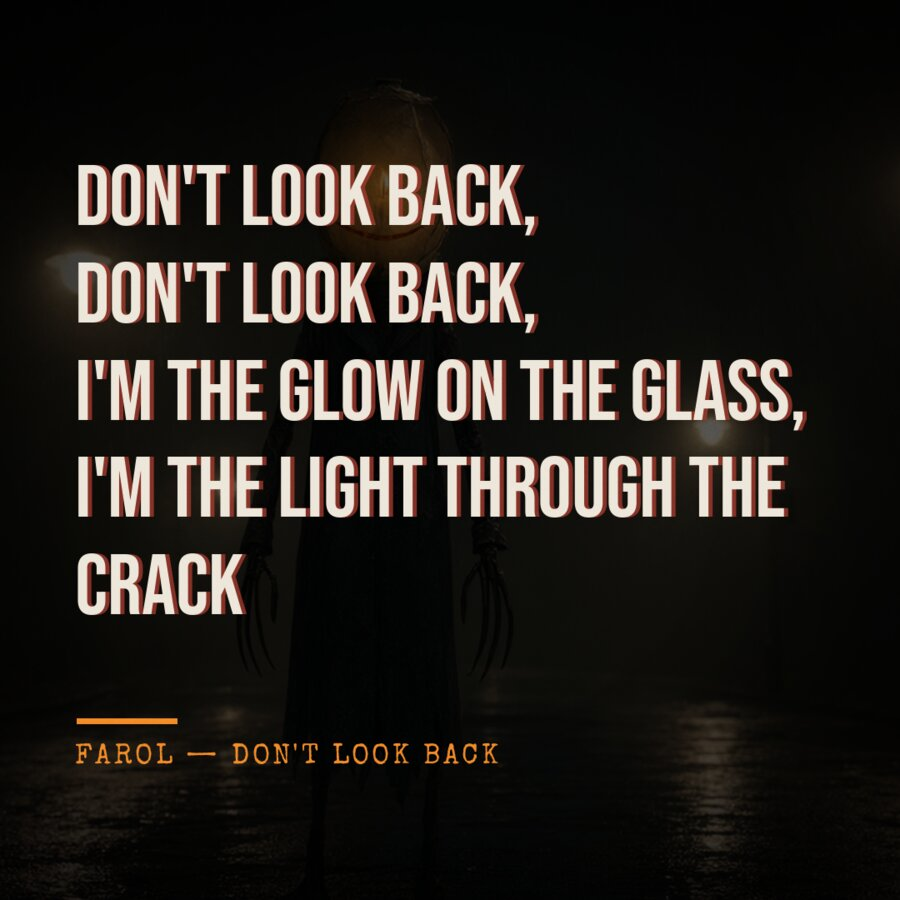
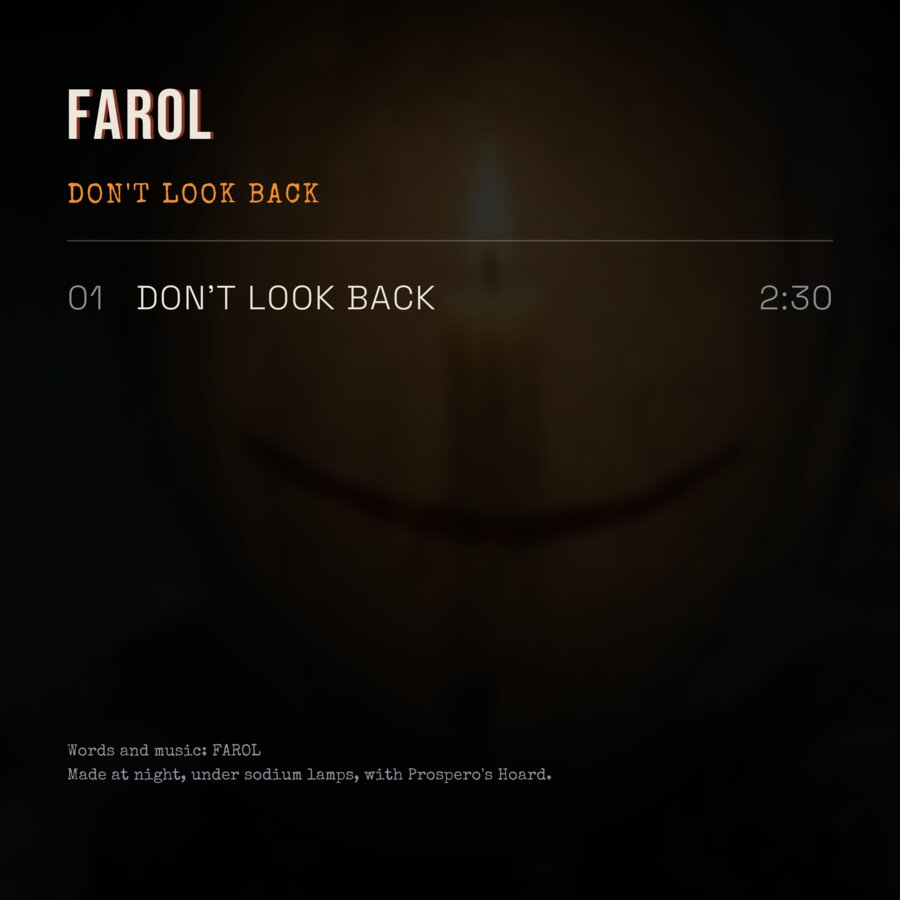

# Example production: "DON'T LOOK BACK" by FAROL

[Español](no-mires-atras.es.md) · [Back to the README](../../README.md#production-example)

A two-and-a-half-minute horror song with an original character, made end to
end on one local machine by
[`scripts/productions/no_mires_atras.py`](../../scripts/productions/no_mires_atras.py).
It exists in two versions that share every picture and clip: **DON'T LOOK
BACK**, a sung English horror anthem told by the creature (`--lang en
--motion full`, the one shown here), and the first take, **NO MIRES ATRÁS**,
a Spanish horror rap (the default). The English version was made with
`--reuse-from` the Spanish run, so only its song, its extra clips, the
designs and the cut were made again.
The script drives Prospero **only through its MCP adapter**, the same path
Faustus uses. This page holds everything needed to understand or reproduce
it: the character bible, every prompt and negative, the seeds, the model and
sampler settings, the real timings, and the problems the run found (all
fixed in the app).


| | |
| --- | --- |
| Hardware | ComfyUI 0.37 on 16 GB cards (RTX 5060 Ti): one for the Spanish run, three as a render pool for the English one; Prospero, ffmpeg and the designer on the CPU |
| Image model | Qwen-Image 2.1 (int8): the reference sheet, the stills and the photocards; the edit template carries FAROL's reference |
| Video model | Wan 2.2 TI2V 5B: 18 clips of 5 s at 1280×704, 24 fps (every shot, plus second clips for the busiest sections) |
| Music model | ACE-Step 1.5 turbo: four 150 s takes for the English version, two 120 s takes for the Spanish one |
| Lyric timing | word timestamps from faster-whisper (`small`, run outside Prospero), aligned to the written lyrics and imported as an LRC |
| Wall-clock | reference sheet 4.7 min · 48 stills 57 min · first 7 clips ≈ 70 min on one card · 11 more clips ≈ 40 min on three · four song takes 2 min · 5 photocards ≈ 10 min · album art 5 s · two timelines with preview and 1080p final renders ≈ 7 min |
| Picked by eye (and ear) | the canonical reference (sheet 4 of 4), the best of three variants for each of the 12 shots, and the song take |

## 1. The bible

**FAROL**: an urban night creature. Very tall and thin (2.3 m), made of wet
black paper and wire. Its head is an old oval paper street lantern (washi,
amber) with rips, a candle flame visible inside and a crooked smile painted
in faded red. Long fingers like bent umbrella ribs, a torn, too-long dark
raincoat. It is never shown mid-stride: always still, always a little
closer.

- Palette: sodium orange `#F28C28`, wet asphalt `#1B1D22`, fog grey `#8A9099`, faded smile red `#A33A2E`.
- Mood: quiet dread, cinematic, 35 mm, shallow depth of field, rain, fog, practical light only.
- Setting: a night-time, empty, Spanish-style street under sodium lamps, with wet asphalt and no readable signs or brands.
- Contrast: an idol-style photocard set, where the same creature appears in a glossy pastel studio shoot.

## 2. Character: reference sheet → canonical reference

Four seeds (1001…1004) of a 16:9 turnaround sheet through `qwen21_txt2img`.
The fourth read best (the candle is visible, the crooked red smile is there
and the fingers look like umbrella ribs), and its left third (the front view)
became FAROL's canonical reference: `studio_cast update canonical_asset_id +
canonical_crop=left_third`. Every later image of FAROL is an edit from that
crop (`consistent=true`, which routes to `qwen21_edit` with the reference as
`image_1`).

Look (every FAROL prompt starts from it):

```text
FAROL, a very tall and thin urban night creature about 2.3 meters tall, made of wet black paper and wire,
its head an old oval paper street lantern (washi, amber) with rips, a candle flame visible inside, a crooked
smile painted in faded red on the paper, long fingers like bent umbrella ribs, a torn too-long dark raincoat,
never shown mid-stride, always still, always a little closer; palette sodium orange, wet asphalt dark grey,
fog grey, faded smile red; quiet dread, cinematic, 35mm, shallow depth of field, rain, fog, practical light only
```

Sheet: the look, then `character turnaround reference sheet, three full-body
poses side by side on a neutral grey seamless studio backdrop: front view,
three-quarter view, back view, identical design and proportions in every
pose, even studio lighting, reference photography`.

Negative for the shots without FAROL (a txt2img has no reference to hold the
look): `cartoon, cute, bright daylight, sunny, comic style, text, watermark,
extra limbs, deformed hands`.

## 3. Song

`studio_compose` with ACE-Step 1.5 turbo, four seeds (2001…2004); the take
that sings the whole lyric, in order, is the single.

- Tags: `electronic rock, horror anthem, catchy sung chorus, melodic male vocals, vocal harmonies, dark synth, distorted synth bass, driving drums, music box intro, eerie, dramatic, minor key, 130 bpm, english, storytelling, cinematic`.
- 130 bpm, D minor, 4/4, language `en`, 150 s.
- The lyric (`SONG_LYRICS_EN` in the script) is sung by FAROL itself, in the tradition of fan songs about horror-game villains: the walk home told from the thing that follows you. Hook: *So don't look back, don't look back, / I'm the glow on the glass, I'm the light through the crack, / every step that you take, I'm a little more near, / when the streetlight dies, you'll find me here.*
- The Spanish take is a different song: `dark trap, horror rap, eerie music box melody, detuned piano, heavy 808, half-time 140 bpm, whispered ad-libs, male rap vocals, spanish…`, 140 bpm, F# minor, 120 s (`SONG_LYRICS`). The first English try was also a rap. It read as a street rap rather than a horror song, and was replaced by the anthem.

Timing: Prospero's own `studio_time_lyrics` estimates each line from the
section tags and the song's bars. For the final cut, each take was
transcribed with faster-whisper (`small`, word timestamps), each written
line was matched to the words (difflib) and saved as an LRC **with timed
`[Section]` markers**, and the result was imported
(`--only timeline --lrc-path <file>`). That also told the takes apart: the
chosen one had 41 of its 42 lines recognised, while the other three skipped
parts of the first verse or added ad-libs that are not in the lyric. The
chorus lands at 0:46.7 and 1:44.6, the bridge at 1:33.7.

Two lessons from the aligner:

- **Give whisper only the title as its prompt.** Whisper treats the prompt as text it has already heard, so prompting it with the opening lines made it skip them.
- **Keep the section markers.** Without them the auto-cut falls back to energy-based sections, the storyboard pools never match, and every section draws from one shuffled pool.

## 4. Stills: 12 shots

Each shot gets three 16:9 variants at 1344×768 (seeds `3000 + 10·n`, then +1,
+2) plus one 4:5 post (seed `3000 + 10·n + 1`). When FAROL is in frame, the
prompt is `@FAROL <shot>, <night look>` with `consistent=true` (Qwen edit
from the canonical reference). When it is not, the prompt is `<shot>,
<night look>` through txt2img, with the negative above.

Night look, appended to every shot:

```text
cinematic 35mm film still, night, sodium-vapour street lamps, wet asphalt, fog, light rain, shallow depth
of field, practical light only, deep shadows, subtle film grain, no text, no readable signs, no logos
```


| # | FAROL | Shot prompt |
| --- | --- | --- |
| 1 | yes | standing perfectly still under a far flickering sodium lamp at the end of an empty Spanish-style street at 2:15 a.m., seen small in the distance, fog |
| 2 | yes | seen over the shoulder of someone looking back down an empty wet street, standing under a closer sodium lamp, still, a little closer than before |
| 3 | yes | extreme close-up of the paper lantern head: the crooked painted smile, the candle flame inside, raindrops beading on the wet paper |
| 4 | no | close-up of a phone held in a trembling hand at night, the screen's cold glow on a wet frightened face, rainy street blurred behind, the screen itself blank |
| 5 | yes | reflected in the fogged glass of a night bus shelter, standing right beside the viewer's reflection, while the real bench beside the viewer is empty |
| 6 | yes | only its long paper fingers curling over a stairwell rail two floors up, seen from below, dim stairwell light |
| 7 | yes | seated perfectly still among empty plastic chairs in a laundromat at 3 a.m., washing machines spinning, flickering fluorescent tubes |
| 8 | yes | an amber lantern glow in an elevator mirror, just behind the viewer's shoulder, the lantern head barely visible |
| 9 | no | close-up of a wet doormat outside a flat door at night, a trail of wet footprints that are not human, long and thin like bent umbrella ribs, leading to the door |
| 10 | yes | seen from inside a dark flat through a rain-streaked window: standing on the empty street below, lantern lit, looking up at the window |
| 11 | yes | a quick fragmented insert: flickering sodium lamps, the crooked painted smile, long paper fingers and the candle flame, extreme close framing |
| 12 | no | a dark bedroom a second after the light switch was turned off, a hand still on the switch, the room slowly filling with a sodium-orange glow from the window |

Qwen edit settings: 25 steps, cfg 1, euler / simple, denoise 1,
`resolution` 1024, `custom_size` on with the explicit 1344×768 canvas.
About 70 s per image.

## 5. Clips: Wan 2.2 TI2V, every shot moves

Each clip is 121 frames at 24 fps (5.04 s), 1280×704. Settings: 20 steps,
cfg 5, shift 8, uni_pc / simple, seed `5000 + n` (`+100` for a second clip).
About 9.5 min per clip on one card.

- **First pass (the Spanish run):** 7 clips, for shots 1, 2, 3, 5, 7, 10 and 12. With only seven, most of the ~130 cuts were stills with a slow zoom, and the video felt like a slideshow.
- **Second pass (`--motion full`):** 11 more clips: the five shots that had none (4, 6, 8, 9, 11) and a second clip, made from the runner-up still, for the six shots the cut uses most (1, 2, 3, 5, 10, 11). The script queues all of them before waiting, and a render pool of three ComfyUI servers, one per 16 GB card, rendered them three at a time in about 40 min.

<p>

</p>

| # | Motion prompt |
| --- | --- |
| 1 | light rain falling, the far lamp flickering, fog drifting; the tall figure under the lamp stands perfectly still and does not walk |
| 2 | light rain falling, a subtle slow push-in; the figure under the lamp stays perfectly still |
| 3 | the candle flame flickering gently inside the lantern, raindrops sliding down the paper |
| 4 | the phone screen's cold glow flickering on the frightened wet face, the hand trembling, rain falling behind |
| 5 | rain streaking down the glass, a slow push-in; the reflected figure stays perfectly still |
| 6 | the long paper fingers slowly curling tighter around the stairwell rail, the dim light flickering |
| 7 | a washing machine spinning, faint fluorescent flicker; the seated figure stays perfectly still |
| 8 | the amber glow in the elevator mirror slowly brightening, a faint flicker; the lantern head stays perfectly still |
| 9 | rain dripping, the wet footprints glistening on the doormat, a slow push-in towards the door |
| 10 | rain on the window glass, the street lamp flickering; the figure on the street stays perfectly still, looking up |
| 11 | the candle flame flaring and flickering, sodium lamps strobing, the painted smile lit by the flicker; the figure stays perfectly still |
| 12 | the room slowly brightening into sodium orange, a very slow push-in |

**Stillness needs its own negative.** Wan's stock negative prompt lists
"static" and "motionless frame" among the things to avoid, so on the first
try FAROL walked towards the camera. For the shots where FAROL is visible
(1, 2, 5, 7, 8, 10, 11), the negative is the stock one without its stillness
terms, plus walking (`走路，迈步, walking, stepping, striding, moving figure,
turning around`). Everything else keeps the stock negative. The walking take
of shot 1 is still in the project if you want an "it moved" insert.

## 6. Photocards: the idol contrast

Five looks at 2:3 (seeds 4001…4005), each `@FAROL <look>, full-length
portrait, the whole figure in frame with clear empty space above the lantern
head` with `consistent=true`. The framing is left out for the photo-booth
strip. `studio_photocard_set` then lays out the fronts, the backs (each with
a sweet-creepy note) and a contact sheet. About 2 min per photo.


| Role | Look (abridged; the full prompts are `IDOL_LOOKS` in the script) | Back |
| --- | --- | --- |
| Visual | pastel pink seamless backdrop, holding a bouquet of wilted roses, soft beauty lighting, magazine retouching, the candle flame glowing warmly | «thanks for coming» |
| Main Rapper | sitting on a wooden stool in a cream knit sweater, warm cream backdrop, the flame glowing softly | «wrap up, it's cold out» |
| Center | a peace sign with one long paper finger, photo-booth strip, four small frames, bright flash, baby blue curtain | «click!» |
| Lead Vocal | by a rainy window strung with warm fairy lights, soft bokeh, gentle smile painted on the lantern | «I can see you from here» |
| Maknae | holding a small hand-written note that says "sorry" with both paper hands, lilac backdrop | «sorry for following you» |

## 7. Album art

Prospero's own typographic layer (exact text, bundled fonts), in the night
variants, with the accent `#F28C28`:

- Cover (3000×3000): still 3, the lantern close-up. Title «DON'T LOOK BACK», artist «FAROL», «single».
- Tracklist back: the same still blurred, with «01 DON'T LOOK BACK 2:30» and the credits.
- Teaser poster: still 1, the establishing shot. «FAROL», tagline «Don't look back», line «Always a little closer».
- Lyric card: still 11, the chorus insert, with the start of the hook («Don't look back, don't look back, I'm the glow on the glass, I'm the light through the crack»).

The Spanish version prints the same designs in Spanish: «NO MIRES ATRÁS», «Siempre un poco más cerca» and the backs «gracias por venir», and so on.

<p>

</p>

## 8. The cut

`studio_timeline action=auto` for 9:16 and 16:9, fed with the 12 best stills
and the 18 clips:

- **Cutting:** a new shot on every sung line and at every section start. The intro, bridge and outro hold each shot for two bars, the verses change once a bar (or once a line, whichever comes first), and the chorus cuts every half bar. Each section draws from its own shot pool in story order (`STORYBOARD_EN` in the script); for example, the pre-chorus is the flaring flame and then the bus-shelter clip. Every entry is a clip.
- **Video offsets:** Wan clips open on their source still, so each video cut starts a second in (`video_lead_in_s`), and each reuse of a clip starts further into it (`video_rotate_offsets`). A clip that plays four times in a chorus shows four different moments.
- **Finishing:** `sodium_night` grade, grain 0.3, vignette, a white flash plus a colour-split glitch on the chorus's strong downbeats, and horror karaoke captions (a condensed uppercase face, per-line jitter and progressive highlighting).
- **Renders:** a preview first, then the final: 1080×1920 and 1920×1080 H.264 with the song as AAC (CRF 18, about 75 MB per minute of final).


## 9. What the run found (fixed in the app)

- **Qwen edits came out as noise.** The edit template fed a pure empty latent
  to the sampler at denoise 0.6, which the model renders as texture. Qwen
  edits now sample at denoise 1 unless you ask for a strength.
- **Videos timed out on a shared card.** A language model spilled onto the
  same GPU and one clip took 43 minutes, so the fixed 900 s wait failed it.
  Now the wait is 1 h for video, 30 min for audio and 20 min for images, and
  `PROSPERO_COMFY_TIMEOUT_S` overrides it.
- **A job waited behind its own renderer.** The VRAM gate read the freest
  card through nvidia-smi and counted ComfyUI's cached models as used. Now it
  reads the card ComfyUI really runs on (`/system_stats`), where cached models
  count as free.
- **A red stripe ran down every frame.** On ffmpeg 8, a round trip through
  planar RGB (`gbrp`) blacks out the right-most 8 columns of a 1080-wide
  frame, and the grade then tinted them red. The RGB-only grade filters now
  run on packed RGB, and the glitch uses `chromashift`, which stays in YUV.
- **The final grew to 820 MB.** Once the grade stopped going through planar
  RGB, the grain landed on the chroma planes too. That coloured speckle is
  nearly incompressible, and the 2 min 1080p final came out eight times
  bigger at the same CRF. Grain is luma-only now, the way film grain looks,
  and the final is down to about 150 MB.
- **Photocard heads were cut off.** A tall subject filled its 2:3 photo and
  the card cropped at a fixed point. Card fronts now use a subject-aware crop,
  and the idol prompts ask for headroom.
- **FAROL walked.** See the clips section above.
- **The video felt like a slideshow.** Seven clips for about 130 cuts means
  most cuts were stills with a slow zoom, and every video cut started on the
  clip's own still opening. `--motion full` makes a clip for every shot, the
  cut skips each clip's opening and varies its repeats, and a render pool
  spreads the clips over every card.
- **The storyboard was ignored.** The whisper LRC had no `[Section]` markers,
  so the cut used energy-based sections whose labels no storyboard pool
  matched, and shots came from one shuffled pool. The aligner now writes the
  markers.

## Reproduce it

Start ComfyUI on a card with 16 GB or more, with Qwen-Image 2.1, Wan 2.2
TI2V 5B and ACE-Step 1.5 installed. Then start Prospero and, from the repo
root:

```powershell
# the whole production, resumable (each still, clip, card and render is checkpointed)
.venv\Scripts\python.exe scripts\productions\no_mires_atras.py --backend real --quality final
# the English version on top of it: same pictures, a sung song (4 takes to choose from), a clip for every shot
.venv\Scripts\python.exe scripts\productions\no_mires_atras.py --backend real --quality final --lang en --reuse-from data\productions\no_mires_atras --motion full --only song --song-takes 4
.venv\Scripts\python.exe scripts\productions\no_mires_atras.py --backend real --quality final --lang en --motion full --only clips --keep
# after listening: cut with the take you chose and its aligned LRC
.venv\Scripts\python.exe scripts\productions\no_mires_atras.py --backend real --quality final --lang en --motion full --use-take 4 --lrc-path C:\Users\<you>\Music\dont_look_back.lrc
```

For the render pool, start the same ComfyUI once per card
(`main.py --cuda-device N --port P` with its own `--output-directory`,
`--temp-directory`, `--user-directory` and `--database-url`), list the extra
servers in Settings or `data/backend.json` (`"render_pool":
["http://127.0.0.1:8189", "http://127.0.0.1:8190"]`), and restart Prospero.

Seeds are fixed, but the same seeds only give the same pictures on the same
models, ComfyUI version and card. Each asset's lineage (`studio_lineage`)
has its exact recipe.
